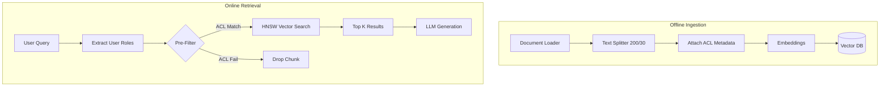

# 1. GEN AI & THEORY: THE MASTER SHEET (EXPANDED)

## SECTION 1: BUILDING EFFECTIVE AGENTS (Anthropic Patterns)
**1. Core Philosophy:**
- **Simple & Composable:** Successful AI systems are built on simple, composable primitives, not black-box frameworks.
- **Patterns over Frameworks:** Understand the underlying design patterns (routing, chaining) rather than blindly calling `AgentExecutor`.
- **APIs vs Frameworks:** Frameworks (LangChain) simplify boilerplate but hide abstraction leaks and breaking changes. Building directly from LLM APIs gives maximum control and stability.

**2. Augmented LLMs:**
- The foundation is an Augmented LLM. The LLM is wrapped with **Augmentations**: Retrieval (context), Tools (actions), Memory (state), and easy, well-documented interfaces like **MCPs (Model Context Protocol)**.

**3. Multiple Definitions of an Agent System (The Ambiguity):**
- *The Academic/Industry Split:* Some define an agent simply as "an LLM that has access to tools." Anthropic defines an agent strictly as a system where "the LLM dynamically directs its own control flow and process." Be prepared to clarify which definition you are using in the interview.

**4. When to use what? (Agents vs Workflows vs Baselines)**
- **Baseline:** For many applications, complex agents are overkill. Simple **Retrieval + In-Context Few-Shot Examples** is enough. Always start here.
- **Workflows:** Use when the task is predictable and the path to success is known. The human defines the control flow.
- **Autonomous Agents:** Use when the problem is open-ended and requires flexibility. The **LLM** drives the control flow (Think -> Act -> Observe). *Cons:* Hard to control, prone to infinite loops, expensive.

**4. Workflow Patterns (With Examples):**
- **Prompt Chaining:** Sequential (A -> B -> C). *Example:* Generate a marketing email -> Extract the subject line -> Translate to French.
- **Routing:** Conditional logic. *Example:* If query is technical -> Route to coding model; If query is billing -> Route to deterministic SQL tool.
- **Parallelization (Variants):**
  - *Sectioning:* Divide a large document into 3 chunks, process all 3 concurrently, merge at the end.
  - *Voting:* Ask 3 different models the same question concurrently, take the majority answer to reduce hallucination.
- **Orchestrator-Workers:** Divide and conquer. An orchestrator LLM breaks a complex prompt into sub-tasks and delegates to worker LLMs.
- **Evaluator-Optimizer:** A refinement loop. *Example:* LLM writes code -> Evaluator runs tests (fails) -> Optimizer rewrites code based on error trace.

---

## SECTION 2: LANGCHAIN & LANGGRAPH MECHANICS
**1. LangChain (The Primitives):**
- **4 Core Concepts:** Chains (sequential logic), Tools (schemas), Agents (decision makers), Memory (state tracking).
- **LCEL (LangChain Expression Language):** The modern pipeline syntax (`prompt | model | parser`) for composing chains cleanly.
- **Integrations & Variants:**
  - *Splitters:* RecursiveCharacterTextSplitter (respects paragraphs/sentences).
  - *Vector Stores:* pgvector (transactional), Pinecone (scale).
  - *Retrievers:* Similarity (standard), MMR (Maximal Marginal Relevance - penalizes redundant chunks to ensure diverse context).
  - *Output Parsers:* JSON output parsers with built-in retry logic.
- **Chain Shape:** A Chain is a DAG (Directed Acyclic Graph). It is one-way. It cannot loop.

**2. LangGraph (The Runtime for Agents):**
- **Terminology:**
  - `StateGraph`: The state machine.
  - `Node`: A Python function returning a state update.
  - `Checkpointer`: Short-term, **within-thread** memory (this conversation).
  - `Store`: Long-term, **cross-thread** memory (facts across sessions).
- **TRAP - Parallel Writes:** If two nodes execute concurrently and write to the same state key, LangGraph throws `InvalidUpdateError`. *Fix:* Use a **Reducer** (e.g., `operator.add`) to safely merge them.
- **TRAP - Sequential Writes:** If two sequential nodes write to the same un-reduced key, the second silently clobbers the first with no error.
- **TRAP - Semantic Cache Bypass:** Caching an LLM response via Redis speeds up TTFT. *The Trap:* CEO asks "Q3 Revenue", cache saves it. Intern asks "Q3 Revenue", cache serves the CEO's answer, bypassing ACLs. *Fix:* Salt the cache key with the user's role/clearance.

---

## SECTION 3: RAG ARCHITECTURE & SYSTEM DESIGN
**1. The RAG Drawing (Two Lanes):**
- **Offline Ingest:** Parse -> Chunk (200 tokens, 30 overlap) -> Embed -> Index (Vector + BM25).
- **Online Retrieval:** User Query -> Retrieve Top 50 (Dense + Sparse) -> Reciprocal Rank Fusion (RRF) -> Cross-Encoder Rerank to Top 5 -> Assemble Context -> LLM Generation.

**2. Vector DBs, Search Algos, and Math:**
- **Index Types:** `pgvector` for <10M docs (boring, ACID). Pinecone/Milvus (sharded) for >10M docs because the graph exceeds single-node RAM.
- **Search Algos:**
  - *KNN (K-Nearest Neighbors):* Exact match, but a linear scan O(N). Too slow at scale.
  - *HNSW (Hierarchical Navigable Small World):* Approximate search. A skip-list in vector space (highways to local roads). O(log N) speed.
  - *Hybrid Search:* Combines HNSW (semantic meaning) with BM25 (exact keyword match).
- **Distance Metrics (Cosine vs Dot Product):**
  - Cosine measures angle; Dot Product measures magnitude + angle.
  - *The TR Answer:* Snowflake Arctic Embeddings are **L2-Normalized** by default (length = 1). Therefore, Cosine and Dot Product yield the exact same ranking. We use Dot Product because it requires fewer floating-point operations.

**3. RAG System Design Choices (The TRs):**
- **Chunking (TR-4):** 200 tokens with 30 overlap. Overlap ensures facts straddling boundaries survive. Decided via **Ablation Studies** against the Golden Set, proving Chroma's 800-token default was suboptimal.
- **Security / ACLs (TR-3):** **Pre-Filtering**. Pushing a boolean clearance mask into the vector DB *before* search. *Trap:* Post-filtering causes Top-K starvation (fetching 10, dropping 9, leaving LLM empty).
- **Decoding (TR-15):**
  - *Temperature:* Divides logits before softmax. Temp 0 = deterministic (required for RAG).
  - *Top-K:* Hard cap (keep exactly K tokens).
  - *Top-P:* Dynamic cap (keep tokens until cumulative probability hits P).

---

## SECTION 4: EVALUATION & HALLUCINATION MITIGATION
**1. Hallucination Mitigation (TR-16):**
- LLMs optimize for plausibility, not truth. They will lie to appease the user.
- **The Fix:** The **Abstention Gate**. Explicitly prompt the model: *"If the context does not contain the answer, output exactly: 'I lack the context to answer this.'"*

**2. The RAG Triad (TR-17):**
- Separate retrieval eval from generation eval.
- **Context Recall:** Did the vector DB fetch the right documents?
- **Faithfulness:** Is the LLM's generated answer entirely supported by the retrieved context?
- **Answer Relevance:** Does the generated answer actually address the user's prompt?

**3. Golden Sets & Ablation Studies:**
- **Golden Set:** A hand-curated list of perfect QA pairs mapping query -> expected document. We explicitly included adversarial `expect_abstain` rows to test if the Abstention Gate actually works.
- **Ablation Study:** Changing exactly ONE variable (e.g., chunk size from 200 to 400) while holding the rest of the architecture constant, and measuring the delta in Recall.

**4. LLM as a Judge (TR-18 & 20):**
- **Failure Modes / Traps:**
  - *Position Bias:* Prefers whichever answer was presented first.
  - *Verbosity Bias:* Gives higher scores to longer answers regardless of accuracy.
  - *Self-Preference:* Llama3 rates Llama3 answers higher than GPT-4 answers.
- **The Fix:** Treat the Judge like a model. Hand-label 50 examples yourself and measure the Human-vs-Judge agreement rate before trusting it in CI/CD.

---

## SECTION 5: PYTHON FUNDAMENTALS (Paper Coding & TRs)
**1. The TR-21 Python Rapid Fire:**
- **Decorators:** A function that takes a function and returns a wrapped function. Used for cross-cutting concerns (e.g., `@retry_on_failure`, `@check_auth`) to avoid copy-pasting logic.
- **Threading vs Multiprocessing:** Python has a Global Interpreter Lock (GIL). Threads are only useful for **I/O-bound** work (waiting for an LLM API call). For heavy CPU math, you must use Multiprocessing to spawn separate interpreters.
- **Tuples vs Lists:** Tuples are immutable, which makes them **hashable**. Therefore, a Tuple can be used as a Dictionary key, but a List cannot.

**2. Coding on Paper (TR-20): Second Largest in Array**
- *The Trap:* Initializing the max variable to `0` fails if the array contains negative numbers. Assuming the second positional element instead of the second *distinct* element.
```python
def second_largest(nums):
    if not nums: return None
    largest = second = None
    for n in nums:
        if largest is None or n > largest:
            second = largest
            largest = n
        elif n != largest and (second is None or n > second):
            second = n
    return second
```

---

## SECTION 6: ADVANCED ENTERPRISE ARCHITECTURAL PATTERNS (NEW)
**1. Model Context Protocol (MCP):**
- Anthropic's new open standard that decouples tools from agents. Instead of hardcoding tools into system prompts, agents discover them dynamically via standard JSON-RPC. Resolves N×M custom API integration nightmare.

**2. Eval-Driven SDLC & Prompts as Code:**
- **Prompts as Code:** Prompts must be version-controlled like software binaries.
- **CI/CD Integration:** Running "LLM-as-a-judge" in CI pipelines to automatically score outputs against a rubric, blocking bad PRs from merging into production.

**3. The TTFT Bottleneck & Prefix Caching:**
- **TTFT (Time To First Token):** The absolute bottleneck of GenAI, driven by the *prefill phase* (generating the KV cache for the prompt).
- **Prefix Caching:** Caching the KV cache of static prompt parts (like system instructions or fixed RAG documents) in VRAM so it doesn't need to be recomputed for every request.

**4. Explicit Reasoning Architectures:**
- When a simple DAG chain is not enough, you use explicit stateful loops:
  - **ReAct (Reason + Act):** The classic loop where the agent thinks, acts, and observes repeatedly.
  - **Plan-and-Execute:** The agent writes a multi-step plan upfront, then executes each step one by one.
  - **Reflection:** The agent generates an answer, critiques its own answer against a rubric, and generates a better answer.

**5. Event-Driven HITL (Human-in-the-Loop):**
- Why do we use Checkpointers? Not just for chat history, but for **microservice event interrupts**. You can pause a LangGraph workflow before a sensitive tool call, save state to Postgres, wait for an asynchronous human approval via webhook, and seamlessly resume.

---

## SECTION 7: THE FINAL CRAM (LAST-MINUTE ADDITIONS)

**1. When to use which Workflow (with examples):**
- *Prompt Chaining:* When the task is a fixed, deterministic sequence. (e.g., Translate -> Summarize -> Format).
- *Routing:* When there are distinct categories of tasks. (e.g., If 'Billing' use SQL Tool; If 'Support' use RAG).
- *Parallelization:* When tasks are independent and latency is critical. (e.g., Ask 3 different models the same prompt and take the majority vote to prevent hallucination).
- *Evaluator-Optimizer:* When output quality is subjective and needs refinement. (e.g., Generating code, running it in a sandbox, and feeding the error back to fix it).

**2. Middlewares (Callbacks & Guardrails):**
- Intercepts requests/responses between the application and the LLM. 
- *Examples:* Token usage logging, PII masking (scrubbing emails before hitting OpenAI), caching, and Toxicity Guardrails.

**3. Structured Output (Pydantic):**
- Essential for agentic systems. You force the LLM to reply in a strict JSON schema using `model.with_structured_output(PydanticModel)`. If the LLM breaks the schema, Pydantic throws a validation error which triggers an automatic retry loop.

**4. The LangChain Data Connection Flow (Detailed):**
- `DocumentLoader` (Reads PDF/HTML) $\rightarrow$ `TextSplitter` (Recursive character splitting at 200 tokens) $\rightarrow$ `Embeddings` (Converts text to floats) $\rightarrow$ `VectorStore` (Indexes the floats) $\rightarrow$ `Retriever` (Wraps the DB to expose a `.invoke(query)` interface).

**5. Chain Shape (Detailed):**
- A standard LangChain LCEL chain is a **DAG (Directed Acyclic Graph)**. It flows from left to right (`Prompt | LLM | Parser`). It has **no cycles**. If it fails, it crashes. LangGraph exists purely to add cycles (loops/state) to this DAG.

**6. Flat vs IVF vs HNSW (Vector Indexes):**
- *Flat (KNN):* Exact match. Compares query to *every* vector. 100% accurate, but $O(N)$ (Too slow for 10M+ docs).
- *IVF (Inverted File Index):* Clusters vectors into Voronoi cells. Finds the closest cluster centroid, then searches only inside that cell. Fast, but edges of cells cause accuracy drops.
- *HNSW (Hierarchical Navigable Small World):* Graph-based. Creates multi-layered skip-lists (like highways to local roads). $O(\log N)$ speed. The industry standard for speed vs accuracy.

**7. Keyword vs Vector vs Hybrid (RRF):**
- *Keyword (BM25):* Pros: Exact matches ("SKU-1234"). Cons: Fails on synonyms ("automobile" vs "car").
- *Vector (Dense):* Pros: Semantic understanding (knows "happy" is close to "joy"). Cons: Terrible at exact serial numbers or names.
- *Hybrid Search:* Does both simultaneously.
- *RRF (Reciprocal Rank Fusion):* The math formula used to merge the BM25 score and the HNSW score into a single ranked list without them destroying each other.

**8. PermRAG Architecture (Mermaid):**

