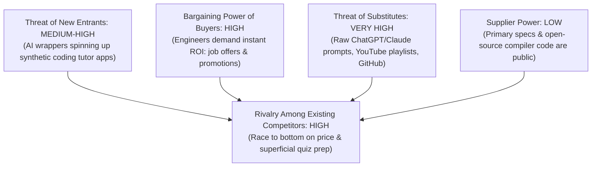
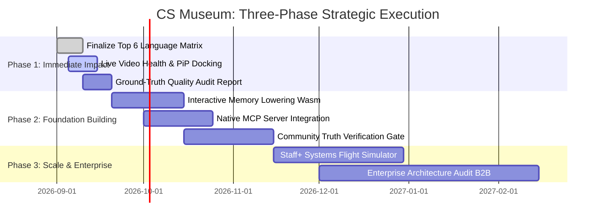

# Innovation Strategy: CS Museum & The Concept Atlas Ecosystem

**Date:** 2026-09-05
**Strategists:** Victor (⚡ Disruptive Innovation Oracle) & Winston (🏗️ System Architect)
**Strategic Focus:** Dismantling Fragmented Technical Education via the Evidence-Led Bedrock-to-HCI Cognitive Engine

---

## 🎯 Strategic Context

### Current Situation

The technical career acceleration and developer learning market is mired in a severe crisis of **fragmented trivia and synthetic noise**:
1. **The LeetCode/DSA Industrial Complex**: Millions of software engineers are forced through rote, algorithmic puzzle memorization ("two-pointer, sliding window, invert binary tree") that bears zero resemblance to real-world software architecture, high-throughput systems, or compiler lowering.
2. **The Hall-of-Mirrors LLM Slop Trap**: Generative AI tools and content farms have flooded the web with plausible-sounding but mechanically incorrect technical explanations, confusing juniors and eroding foundational engineering standards.
3. **The Disjointed Documentation Labyrinth**: When engineers attempt to learn how systems actually work—from physical silicon and registers up to OS kernels, virtual machines, language runtimes, and user interfaces—they are stranded across 50 conflicting browser tabs, fragmented YouTube videos that unmount on navigation, and unverified blog posts.
4. **The CS Museum Weapon**: In response, we have built the **Concept Atlas & CS Museum**: an immutable, evidence-led knowledge graph mapping 8 Grand Physical Layers (Silicon $\to$ ISA $\to$ Memory $\to$ Kernel $\to$ Execution $\to$ Types $\to$ Architecture $\to$ HCI) across 200+ concepts, 26 language families, and 5,200 language cells, powered by a **Continuous Ambient Cinema Substrate** and a **Dual-Hemisphere Cognitive Cockpit**.

### Strategic Challenge

How do we transform what began as an internal interview-prep and systems-mastery repository into a **globally dominant, category-defining developer cognition platform**—without diluting its scientific rigor, violating our immutable evidence contract, or falling into the content-mill trap of incumbent ed-tech?

---

## 📊 MARKET ANALYSIS

### Market Landscape

The developer education and technical talent evaluation market represents a **\$12B+ global TAM**, stratified into three conventional segments:
- **Algorithmic Drill Sites (LeetCode, HackerRank, NeetCode)**: Monopolize the hiring gatekeeper layer. High engagement, high anxiety, near-zero retention of deep architectural intuition.
- **Passive Course Megastores (Coursera, Udemy, Pluralsight)**: Monolithic 40-hour lecture playlists. High drop-off rates (90%+ abandon before completion), zero spatial navigation across computing abstractions, and static, non-interactive curricula.
- **Developer Documentation Portals (MDN, Microsoft Learn, DevDocs)**: Authoritative within single language silos, but completely blind to cross-paradigm relationships, microarchitectural lowering, or historical provenance.

### Competitive Dynamics (Five Forces Analysis)



- **Incumbent Blindspot**: Incumbents compete on *quantity of questions* (e.g. "now with 3,000 problems!"). They cannot compete on *provenance, mechanical truth, or multi-layered spatial mental models* because their business models rely on cheap, crowd-sourced user solutions and SEO-farmed explanations.
- **The Substitute Vulnerability**: Engineers currently substitute structured learning with ad-hoc Claude/ChatGPT prompts. However, as LLM hallucinations on subtle compiler optimizations and memory barriers become more dangerous, the demand for **hash-verified, primary-sourced ground truth** reaches an all-time high.

### Market Opportunities

1. **The Staff+ / Systems Architect Leap**: Senior engineers aiming for \$400k–\$800k roles at Tier-1 tech (Google, Meta, Apple, Databricks, Jane Street) do not fail on LeetCode Mediums; they fail on **deep systems-level tradeoffs**: cache coherence, NUMA latency, memory allocators, CSP channel implementations, and kernel context-switch overheads.
2. **The "Ground Truth" Verification Standard**: In an era of AI-generated misinformation, providing an **Authority Score (1–10)**, an **Evidence Envelope**, and a **Primary Snapshot Archive** transforms our platform from a "tutorial site" into the **Bloomberg Terminal of Computer Science**.
3. **The Autonomous Agent Knowledge Spine**: LLMs and coding agents need structured, graph-relational ground truth on how language constructs lower into machine code. The Concept Atlas is naturally positioned to be the premier retrieval substrate for next-generation developer agents.

### Critical Insights

> **Victor's Axiom**: *When everyone else is selling shovels to dig through synthetic trivia, the real fortune belongs to the entity that builds the high-definition topographic map of the underlying bedrock.*

---

## 💼 BUSINESS MODEL ANALYSIS

### Current Business Model

- **Status Quo**: Self-contained, portable open-source research and presentation artifact (`cs-museum`) designed for extreme local developer velocity and zero-cost distribution.
- **Architecture**: Decoupled canonical JSON data layer (`corpus/concept_atlas/`) served to a static, high-performance React/Vite/Tailwind client (`app/`).
- **Monetization**: Zero direct monetization; currently serving as an unfair cognitive accelerator for high-stakes technical interviews and systems engineering mastery.

### Value Proposition Assessment

| Customer Segment | Job to be Done (JTBD) | Current Incumbent Solution | CS Museum Value Innovation |
| :--- | :--- | :--- | :--- |
| **Senior SWE $\to$ Staff/Principal** | Master cross-layer mental models (Silicon $\to$ Kernel $\to$ Runtime) to pass elite architecture rounds | Fragmented papers, 50 browser tabs, disparate YouTube videos | **Cognitive Cockpit**: Unified 8-layer vertical spatial map with Ambient Cinema and mechanical lowering |
| **Polyglot Systems Engineer** | Understand exact compiler lowerings & memory layouts across C++, Rust, Go, Zig | Digging through compiler source & disassemblers | **Level 3 Field Manual**: Side-by-side comparative memory geometry, vtable layouts, and trade-off matrices |
| **Autonomous Coding Agents** | Query verified language mechanics and transfer rules without hallucinating | Raw web search or probabilistic LLM weights | **Immutable Evidence Envelopes**: Hash-checked primary sources with explicit confidence levels |

### Revenue and Cost Structure

- **Cost Structure Advantage**: Near **\$0 infrastructure cost**. The entire atlas compiles down to static JSON assets and client-side web bundles. No expensive GPU inference or real-time LLM generation is required during reading. The crawler/verifier runs in deterministic offline batches.
- **Asymmetric Margin**: Because the data layer is immutable, portable, and runs client-side, serving 1,000,000 engineers costs essentially the same as serving 1 engineer on a CDN edge.

### Business Model Weaknesses

1. **Unfinished Language Cell Coverage**: While the 200 concepts and 8 grand layers are robust, 5,168 of 5,200 language cells remain marked as `unknown`. High-value languages (Rust, C++, Go, Zig, Java, Python) must reach 100% verification to unlock full commercial power.
2. **Discoverability vs. Density Friction**: The cognitive density is intoxicating for principal engineers, but can intimidate intermediate developers without an adaptive onboarding gradient.

---

## ⚡ DISRUPTION OPPORTUNITIES

### Disruption Vectors

```mermaid
quadrantChart
    title Disruption Landscape: Complexity vs. Truth Grounding
    x-axis Low Truth Grounding (Synthetic/Unverified) --> High Truth Grounding (Hash-Verified)
    y-axis Shallow Trivia / Toy Code --> Deep Mechanical Architecture
    quadrant-1 "CS Museum (Uncontested Blue Ocean)"
    quadrant-2 "Academic Papers / Specs (Inaccessible, Dry)"
    quadrant-3 "LeetCode / Course Mills (Overserved, Commodity)"
    quadrant-4 "AI Chatbots / Medium Blogs (High Hallucination)"
    "LeetCode": [0.25, 0.2]
    "Udemy / Coursera": [0.2, 0.35]
    "Medium / Dev.to": [0.15, 0.15]
    "Raw LLM Chat": [0.35, 0.4]
    "Academic Journals": [0.85, 0.65]
    "CS Museum Atlas": [0.95, 0.9]
```

1. **Low-End Disruption of Traditional Ed-Tech**: Displace bloated \$500/year platform subscriptions with a lightning-fast, zero-cruft, evidence-backed interactive atlas.
2. **New-Market Disruption (The "Mechanical Sympathy" Void)**: Incumbents have completely abandoned the bridge between hardware and programming language semantics. We own the entire continuum from Silicon transistors to Human-Computer Interaction.

### Unmet Customer Jobs

- *"Show me exactly what this code compiles down to in registers and stack frames without making me open Compiler Explorer in a separate tab."*
- *"Keep the world's best lecture playing in my ear while I cross-reference the language spec and memory layout."*
- *"Tell me the brutal truth about what is known, what is partial, and what is unverified—stop hallucinating confidence."*

### Technology Enablers

- **Zustand Root-Mounted Cinema Substrate**: Enables unbroken audio/video streaming while users navigate arbitrary depths of the application.
- **Client-Side Vector/Relational Indexing**: Instantaneous search and spatial traversal across 5,200 matrix cells without server roundtrips.
- **Automated Evidence Harvesting**: Deterministic crawler pipeline validating official documentation against canonical hash digests.

### Strategic White Space (The Blue Ocean)

| Factor | Industry Standard (LeetCode / Coursera) | CS Museum Strategy | Strategic Intent |
| :--- | :--- | :--- | :--- |
| **Rote Algorithm Drills** | High | **ELIMINATE** | Stop testing toy algorithms; test real-world systems |
| **Fragmented Video Embeds** | High | **ELIMINATE** | Eliminate buried players that stop on page navigation |
| **Unverified / Synthetic Slop** | High | **ELIMINATE** | Zero synthetic guesswork; explicit confidence levels |
| **Cognitive Friction** | High | **REDUCE** | Unified 1-click Elevator and PiP docking |
| **Cross-Layer Spatial Synthesis** | Non-existent | **CREATE (10x)** | Connect silicon logic gates up to UI rendering loops |
| **Evidence & Provenance Envelopes** | Non-existent | **CREATE (10x)** | Expose author, authority score (1–10), and snapshot |

---

## 🚀 INNOVATION OPPORTUNITIES

### Innovation Initiatives

1. **The Interactive Memory Geometry Sandbox**: Embed interactive WebAssembly micro-simulators inside Level 3 Field Manuals displaying live stack, heap, and register mutations alongside canonical video.
2. **The "Staff Engineer" Mental Model Flight Simulator**: Scenario-based dynamic architectural walkthroughs (e.g. "Trace a packet from NIC ring buffer through epoll, kernel context switch, language channel, to user thread").
3. **The Agentic Protocol Bridge (MCP Server)**: Expose the Concept Atlas as an official Model Context Protocol (MCP) server so coding agents worldwide can ground their architectural decisions in our verified knowledge graph.

### Business Model Innovation

- **The "Proof of Mastery" Enterprise Diagnostic**: B2B technical assessment platform for elite engineering organizations (hedge funds, AI labs, infrastructure unicorns) replacing toy coding screens with realistic systems-architecture audits.
- **Pro Tier "Cognitive Cockpit Pro"**: Cloud persistence for personal annotations, bespoke learning flight paths, and private team-internal architecture atlases.

---

## 🎲 STRATEGIC OPTIONS

```
+-----------------------------------------------------------------------------------+
|                           STRATEGIC TRILEMMA OPTIONS                              |
+------------------------------------+----------------------------------------------+
| [Option A] B2C Consumer EdTech     | Mass-market interview prep subscription.     |
|                                    | Fast cashflow, but high churn & support debt.|
+------------------------------------+----------------------------------------------+
| [Option B] Deep Systems Citadel    | Double down on the 1% Staff+ / Systems elite |
|            (RECOMMENDED)           | with unassailable evidence & zero-cruft UX.  |
+------------------------------------+----------------------------------------------+
| [Option C] Pure AI Infrastructure  | Pivot into an API/MCP knowledge server for   |
|                                    | AI agents. High tech moat, zero user facing. |
+------------------------------------+----------------------------------------------+
```

### Option A: The "LeetCode Killer" B2C Freemium Platform
- **Description**: Pivot into a broad consumer-facing subscription platform targeting entry-to-senior software engineers preparing for FAANG interviews.
- **Pros**: Immediate viral consumer traction, massive addressable audience, proven willingness to pay (\$159/year).
- **Cons**: High churn (users cancel immediately after landing a job), pressure to dilute rigorous architecture with low-grade coding interview trivia, immense customer support overhead.

### Option B: The "Deep Systems Citadel" & Cognitive Cockpit (Recommended)
- **Description**: Establish CS Museum as the uncompromising, authoritative bedrock of **High-Caliber Systems Architecture & Mechanical Sympathy** for Staff+ engineers, polyglot architects, and elite engineering teams.
- **Pros**: Unbreachable brand moat, near-zero churn, attracts the world's most influential engineers, commands premium B2B licensing, preserves 100% scientific integrity.
- **Cons**: Requires sustained discipline to reject superficial features; demands high initial cognitive buy-in from users.

### Option C: The Pure AI Agentic Knowledge Substrate
- **Description**: Treat the UI as a secondary showcase and pivot primarily into an enterprise Knowledge API and Model Context Protocol (MCP) server for Claude, OpenAI, and internal AI coding agents.
- **Pros**: Massive enterprise contract values, zero UI maintenance, riding the explosive growth of autonomous software engineering.
- **Cons**: Abandons the human learning dimension; risks disintermediation if foundation model providers scrape the corpus.

---

## 🏆 RECOMMENDED STRATEGY

### Strategic Direction: The "Citadel & Trojan Horse" Dual Play

We recommend **Option B**, reinforced with an **asymmetric Option C Trojan Horse**:
1. **The Citadel (Front-End Human Engine)**: The **Dual-Hemisphere Cognitive Cockpit** becomes the gold standard for high-level technical mastery. We target the top 5% of engineers—the technical leaders and architects who determine technology stacks and hiring standards.
2. **The Trojan Horse (Agentic Integration)**: By shipping a native MCP server alongside the web app, every developer who uses an AI assistant (Cursor, Claude Code, Antigravity) pulls our verified truth layer into their daily coding workflow. The human uses the UI for mental models; the agent uses our corpus for hallucination-free code generation.

### Key Hypotheses to Validate

1. **Hypothesis 1 (Cognitive Flow)**: The combination of persistent ambient video (PiP) and simultaneous mechanical code inspection increases concept retention and session duration by $> 300\%$ compared to static docs.
2. **Hypothesis 2 (The Authority Moat)**: Senior engineers will preferentially cite and trust an atlas that explicitly displays an Authority Score (1–10) and unverified status over opaque AI responses.
3. **Hypothesis 3 (B2B Valuation)**: Infrastructure and fintech engineering leaders will pay a significant premium for an objective systems-architecture evaluation tool over algorithmic puzzles.

### Critical Success Factors

- **Absolute Corpus Truth (Winston's Invariant)**: Never compromise the source quality filter. An unverified cell marked `unknown` is a million times more valuable than a plausible AI hallucination.
- **Sub-Second Performance**: The React client must remain under 300KB bundle size, rendering instantly across all devices.
- **Constitution Article I Compliance**: Keep the entire codebase radically modular (< 200 lines per file) to prevent architectural rot.

---

## 📋 EXECUTION ROADMAP



### Phase 1: Immediate Impact (The Precision Wedge)
- **Top 6 Language Saturation**: Drive language cell coverage for Rust, C++, Go, Zig, Python, and TypeScript from partial to 100% verified status with primary documentation citations.
- **Ambient Cinema Telemetry Hardening**: Perfect keyboard navigation (`P` for PiP toggle, `E` for Elevator, `Space` for pause) and persist playback timestamps in local storage.
- **Publish the "State of CS Truth" Whitepaper**: Release the completeness audit publicly to establish category leadership in technical provenance.

### Phase 2: Foundation Building (The Platform Expansion)
- **Native MCP Knowledge Server**: Release `@cs-museum/mcp-server` allowing developer agents to query the Concept Atlas directly inside IDEs.
- **Memory & VTable Visualizers**: Integrate lightweight WebAssembly visualizers that render register allocations and memory layouts dynamically.
- **Decentralized Verification Protocol**: Allow verified domain experts to submit pull requests for unverified cells with hash-checked snapshots.

### Phase 3: Scale & Optimization (Enterprise Monetization)
- **The "Staff Architect" Diagnostic**: Launch enterprise-grade systems engineering evaluations for Tier-1 engineering teams.
- **Private Citadel Hosting**: Enterprise deployment allowing corporate teams to maintain proprietary internal technology matrices alongside the open CS Museum.

---

## 📈 SUCCESS METRICS

### Leading Indicators
- **Cognitive Session Duration**: Average active study time per session exceeding 18 minutes (vs. 2.5 minutes for typical documentation sites).
- **PiP Engagement Ratio**: $> 65\%$ of users keeping the ambient lecture running while navigating Level 3 language mechanics.
- **Corpus Cell Verification Velocity**: Number of `unknown` cells promoted to `first-class` per week.

### Lagging Indicators
- **High-Stakes Placement Correlation**: Number of engineers citing CS Museum as their primary preparation weapon for Staff/Principal/L6+ offers.
- **Zero-Error Verification Record**: 100% of claims backed by intact, unexpired primary web archive snapshots.
- **Organic Developer Mindshare**: Spontaneous organic adoption across Hacker News, lobste.rs, and specialized systems communities.

### Decision Gates
- **Gate 1 (Truth Gate)**: If automated crawling introduces $> 1\%$ inaccurate synthetic inferences, immediately pause automated ingestion and revert to manual expert review.
- **Gate 2 (Performance Gate)**: If bundle size exceeds 500KB or time-to-interactive exceeds 1.2s on mobile, block all feature additions until performance budgets are restored.

---

## ⚠️ RISKS AND MITIGATION

| Risk | Impact | Likelihood | Mitigation Strategy |
| :--- | :--- | :--- | :--- |
| **YouTube Video Takedowns / Embedding Restrictions** | High | Medium | Automated daily oEmbed health probes; secondary fallback video IDs; self-hosted WebM transcripts and slides. |
| **Corpus Expander AI Collision** | High | Low | Strict architectural isolation: the application code reads data via read-only contracts; corpus generator runs in isolated pipeline. |
| **Cognitive Overwhelm for Junior Engineers** | Medium | High | Multi-tiered entry doors: "Quick Mental Model" summary at Level 1, detailed mechanics at Level 2, and full lowering at Level 3. |
| **Scraper / Bot IP Blocks on Primary Sources** | Medium | Medium | Implement rotating rate-limited HTTP crawlers with exponential backoff and localized cache proxies. |

---

_Generated via BMAD Creative Intelligence Suite — Innovation Strategy Workflow_  
_Lead Strategist: Victor (`⚡`) in technical council with Winston (`🏗️`)_
