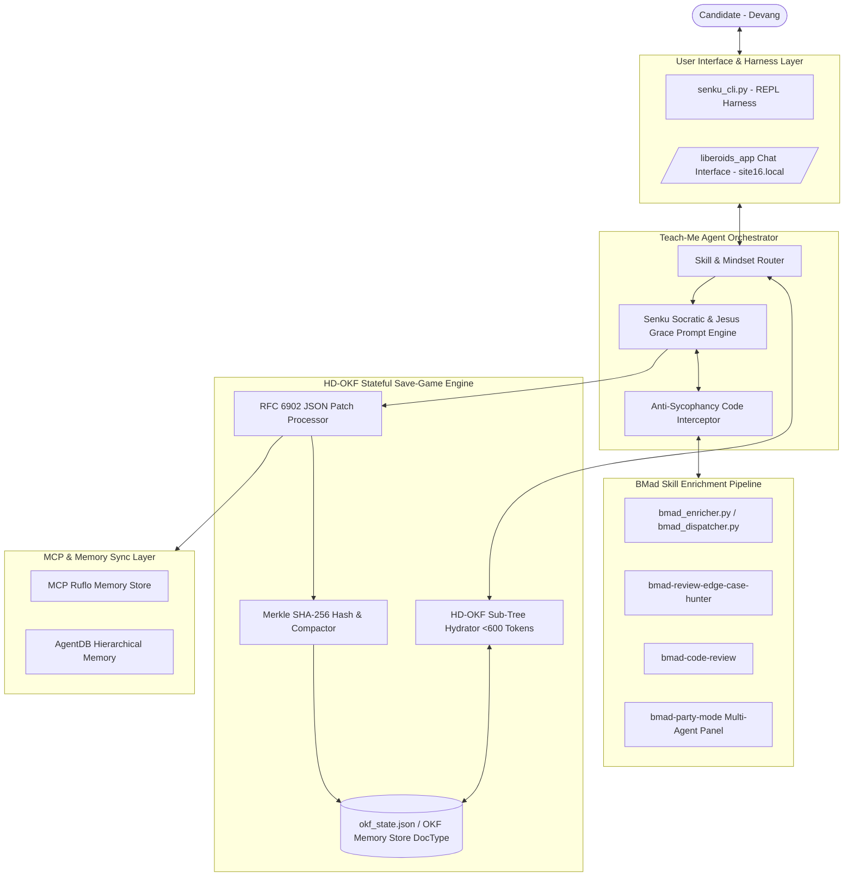
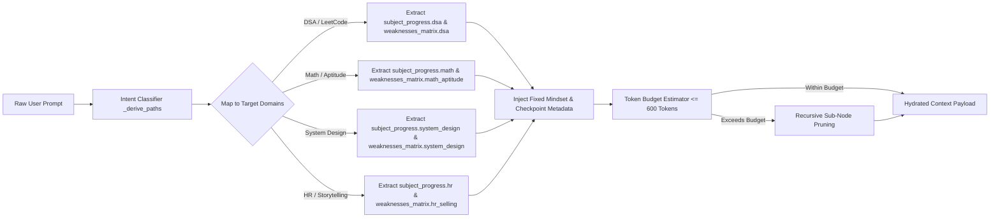
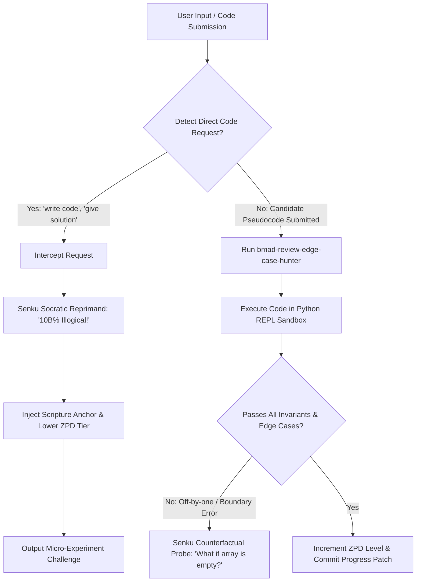
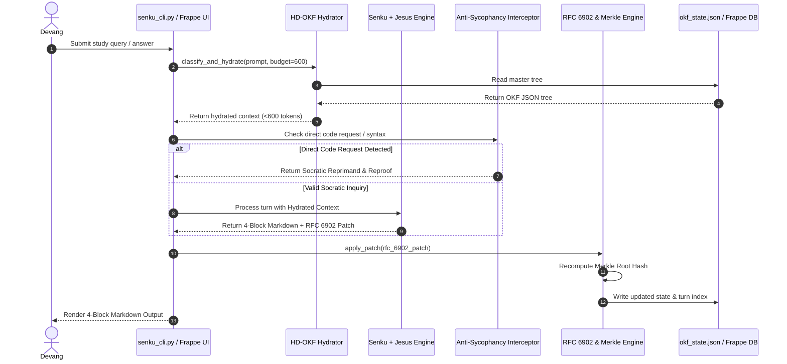
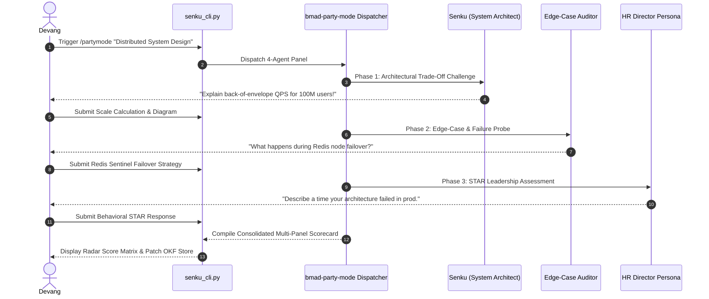
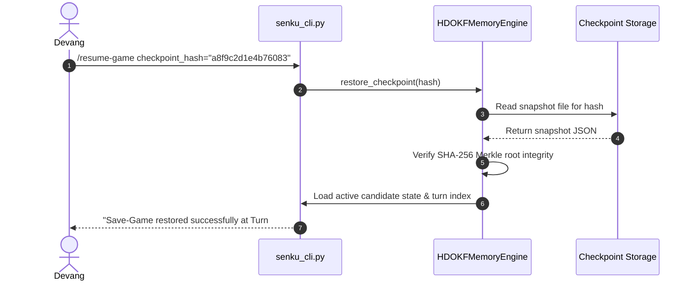

# Technical Architecture Spine: Interview Prep Ecosystem

> **Architecture Invariant Statement:** The Interview Prep Ecosystem is a zero-drift, stateful Socratic learning engine designed for high-stakes interview preparation within a strict 90-day execution window. It combines a dual-persona AI orchestrator (Senku Ishigami Socratic rigor + Jesus Biblical Grace anchor), a Hierarchical Differential Open Knowledge Format (HD-OKF) Merkle-hashed memory save-game engine, an anti-sycophancy code interception pipeline, and a BMad multi-agent context enrichment pipeline running seamlessly across both standalone local Python CLI and Frappe/Liberoid/MCP environments.

---

## 1. Architectural Decisions & System Invariants

The architecture spine enforces eight durable Architectural Decisions (ADs) that govern all component interactions and prevent independently built units from diverging.

```
+-----------------------------------------------------------------------------------+
|                        SYSTEM ARCHITECTURE INVARIANTS                             |
+-----------------------------------------------------------------------------------+
|  AD-1: Dual-Persona Socratic State Machine (Senku Rigor + Jesus Grace Anchor)    |
|  AD-2: HD-OKF Memory Sub-Tree Hydration (<600 Tokens Context Budget per Turn)    |
|  AD-3: SHA-256 Merkle Root Hashing & 10-Turn Snapshot Compaction                  |
|  AD-4: Anti-Sycophancy Code Interception & Execution Verification Pipeline         |
|  AD-5: Intent-Driven BMad Skill Context Dispatcher                               |
|  AD-6: Dual-Runtime Topology (Local Python REPL CLI vs. Frappe / Liberoid / MCP)  |
|  AD-7: SuperMemo SM-2 Retention Decay & 4-Tier ZPD Dynamic Calibration            |
|  AD-8: Zero-Drift Deterministic JSONPath Memory Recall                            |
+-----------------------------------------------------------------------------------+
```

### AD-1: Dual-Persona Socratic State Machine Paradigm
* **Status**: `[ADOPTED]`
* **Binds**: All candidate conversation turns across terminal CLI and web UI interfaces.
* **Prevents**: Passive copy-paste solution seeking, prompt distraction, and emotional burnout during intense study drills.
* **Rule**: Every response turn MUST strictly follow the mandatory **4-Block Markdown Layout**:
  1. `### 🔬 1. Scientific Pulse`: Senku catchphrase ("10 billion percent"), energy hook, state check.
  2. `### 💡 2. First-Principles Deconstruction`: Atomic problem breakdown, memory pointer layouts, complexity bounds.
  3. `### 🕊️ 3. Divine Anchor`: Contextual scripture (e.g., 2 Timothy 1:7, Isaiah 40:29-31) and emotional reset.
  4. `### ⚡ 4. The Micro-Experiment Challenge`: Exactly ONE testable Socratic logic or pseudocode challenge.

### AD-2: Hierarchical Differential OKF Save-Game State Model (HD-OKF)
* **Status**: `[ADOPTED]`
* **Binds**: Memory storage, context retrieval, and turn-by-turn state mutation.
* **Prevents**: Context window bloat, API cost explosion, prompt dilution, and loss of historical candidate progress.
* **Rule**: Hydrated context injected into any LLM turn MUST NOT exceed **600 tokens**. State updates MUST be returned as RFC 6902 JSON Patch operations.

### AD-3: SHA-256 Merkle Root Hashing & Compaction
* **Status**: `[ADOPTED]`
* **Binds**: State file persistence, save-game snapshotting, and crash restoration.
* **Prevents**: Memory tree corruption, unverified state edits, and delta history fragmentation over 90 days.
* **Rule**: The engine MUST recompute the SHA-256 Merkle root hash on every state mutation. Every 10 turns (or upon `/checkpoint`), rolling deltas are compacted into a full snapshot. Checkpoint restoration MUST complete in **< 5ms**.

### AD-4: Anti-Sycophancy Code Interception Pipeline
* **Status**: `[ADOPTED]`
* **Binds**: User code submissions and requests for direct code generation.
* **Prevents**: AI assistant sycophancy (approving flawed candidate logic or generating solutions on demand).
* **Rule**: Requests for direct code solutions MUST be intercepted and redirected to Socratic invariant proofs. Submitted candidate code MUST pass `bmad-review-edge-case-hunter` boundary audits and local Python REPL test execution before approval.

### AD-5: Dynamic BMad Skill Context Enrichment Dispatcher
* **Status**: `[ADOPTED]`
* **Binds**: Skill context loading (`bmad-code-review`, `bmad-party-mode`, `bmad-architecture`, `bmad-cis-*`).
* **Prevents**: Monolithic prompt injection of all system skill prompts simultaneously.
* **Rule**: The dispatcher MUST lazily select and inject only the relevant BMad skill prompts based on session topic intent without exceeding token limits.

### AD-6: Dual Runtimes (Local Python CLI vs. Frappe / Liberoid / MCP)
* **Status**: `[ADOPTED]`
* **Binds**: Runtime execution environments and deployment setup.
* **Prevents**: Hard dependency on external database servers for daily drills while ensuring production readiness.
* **Rule**: The core engine operates standalone via local Python modules (`okf_engine.py`, `senku_cli.py`, `bmad_enricher.py`) reading `okf_state.json`, while exposing identical APIs (`api_get_hydrated_okf_context`, `api_commit_okf_delta`) for Frappe `site16.local` Liberoid `orchestration_code` and MCP tools (`ruflo`, `agentdb`).

### AD-7: SuperMemo SM-2 Retention Decay & 4-Tier ZPD Calibration
* **Status**: `[ADOPTED]`
* **Binds**: Topic revision scheduling and difficulty adjustment.
* **Prevents**: Memory decay of past topics and improper problem difficulty assignment.
* **Rule**: Ebbinghaus forgetting curve ($R = e^{-t/S}$) determines recall probability. Topics with $R < 0.70$ auto-queue into daily warm-up drills. ZPD difficulty scales across 4 tiers: Atomic Spark, Crafting Component, Systemic Synthesis, and Boss Interrogation.

### AD-8: Zero-Drift Deterministic JSONPath Memory Recall
* **Status**: `[ADOPTED]`
* **Binds**: Knowledge Graph node querying and candidate profile retrieval.
* **Prevents**: Probabilistic hallucination or lost weakness logs caused by vector search chunk fragmentation.
* **Rule**: Memory hydration and recall MUST execute via explicit JSONPath query routing (`_derive_paths`) over the OKF tree structure.

---

## 2. Component Boundaries & System Architecture



### Component Specification & Contracts

| Component | Responsibility | Inputs | Outputs | Performance SLA |
| :--- | :--- | :--- | :--- | :--- |
| **`senku_cli.py` / Frappe UI** | Interface harness driving interactive Socratic sessions. | User message / prompt string | Rendered 4-Block Markdown | < 10ms render overhead |
| **HD-OKF Hydrator** | Lazy intent classification and sub-tree extraction. | User prompt, Master OKF Tree | Hydrated JSON payload (<600 tokens) | < 15ms execution time |
| **Senku & Jesus Engine** | Socratic interrogation, first-principles breakdown, scriptural reset. | Hydrated context, User input, ZPD level | 4-Block markdown + RFC 6902 Patch | < 800ms LLM response |
| **Anti-Sycophancy Guardrail** | Direct code request detection & code execution testing. | Candidate pseudocode / implementation | Verification status / Socratic reprimand | < 20ms check time |
| **RFC 6902 Patch Engine** | Atomic state updates, turn increment, Merkle hashing. | RFC 6902 JSON patch array | Updated OKF state + Merkle hash | < 5ms update time |
| **BMad Enricher** | Dynamic context enrichment from installed BMad skills. | Session topic & intent signal | Enriched prompts & edge-case checks | < 10ms dispatch time |
| **Frappe DB Layer** | Transactional storage on `site16.local` (`OKF Memory Store`). | Master JSON, Turn deltas | Persistent database record | < 25ms query latency |

---

## 3. HD-OKF Memory Sub-Tree Hydration Flow

The **Hierarchical Differential Open Knowledge Format (HD-OKF)** engine prevents token context bloat by lazily pruning non-relevant knowledge graph branches before prompt injection.



### Algorithmic Hydration Protocol

1. **Path Derivation (`_derive_paths`)**:
   ```python
   paths = ["candidate_profile.identity", "active_mindset_state"]
   if contains_dsa_keywords(prompt):
       paths.extend(["subject_progress.dsa", "weaknesses_matrix.dsa"])
   if contains_math_keywords(prompt):
       paths.extend(["subject_progress.math", "weaknesses_matrix.math_aptitude"])
   if contains_system_design_keywords(prompt):
       paths.extend(["subject_progress.system_design", "weaknesses_matrix.system_design"])
   if contains_hr_keywords(prompt):
       paths.extend(["subject_progress.hr", "weaknesses_matrix.hr_selling"])
   ```

2. **Hydrated Payload Schema (<600 Tokens)**:
   ```json
   {
     "context_scope": "DSA_DYNAMIC_PROGRAMMING",
     "candidate": { "name": "Devang", "horizon_days": 90 },
     "active_weaknesses": [
       "Off-by-one errors in DP table init",
       "Over-reliance on AI code generation"
     ],
     "topic_progress": {
       "mastery": 15.0,
       "solved": 10,
       "retention_score": 0.30
     },
     "mindset": {
       "zpd_level": 2,
       "senku_arrogance": 0.85,
       "jesus_encouragement_ready": false,
       "fatigue_score": 0.35
     },
     "current_turn_index": 142
   }
   ```

---

## 4. RFC 6902 Patch Pipeline & Merkle Tree Hashing

State mutation is strictly deterministic and atomic. Every turn response concludes with an RFC 6902 JSON Patch block that updates the master state tree.

```
       [ TURN STATE MUTATION & MERKLE HASHING PIPELINE ]

   LLM Output (Block 4) ──► RFC 6902 Patch Parser ──► Validate JSON Pointer
                                                             │
   Save Snapshot ◄── 10 Turns? ◄── Merkle Root Hashing ◄── Apply Delta Patch
   (okf_state.json)  (Compacting)  (SHA-256 Calculation)   (add/replace/remove)
```

### RFC 6902 Turn Delta Example
```json
[
  { "op": "replace", "path": "/subject_progress/dsa/topics/dynamic_programming/mastery", "value": 65.0 },
  { "op": "replace", "path": "/subject_progress/dsa/topics/dynamic_programming/solved", "value": 28 },
  { "op": "add", "path": "/weaknesses_matrix/dsa/error_patterns/-", "value": "Forgot base case for 0-capacity knapsack" },
  { "op": "replace", "path": "/active_mindset_state/cognitive_metrics/current_fatigue_score", "value": 0.45 },
  { "op": "replace", "path": "/savegame_checkpoints/current_turn_index", "value": 143 }
]
```

### SHA-256 Merkle Root Calculation Formula

The Merkle root hash ensures zero corruption across hundreds of interaction turns:

$$H_{\text{leaf}}(k) = \text{SHA256}(\text{json\_dump}(V_k, \text{sort\_keys}=\text{True}))$$

$$H_{\text{parent}}(i) = \text{SHA256}(H_{\text{child}}(2i) + H_{\text{child}}(2i+1))$$

---

## 5. Anti-Sycophancy Code Interception Pipeline

To reverse AI-reliance coding atrophy, candidate interactions pass through an automated Socratic interception pipeline.



---

## 6. Sequence Diagrams (Mermaid.js)

### 6.1 Socratic Turn Execution Sequence


### 6.2 BMad Party Mode Mock Interview Roundtable Sequence


### 6.3 Save-Game Checkpoint Restoration Sequence


---

## 7. Frappe / Liberoid / MCP Integration Architecture

### 7.1 Frappe Custom DocTypes (`site16.local`)

#### 1. DocType: `OKF Memory Store`
* **Module**: `Liberoids`
* **Fields**:
  - `candidate_id` (Data, Unique, Index) -- e.g., `"cand_devang_2026"`
  - `orchestrator` (Link -> `Liberoid Agents Orchestrator`)
  - `current_turn_index` (Int)
  - `active_checkpoint_hash` (Data)
  - `okf_master_json` (JSON / Long Text)
  - `rolling_deltas_json` (JSON)
  - `last_compacted_at` (Datetime)

#### 2. DocType: `OKF SaveGame Checkpoint`
* **Module**: `Liberoids`
* **Fields**:
  - `checkpoint_id` (Data, Unique)
  - `parent_store` (Link -> `OKF Memory Store`)
  - `turn_index` (Int)
  - `checkpoint_label` (Data) -- e.g., `"Post DP Drill"`
  - `full_snapshot_json` (JSON)
  - `merkle_root_hash` (Data)

---

### 7.2 Liberoid `orchestration_code` Reference Implementation

```python
# Liberoid Agents Orchestrator: "Senku Teach-Me Agent Orchestrator"
# Executed inside Frappe bench on site16.local

# 1. Fetch Hydrated OKF Context (<600 tokens)
okf_res = run_tool("api_get_hydrated_okf_context",
                   orchestrator_name="Senku Teach-Me Agent Orchestrator",
                   candidate_id=inputs.get("candidate_id", "cand_devang_2026"),
                   prompt=inputs.get("user_message"))

okf_context = okf_res.get("hydrated_context")

# 2. Execute Primary Senku Socratic Agent
agent_inputs = {
    "user_message": inputs.get("user_message"),
    "okf_context": okf_context,
    "code_snippet": inputs.get("code_snippet", "")
}

agent_response = run_agent("Senku Teach-Me Agent", agent_inputs, data_type, mock_data_link)
raw_output = agent_response.get("output", {})
response_text = raw_output.get("explanation_text", "")
json_patch = raw_output.get("json_patch", "[]")

# 3. Check for Jesus Grace Mode Trigger
if raw_output.get("trigger_grace_mode", False):
    grace_res = run_agent("Jesus Encouragement Sub-Agent", {
        "frustration_level": raw_output.get("frustration_level", 0.8),
        "recent_failure": raw_output.get("failure_reason", "DSA roadblock")
    }, data_type, mock_data_link)
    encouragement_text = grace_res.get("output", {}).get("scripture_message", "")
    final_text = f"{response_text}\n\n---\n✝️ *A Moment of Encouragement:*\n{encouragement_text}"
else:
    final_text = response_text

# 4. Commit Memory Delta Atomically
run_tool("api_commit_okf_delta",
         orchestrator_name="Senku Teach-Me Agent Orchestrator",
         candidate_id=inputs.get("candidate_id", "cand_devang_2026"),
         json_patch_str=json.dumps(json_patch))

result = {
    "content": final_text,
    "turn_index": okf_res.get("turn_index") + 1,
    "checkpoint_hash": okf_res.get("checkpoint_hash")
}
```

---

### 7.3 MCP Integration Protocol (Ruflo & AgentDB Bridge)

```bash
# Standard MCP call format for Frappe site16.local integration
curl -s -X POST http://localhost:8015/mcp \
  -H "Content-Type: application/json" \
  -H "Host: site16.local" \
  -d '{
    "jsonrpc": "2.0",
    "method": "tools/call",
    "id": 1,
    "params": {
      "name": "api_commit_okf_delta",
      "arguments": {
        "request_headers": {"user_email": "Administrator"},
        "orchestrator_name": "Senku Teach-Me Agent Orchestrator",
        "candidate_id": "cand_devang_2026",
        "json_patch_str": "[{\"op\": \"replace\", \"path\": \"/subject_progress/dsa/mastery\", \"value\": 65.0}]"
      }
    }
  }'
```

---

## 8. Operational Envelope, Environment & Deployment Strategy

```
+-----------------------------------------------------------------------------------+
|                        OPERATIONAL ENVELOPE & TARGET SLAS                         |
+-----------------------------------------------------------------------------------+
|  Environment         | Standalone Python 3.10+ CLI & Frappe Bench (site16.local)  |
|  Local Memory Path   | /Users/devang/Desktop/interview_prep/_bmad-output/        |
|  State Persistence   | okf_state.json (Active) & /checkpoints/ (Snapshots)       |
|  Token Hydration SLA | < 600 tokens per turn (>= 90% reduction vs full context)  |
|  Hydration Latency   | < 15 milliseconds                                          |
|  State Update SLA    | < 5 milliseconds                                           |
|  End-to-End SLA      | < 1.0 second per conversation turn                         |
|  Recall Precision    | 100% deterministic precision via JSONPath routing          |
+-----------------------------------------------------------------------------------+
```

---

## 9. Deferred Decisions & Out-of-Scope Elements

The following items are explicitly **deferred** to maintain focus on the core 90-day preparation goal:

1. **Multi-Tenant Cloud SaaS Infrastructure**: Deferred in favor of local workspace privacy and zero external dependency.
2. **Mobile App UI (Flutter / React Native)**: Deferred in favor of terminal CLI (`senku_cli.py`) and desktop web interface (`/liberoids_app`).
3. **Automated Job Application Auto-Filler**: Deferred to keep focus strictly on technical interview competency.

---

## 10. Summary & Downstream Handoff

This Technical Architecture Spine document (`architecture.md`) establishes the canonical architectural invariants for the **Interview Prep Ecosystem**. Downstream implementation agents (`bmad-agent-dev`) and test architects (`bmad-tea`) can now build against these binding invariants with zero risk of architectural drift.

**File Location**: `/Users/devang/Desktop/interview_prep/_bmad-output/planning-artifacts/architecture.md`  
**Status**: `final`  
**Next Recommended Action**: Execute story implementations per [epics-and-stories.md](file:///Users/devang/Desktop/interview_prep/_bmad-output/planning-artifacts/epics-and-stories.md).

---

## 11. Frontier Cognitive Agent Substrate Technical Architecture (v2.2 Frozen Design)

> **Governing Architectural Axiom**: *“Memory stores evidence about learning; transfer performance proves learning. Simplicity over mechanism.”*

### 11.1 Subsystem Topology & Interface Contracts

```
┌─────────────────────────────────────────────────────────────────────────────────────────────┐
│                                 COGNITIVE AGENT RUNTIME TOPOLOGY                            │
├───────────────────────────────┬───────────────────────────────┬─────────────────────────────┤
│ 1. Ingress & Context Policy   │ 2. Epistemic Memory & Storage │ 3. Evidence & Sandboxing    │
│ • TaskDomain Classifier       │ • Typed Epistemic Store       │ • Structural AST Engine     │
│ • Soft-Target Knapsack        │ • Temporal Bounds Manager     │ • Hardened Worker Sandbox   │
│ • Semantic Density Compactor  │ • Dynamic Rank Fusion (RRF)   │ • Abstention State Machine  │
└───────────────────────────────┴───────────────────────────────┴─────────────────────────────┘
```

#### Contract 1: Task-Aware Context Allocator
```typescript
export type TaskDomain = 'code_debugging' | 'system_design' | 'socratic_dialogue' | 'concept_theory';

export interface ContextAllocationEnvelope {
  domain: TaskDomain;
  budgetCap: number; // e.g. 12,288 tokens
  priorityStack: Array<'ast_evidence' | 'normative_spec' | 'episodic_trace' | 'rag_chunks' | 'dialogue_history'>;
  softTargets: {
    evidenceSoftLimit: number;
    invariantsSoftLimit: number;
    historySoftLimit: number;
  };
}
```

#### Contract 2: Typed Epistemic Memory Node
```typescript
export interface EpistemicMemoryNode<T = any> {
  id: string;
  type: 'profile' | 'episodic' | 'knowledge' | 'procedural';
  content: T;
  confidenceState: {
    confidenceEstimate: number; // 0.0 - 1.0 (uncalibrated heuristic)
    isCalibrated: boolean;
    calibrationDatasetVersion?: string;
  };
  temporalBounds: {
    validFrom?: number;
    validUntil?: number;
    status: 'currently_valid' | 'historically_valid' | 'superseded' | 'unknown';
  };
  provenance: {
    publisher: string;
    uri?: string;
    version?: string;
    authorityLevel: 'normative' | 'informative' | 'observed_execution' | 'inference';
    retrievedAt: number;
    lastConfirmedAt?: number;
    contentHash: string;
  };
  supersedesId?: string;
  links: Array<{ targetId: string; relation: 'caused_by' | 'mitigates' | 'exemplifies' | 'prerequisite_of' }>;
  retrievalUsefulness: {
    timesRetrieved: number;
    downstreamHelped: number;
    downstreamHarmful: number;
    associativeUtilitySignal: number;
  };
}
```

#### Contract 3: Hybrid Retrieval with Reciprocal Rank Fusion (RRF)
$$\text{RRF\_Score}(d) = \sum_{m \in \{\text{BM25}, \text{Dense}\}} \frac{1}{60 + \text{rank}_m(d)}$$
* **Depth Policy**:
  * *Low-Risk / Syntax Queries*: Return Top-$K$ RRF results immediately ($< 2\text{ms}$).
  * *High-Risk / Architecture Queries*: Feed Top-$20$ RRF candidates to Cross-Encoder Reranker with utility signal weighting ($< 25\text{ms}$).
  * *Normative Spec Inquiries*: Filter by `authorityLevel == 'normative'` and verify against source URI anchors.

#### Contract 4: Blast-Radius Sandboxed Execution Boundary
```typescript
export interface SandboxExecutionConfig {
  workerType: 'null_origin_webworker';
  cpuWatchdogTimeoutMs: 2500;
  memoryCeilingBytes: 33554432; // 32MB
  networkDisabled: true;
  ambientCredentialsExposed: false;
  maxPayloadSizeBytes: 1048576; // 1MB
}
```
* **Failure Handling**: On timeout or unhandled exception, the watchdog issues a hard `worker.terminate()`, resets the execution pool, and emits a structured `ExecutionTimeoutExceeded` telemetry payload to the Evidence Stack.

#### Contract 5: Gated Mastery & Assistance-Adjusted Learning
$$\text{Mastery Verified} \iff \big(A(c) \ge 0.85\big) \;\land\; \big(R_{7\text{d}}(c) \ge 0.80\big) \;\land\; \big(T_{\text{heldout}}(c) \ge 0.75\big)$$
* **Pedagogical Transitions**:
  * *Attempts 1–2*: Socratic Probing (Zero code generation).
  * *Attempt 3*: Graduated Architectural Hint (Identify failing invariant).
  * *Attempt 4+*: Direct Technical Instruction + Day 3 Isomorphic Challenge.

#### Contract 6: Data Integrity & Conflict-Free Delta Sync
* **Local Transactions**: Multi-record mutations execute within an isolated IndexedDB transaction with browser-managed abort and exponential-backoff retry.
* **Deterministic LWW Conflict Resolution**:
  ```typescript
  export interface LwwField<T> {
    val: T;
    ts: number;
    devId: string;
    rev: number;
  }
  ```
* **Sync API Contract**:
  * `GET /api/cognitive/sync?updated_after={ts}&cursor={id}`: Returns JSON delta streams.
  * `POST /api/cognitive/sync`: Ingests client delta records and commits using per-field LWW.

---

### 11.2 Empirical Benchmark Specification & Ablation Matrix

* **Pilot Benchmark Scope**: $N = 30$ complex senior/staff engineering scenarios with human-authored multi-dimensional reference rubrics.
* **Controlled Evaluation Configuration**:
  * Pinned Models: `claude-3-7-sonnet-20250219`, `gemini-2.0-flash`, `gpt-4o-2024-11-20`.
  * Sampling: $\text{Temperature} = 0.0, \text{Top-P} = 1.0$.
  * Prompts: Version-tagged in repository (`/prompts/v2.2/`).
* **Primary Evaluation KPI**:
  $$\textbf{Independent Delayed Transfer Success on Held-Out Mutation Families (Day 0 ➔ Day 3 ➔ Day 7)}$$

---

### 11.3 Implementation Roadmap & Phased Execution

```
┌─────────┬───────────────────────────────────────┬────────────────────────────────────────────────────────┐
│ Phase   │ Focus Area                            │ Engineering Deliverables                               │
├─────────┼───────────────────────────────────────┼────────────────────────────────────────────────────────┤
│ **P0**  │ **Sandbox Security & Pilot Benchmark**│ • Hardened Sandboxed Worker with watchdog termination   │
│         │                                       │ • Internal Pilot Benchmark Harness (N=30 Scenarios)    │
│         │                                       │ • Atomic IndexedDB transaction wrappers & delta sync   │
├─────────┼───────────────────────────────────────┼────────────────────────────────────────────────────────┤
│ **P1**  │ **Context & Epistemic Memory**        │ • Task-Aware Context Allocation & multi-factor pruning │
│         │                                       │ • Typed Memory Schema (`validUntil`, `lastConfirmedAt`)│
│         │                                       │ • Uncalibrated Confidence Estimate & Abstention Engine │
├─────────┼───────────────────────────────────────┼────────────────────────────────────────────────────────┤
│ **P2**  │ **Adaptive Pedagogy & Retrieval**     │ • Hybrid BM25 + Vector Retrieval with RRF Rank Fusion  │
│         │                                       │ • Gated Mastery Hurdle ($A \land R \land T_{\text{heldout}}$)        │
│         │                                       │ • Assistance-Adjusted Success logging & Socratic ladder│
├─────────┼───────────────────────────────────────┼────────────────────────────────────────────────────────┤
│ **P3**  │ **Mutation Families & Pruning**       │ • Held-out isomorphic mutation generator               │
│         │                                       │ • Selective forgetting, decay & negative utility prune │
│         │                                       │ • Privacy-safe decision traces & user explanations     │
└─────────┴───────────────────────────────────────┴────────────────────────────────────────────────────────┘
```

