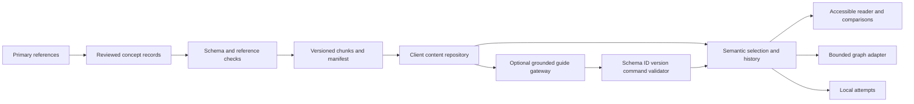

# Decisions and invariants

## Scope and assumptions

The authored release targets200 language concepts across14 clusters and26 comparison columns. It is a public, curated, read-mostly atlas. Reading/search/comparison must work without accounts or inference. Learning claims and device-specific performance claims require separate evidence. Stable IDs survive revisions; deleted/replaced IDs receive redirect records. The first delivery is a functional semantic reader and graph projection; R3F is a subsequent presentation adapter subject to the same contracts.

## AD-1 — Semantics precede presentation

Canonical JSON owns conceptual truth. The content repository resolves IDs, version and evidence; the navigator owns selection/history; the presentation only projects that state. DOM reader, cluster graph and future WebGL adapter share one selection. Camera depth never changes prerequisite status, semantic edges, or mastery. Diagram links expose relation type and conditions, not unqualified necessity.

## AD-2 — Typed multigraph with selected DAG constraints

Contains edges run cluster→concept. Prerequisite edges run prerequisite→dependent and must be acyclic. Related, analogous, contrasts-with and historically-influenced relations can contain cycles. A prerequisite is a teaching-order decision unless it explicitly cites a formal dependency. Every semantic relation has conditions, limitation/counterexample and evidence. Validation rejects unknown endpoints, duplicate IDs and cycles in constrained subgraphs. Rendering may use a tree projection without discarding cross-links.

## AD-3 — Static immutable publication

Author one concept per JSON file. Build validated manifest/index, one content chunk per cluster, language matrix and graph. Manifest identifies schema/content version and hashes. Serve versioned chunks immutably; revalidate the mutable release pointer. Retain a complete previous release for rollback. A client pins a version for a session and never joins mismatched chunks. Missing, corrupt or incompatible chunks show an explicit recovery state and preserve the selected ID. Static hosting reduces server work; it does not make network or parsing latency zero. [HTTP cache semantics](https://www.rfc-editor.org/rfc/rfc9111.html).

## AD-4 — Bounded visual work

Initial proposed spatial budgets: at most150 active concept nodes,300 visible semantic edges and40 projected DOM labels; selected content remains in a separate reader. Layout uses a bounded worker job when needed. Counts are initial design budgets pending profiling, not library limitations. Fetching, cached records, simulated bodies, mounted geometry and visible labels have distinct lifecycles. Culling geometry must not delete notes, attempts or focus state. Use enter/exit zoom thresholds with hysteresis and cache eviction independent of visibility.

At60Hz the entire frame interval is16.7ms. Measure p50/p95 frame interval, long tasks, interaction-to-content, heap trend and sustained behavior. Cap DPR and disable effects before sacrificing text access. Fall back to the semantic reader if WebGL/context initialization fails. R3F documentation warns against excessive render-loop state updates; device results belong in an evidence file, not inferred from library choice. [R3F pitfalls](https://r3f.docs.pmnd.rs/advanced/pitfalls).

## AD-5 — Accessible interaction is a first-class adapter

Use native links/buttons/selects in the initial reader, visible focus, reflow at320 CSS pixels, and no essential motion. Provide a skip link and named navigation/main landmarks. Search operates over canonical concepts; the user need not pan to discover content. Any future custom tree implements WAI arrow/Home/End behavior and separates focus from selection. Restore focus when a projected item unmounts. [WAI tree pattern](https://www.w3.org/WAI/ARIA/apg/patterns/treeview/), [reduced-motion technique](https://www.w3.org/WAI/WCAG21/Techniques/css/C39.html).

## AD-6 — AI offers validated navigation

The guide is optional. It receives published evidence and can suggest only allowlisted navigation actions. Validate shape, request identity, version, target IDs and evidence IDs outside the model. Discard responses from superseded requests. Navigation permission does not authorize editing the ontology or marking the learner competent. Inference failure returns an explicit unavailable state and never blocks local browsing. Gateway credentials, quotas, input bounds, timeout and output sanitization are deployment requirements; no browser-embedded private key.

## AD-7 — Learning evidence is independent of navigation

A visited concept is not mastered. An attempt stores concept ID, content version, rubric version, answer, self/assessor rating and timestamp. Initial reader ratings are explicitly self-assessed and local; no automated grading accuracy is claimed. Reading and revealing the rubric cannot produce a passed assessment. Exportability and local-storage failure behavior are required. Production multi-device synchronization is deferred until ownership, privacy and conflict requirements exist.

## AD-8 — Truthful publication gates

Build fails for malformed records, counts outside the fixed inventory, missing columns, invalid graph references or missing sources on asserted support cells. Unknown support and uncertain origin remain a quantified evidence backlog rather than a structural failure. A structurally valid release may remain editorially incomplete. Performance targets and learning-efficacy hypotheses stay open until measured. Source confidence is recorded at the affected claim, not inferred from the existence of a bibliography.

## Component and data flow

## Trade-offs and revisit triggers

| Choice | Benefit | Cost / revisit when |
|---|---|---|
| JSON rather than binary source | Reviewable diffs, simple tooling | Parse/transfer overhead; revisit after measured chunk budget failures |
| Static publication | Simple caching and rollback | Rebuild latency; revisit for collaborative live editing |
| Typed multigraph | Honest relationships | More validation and layout complexity |
| Accessible reader before spatial adapter | Content usable and testable now | Does not validate proposed immersive experience |
| Local progress | No account service or inference dependency | No cross-device guarantee; revisit with explicit sync requirements |
| Optional guide | Guidance without making content availability model-dependent | Cost/security/availability envelope must be provisioned before deployment |

Detailed API, NFR and case contracts are linked in the comprehensive report. This spine specifies behavior; validation evidence states what actually ran.
