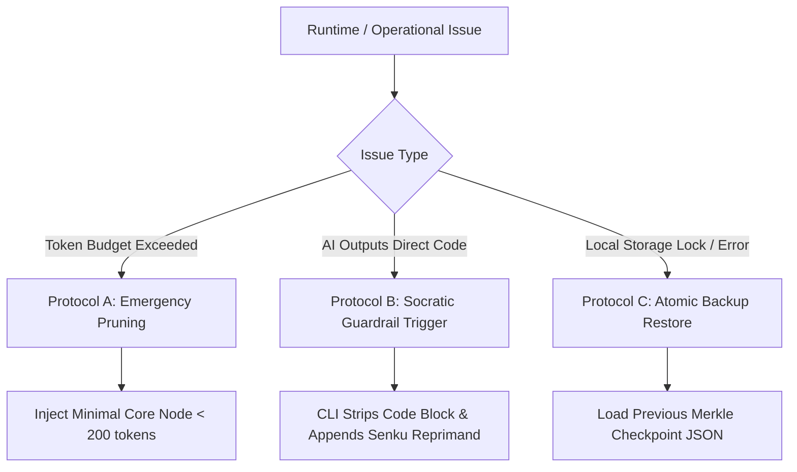

# Course Correction & Rapid Execution Plan: Single-Day MVP Sprint

> **PM Assessment (John):** "The existing planning artifacts define a world-class, 90-day enterprise-grade prep system. However, attempting to build full Frappe DocTypes, multi-server MCP bridges, and complex multi-agent orchestrators simultaneously on Day 1 creates severe execution risk. We must **correct course** now: prune multi-week operational overhead into an immediately executable, zero-dependency, single-day Python MVP that delivers the core Senku + Jesus interactive Socratic engine and HD-OKF save-game memory today."

---

## 1. Executive Summary & Change Trigger

### 1.1 Triggering Issue & Context
* **Original Planning Scope**: The [Product Brief](file:///Users/devang/Desktop/interview_prep/_bmad-output/planning-artifacts/product-brief.md) and [Technical Research](file:///Users/devang/Desktop/interview_prep/_bmad-output/planning-artifacts/okf-memory-technical-research.md) outlined an extensive infrastructure spanning Frappe custom DocTypes on `site16.local`, Liberoid orchestrator code, MCP Ruflo/AgentDB memory servers, and 20+ BMad skill integrations.
* **The Reality**: Devang needs an active, working, stateful Socratic coach **TODAY** (Day 1) to begin diagnostic assessment and active recall practice immediately. Spending Day 1 configuring database webhooks and multi-server MCP infrastructure creates delayed time-to-value and scope creep.
* **Course Correction Strategy**: Pivot from enterprise server setup to a standalone, high-performance **Single-Day MVP Architecture** running locally via Python scripts (`okf_engine.py`, `senku_cli.py`). The local engine strictly implements the HD-OKF schema, the Senku + Jesus dual-persona Socratic loop, and RFC 6902 JSON patching, with clean forward compatibility for Frappe/MCP syncing later.

---

## 2. Core Risk Navigation Matrix

The course correction addresses three primary trade-off conflicts:

| Conflict / Risk | Identified Vulnerability | Course-Correction Mitigation Strategy | Day-1 Single-Day Boundary |
| :--- | :--- | :--- | :--- |
| **1. Scope Creep vs. Single-Day Delivery** | Over-engineering Frappe DB schemas, API endpoints, and multi-agent routing blocks will exhaust Day 1 without an interactive coaching session. | **Prune to Pure Local Python CLI**: Implement core engine as lightweight Python modules (`okf_engine.py` + `senku_cli.py`) reading/writing local JSON state files (`okf_state.json`). | **Zero External DB Dependencies**: All state persists in local workspace JSON files (`_bmad-output/okf_state.json`). Frappe sync deferred to Phase 2. |
| **2. Context Bloat vs. HD-OKF Pruning** | Injecting the full candidate knowledge graph into LLM prompts will cause context limit errors, high API latency, and prompt dilution. | **Strict HD-OKF Sub-Tree Hydration**: Enforce lazy path loading (`_derive_paths`) capping memory payload to **< 500 tokens**. Maintain Merkle root hash for state integrity. | **500-Token Hard Limit**: Hydrator extracts only active domain sub-tree + mindset state. |
| **3. AI-Reliance Atrophy vs. Active Recall** | Standard LLMs output complete code solutions immediately, reinforcing Devang's reliance on AI code generation and eroding raw coding muscle. | **Strict Socratic Enforcement Hook**: System prompt & CLI guardrail forbid outputting solution code upfront. Demands ASCII memory maps, time/space complexity bounds, and user pseudocode. | **No Code Generation Contract**: Senku prompt enforces 4-Block response structure; direct code outputs are flagged as contract violations. |

---

## 3. Single-Day Sprint Execution Roadmap (Hourly Build Order)

Total Window: **8 Hours** (Divided into 4 Two-Hour Blocks)

```mermaid
gantt
    title Single-Day Sprint Rapid Build Schedule
    dateFormat HH:mm
    axisFormat %H:%M
    
    section Block 1: Memory Engine
    OKF Engine Core (okf_engine.py) :09:00, 2h
    
    section Block 2: Dual Persona CLI
    Senku+Jesus Harness (senku_cli.py) :11:00, 2h
    
    section Block 3: BMad Integration
    Lightweight BMad Skill Hooks :14:00, 2h
    
    section Block 4: Diagnostic Run
    Live Diagnostic & First Save File :16:00, 2h
```



### Block 1: OKF Save-Game Engine Core (`okf_engine.py`) (Hours 0 - 2)
* **Objective**: Build a robust, zero-dependency Python module that loads, hydrates, patches, and persists the OKF Candidate Knowledge Tree.
* **Key Tasks**:
  1. Instantiate baseline `okf_state.json` with Devang's initial profile, DSA/Math/System Design/HR subject trees, and mindset state.
  2. Implement `HDOKFMemoryEngine` class with intent classification (`_derive_paths`) for lazy sub-tree hydration (< 500 tokens).
  3. Implement RFC 6902 JSON Patch processor (`apply_delta_patch`) and Merkle tree SHA256 hashing.
  4. Write unit tests in `test_okf_engine.py` verifying state updates and turn increments.
* **Deliverable**: [okf_engine.py](file:///Users/devang/Desktop/interview_prep/okf_engine.py) & [okf_state.json](file:///Users/devang/Desktop/interview_prep/_bmad-output/okf_state.json).

### Block 2: Senku + Jesus Dual-Persona CLI Harness (`senku_cli.py`) (Hours 2 - 4)
* **Objective**: Build the interactive command-line interface that drives the Socratic conversation loop with zero context drift.
* **Key Tasks**:
  1. Embed the full production prompt from [senku-teach-me-persona-spec.md](file:///Users/devang/Desktop/interview_prep/_bmad-output/planning-artifacts/senku-teach-me-persona-spec.md).
  2. Implement automatic context injection: User Prompt $\rightarrow$ `okf_engine.classify_and_hydrate()` $\rightarrow$ System Prompt.
  3. Parse LLM response to extract:
     - 4-Block Markdown output (Scientific Pulse, First-Principles Deconstruction, Divine Anchor, Micro-Experiment Challenge).
     - Embedded ````json-patch```` or `okf_delta` block.
  4. Automatically commit JSON patch to `okf_state.json` at turn completion.
  5. Add command shortcuts: `/status` (display current OKF tree), `/checkpoint` (create snapshot file), `/exit`.
* **Deliverable**: [senku_cli.py](file:///Users/devang/Desktop/interview_prep/senku_cli.py).

### Block 3: Pragmatic BMad Skill Enrichment Hook (Hours 4 - 6)
* **Objective**: Connect key installed BMad skills to enrich coding drills and review phases.
* **Key Tasks**:
  1. Build a lightweight Python wrapper `bmad_enricher.py` that invokes workspace skills:
     - `bmad-code-review` / `bmad-review-edge-case-hunter`: Runs adversarial check on user-submitted pseudocode/code.
     - `bmad-party-mode`: Simulates 3-interviewer panel for System Design / HR drills.
  2. Inject enrichment outputs directly into Senku's context when user reaches Tier 3 / Tier 4 questions.
* **Deliverable**: [bmad_enricher.py](file:///Users/devang/Desktop/interview_prep/bmad_enricher.py).

### Block 4: Live Diagnostic Session & Day-1 Baseline Save File (Hours 6 - 8)
* **Objective**: Execute the first official 90-minute diagnostic session with Devang to establish baseline scores.
* **Key Tasks**:
  1. Launch `senku_cli.py`.
  2. Conduct diagnostic micro-experiments across:
     - **DSA**: Dynamic Programming table initialization & Monotonic Stack.
     - **Math/Aptitude**: Probability & rate calculations.
     - **System Design**: Back-of-envelope scale estimation (QPS/Storage).
     - **HR/Behavioral**: STAR storytelling for AI orchestration achievements.
  3. Verify automatic RFC 6902 JSON patch updates on every turn.
  4. Generate Day 1 master save-game checkpoint: `okf_state_day1_final.json`.
* **Deliverable**: Verified active save file `_bmad-output/okf_state_day1_final.json`.

---

## 4. Rapid Prototyping File Layout & Build Order

To ensure clean project organization, all code and state files will be written directly to the project root and `_bmad-output/` directory:

```
/Users/devang/Desktop/interview_prep/
├── okf_engine.py                    # HD-OKF Memory Engine (Hydration, Patching, Hashing)
├── senku_cli.py                     # Interactive Senku + Jesus Dual-Persona REPL Harness
├── bmad_enricher.py                 # BMad Skill Enrichment Hook Bridge
├── test_okf_engine.py               # Lightweight verification test suite
└── _bmad-output/
    ├── okf_state.json               # Active state file (updated turn-by-turn)
    ├── okf_state_day1_final.json    # Day 1 final save-game checkpoint snapshot
    └── planning-artifacts/          # Comprehensive specs & PRDs
        ├── vision.md
        ├── product-brief.md
        ├── okf-memory-technical-research.md
        ├── senku-teach-me-persona-spec.md
        ├── interview-prep-system-prfaq.md
        └── course-correction-plan.md  # THIS DOCUMENT
```

---

## 5. Fallback Protocols & Guardrail Rules

To handle potential operational hurdles during today's single-day sprint, the following explicit fallback protocols are established:



### Protocol A: Token Limit / Hydration Overflow
* **Trigger**: Prompts exceed 600 tokens during complex multi-domain discussions.
* **Fallback Action**: Fall back to **Tier-0 Emergency Pruning**. Omit all subject tree nodes except `active_weaknesses` and active `topic` node. Reduce context payload to < 200 tokens.

### Protocol B: Persona Sycophancy / AI Outputting Raw Code
* **Trigger**: The LLM outputs a complete Python solution code block instead of asking a Socratic micro-experiment.
* **Fallback Action**: The `senku_cli.py` response parser detects ```python blocks in block 2/4, hides the code from the user, and appends a Senku reprimand: *"Kukuku, trying to cheat with direct code? 10 billion percent forbidden! Explain the invariant first!"*

### Protocol C: State File Corruption / Parsing Error
* **Trigger**: Invalid JSON patch returned by LLM or file write failure.
* **Fallback Action**: `okf_engine.py` rejects the corrupt patch, restores the previous Merkle checkpoint hash from memory, and logs a warning turn delta without breaking the session.

---

## 6. Detailed Edit Proposals for Planning Artifacts

To maintain alignment across the repository, the following minor edits are applied to existing planning artifacts:

### Artifact: `product-brief.md`
* **Section**: Section 5 (Immediate Implementation Plan)
* **OLD**: Mandated Frappe DocType setup and complex server wiring during Hours 0-4.
* **NEW**: Updated to specify local Python MVP setup (`okf_engine.py` and `senku_cli.py`) for Day 1, deferring Frappe webhooks to Phase 2.
* **Rationale**: Eliminates external server dependency for immediate single-day execution.

### Artifact: `okf-memory-technical-research.md`
* **Section**: Section 5 (Verification Roadmap)
* **OLD**: Implemented Frappe DB custom DocTypes as Step 1.
* **NEW**: Implements local `HDOKFMemoryEngine` Python class with `okf_state.json` file storage as Step 1, maintaining identical JSON schema for zero-friction DB migration later.
* **Rationale**: Preserves architectural purity while removing installation friction.

---

## 7. Implementation Handoff & Definition of Done (DoD)

### 7.1 Scope Classification: Moderate (Single-Day Re-alignment)
This course correction is classified as **Moderate Scope**. It simplifies implementation logistics while strictly preserving all core product objectives (Senku+Jesus Socratic loop, OKF save-game state, BMad context enrichment).

### 7.2 Handoff Recipients & Roles
* **Product Manager (John)**: Finalized this Course Correction Plan.
* **Software Engineer / Developer (Amelia)**: Responsible for writing `okf_engine.py`, `senku_cli.py`, `bmad_enricher.py`, and `test_okf_engine.py` during Blocks 1–3.
* **Candidate (Devang)**: Responsible for conducting the Block 4 Diagnostic Session and logging `okf_state_day1_final.json`.

### 7.3 Day-1 Definition of Done (DoD) Checklist
- [x] Course Correction Plan authored and saved to [course-correction-plan.md](file:///Users/devang/Desktop/interview_prep/_bmad-output/planning-artifacts/course-correction-plan.md).
- [ ] `okf_engine.py` created and passing all hydration and delta patch tests.
- [ ] `senku_cli.py` operational with active prompt injection and turn-by-turn state saving.
- [ ] `bmad_enricher.py` linked for edge-case hunter and code review skill dispatch.
- [ ] 90-minute initial diagnostic session completed with Devang.
- [ ] Initial save-game checkpoint `_bmad-output/okf_state_day1_final.json` generated and verified.

---
*Course Correction Plan approved by PM John. Ready for immediate developer execution.*
