# Implementation Readiness Assessment Report

**Date:** 2026-07-22  
**Project:** Interview Prep System & Teach-Me Agent Engine  
**Assessor:** Product Manager John  
**Overall Readiness Score:** **45 / 100** — ⚠️ **NEEDS WORK (BLOCKED FROM PHASE 4 IMPLEMENTATION)**

---

## 1. Executive Summary

An Implementation Readiness Audit was performed on the Interview Prep System planning artifacts. The project vision outlines an urgent **90-day (3-month) transformation program** for candidate **Devang** to recover decapacitated raw coding, Data Structures & Algorithms (DSA), System Design, Core CS Math, and HR self-presentation skills following a sudden job loss.

While the **vision**, **Product Brief**, **Working Backwards PRFAQ**, **OKF Memory Technical Architecture**, and **Senku Dual-Persona Specification** are exceptionally well-crafted, the planning phase is **INCOMPLETE**. Specifically:
1. **Canonical PRD is Missing**: Requirements are scattered across 4 distinct planning artifacts without a single, authoritative `prd.md`.
2. **Epics & User Stories are Missing**: There is **0% Epic & Story Coverage**. No `epics.md` document exists to translate requirements into actionable, testable stories with Acceptance Criteria (ACs).
3. **UX Specification is Missing**: Interface interactions are only implicitly described in the persona system prompt without a formal UX spec (`ux.md`).

---

## 2. Step 1: Document Inventory & Discovery

The following documents were discovered and inventoried under `/Users/devang/Desktop/interview_prep/` and `_bmad-output/planning-artifacts/`:

| Document Name | Path | Size | Status / Version | Assessment |
| :--- | :--- | :--- | :--- | :--- |
| **Vision Document** | `vision.md` | 1.5 KB | Finalized | Foundational target & constraints |
| **Product Brief** | `_bmad-output/planning-artifacts/product-brief.md` | 13.2 KB | v1.0.0 (Final) | Comprehensive product vision |
| **PRFAQ Document** | `_bmad-output/planning-artifacts/interview-prep-system-prfaq.md` | 14.9 KB | v1.0.0 (Complete) | Customer & Internal FAQ |
| **PRFAQ Distillate** | `_bmad-output/planning-artifacts/interview-prep-system-prfaq-distillate.md` | 2.4 KB | v1.0.0 | Token-efficient LLM summary |
| **Technical Architecture** | `_bmad-output/planning-artifacts/okf-memory-technical-research.md` | 23.6 KB | v1.0.0 (Approved) | HD-OKF Memory Engine spec |
| **Persona Spec & Prompt** | `_bmad-output/planning-artifacts/senku-teach-me-persona-spec.md` | 13.5 KB | v1.0.0 | Senku + Jesus system prompt |
| **Planning Log** | `_bmad-output/planning-artifacts/.memlog.md` | 0.4 KB | Updated | Contains erroneous PRD entry |

### Critical Inventory Gaps:
- 🔴 **MISSING `prd.md`**: `.memlog.md` claims `PRD finalized by Product Manager John at .../prd.md`, but **no `prd.md` file exists on disk**.
- 🔴 **MISSING `epics.md`**: No epics or user stories breakdown document exists in the workspace.
- 🟡 **MISSING `ux.md`**: No standalone UX/UI design specification exists.

---

## 3. Step 2: PRD & Requirements Analysis

Because a single `prd.md` was missing, requirements were extracted directly from `product-brief.md`, `interview-prep-system-prfaq.md`, `okf-memory-technical-research.md`, `senku-teach-me-persona-spec.md`, and `vision.md`.

### Functional Requirements (FRs) Extracted:
* **FR1: Dual-Persona Socratic Tutor**: Switch dynamically between Senku Ishigami (first-principles logic, 10B% rigor, Socratic probing) and Jesus (biblical encouragement, mental grounding, anti-burnout grace).
* **FR2: 4-Block Structured Response Protocol**: Enforce markdown layout on every turn: 1. Scientific Pulse, 2. First-Principles Deconstruction, 3. Divine Anchor, 4. Micro-Experiment Challenge.
* **FR3: Stateful OKF Memory Save-Game Engine**: Maintain a persistent hierarchical JSON/YAML AST tracking candidate mastery scores, error patterns, review dates, and cognitive state.
* **FR4: HD-OKF Lazy Context Hydration**: Run prompt-intent path classification to extract and inject <600 tokens of hydrated context into the prompt window.
* **FR5: RFC 6902 Delta Patching & Merkle State Verification**: LLM outputs RFC 6902 JSON patches per turn; engine updates master tree and recalculates SHA256 Merkle root.
* **FR6: Snapshot Compaction & Checkpointing**: Automatically compact rolling deltas and save full snapshot checkpoints every 10 turns.
* **FR7: BMad Context Enrichment Router**: Dynamically dispatch installed BMad skills (`bmad-review-edge-case-hunter`, `bmad-code-review`, `bmad-party-mode`, `bmad-architecture`) based on study phase.
* **FR8: Code Execution & Verification Scaffold**: Execute candidate code in Python REPL / unit test runner to verify time/space complexity and prevent persona sycophancy.
* **FR9: Multi-Agent Mock Interview Panels**: Execute `bmad-party-mode` for 24/7 multi-persona behavioral and technical panel simulations.
* **FR10: Dynamic Grace Trigger & Anti-Burnout Guardrail**: Detect user frustration/distress and automatically trigger Divine Grace reset mode.

### Non-Functional Requirements (NFRs) Extracted:
* **NFR1 (Token Window Efficiency)**: Hydrated OKF context must consume $\le 600$ tokens per turn ($\downarrow 94\%$ reduction vs monolithic state dump).
* **NFR2 (Turn Latency)**: End-to-end turn processing time under 1.0 second.
* **NFR3 (Zero-Loss Memory Integrity)**: 100% state retention across 90 days / 500+ turns without context drift or memory corruption.
* **NFR4 (Platform Integration)**: Native deployment within Frappe Bench / Liberoid Orchestrator on macOS zsh with Gemini 1.5 Pro / Claude 3.5 Sonnet MCP endpoints.

---

## 4. Step 3: Epic Coverage Validation

| FR # | Requirement Description | Epic / Story Coverage | Status |
| :--- | :--- | :--- | :--- |
| **FR1** | Dual-Persona Socratic Tutor Engine | **NOT FOUND** | ❌ UNCOVERED |
| **FR2** | 4-Block Response Formatting | **NOT FOUND** | ❌ UNCOVERED |
| **FR3** | Stateful OKF Memory Save-Game | **NOT FOUND** | ❌ UNCOVERED |
| **FR4** | HD-OKF Lazy Context Hydration | **NOT FOUND** | ❌ UNCOVERED |
| **FR5** | RFC 6902 Delta Patch & Merkle Hashing | **NOT FOUND** | ❌ UNCOVERED |
| **FR6** | 10-Turn Snapshot Compaction | **NOT FOUND** | ❌ UNCOVERED |
| **FR7** | BMad Context Enrichment Router | **NOT FOUND** | ❌ UNCOVERED |
| **FR8** | Code Execution / Sandbox Scaffold | **NOT FOUND** | ❌ UNCOVERED |
| **FR9** | Multi-Agent Mock Interview Panel | **NOT FOUND** | ❌ UNCOVERED |
| **FR10**| Dynamic Grace & Anti-Burnout Trigger | **NOT FOUND** | ❌ UNCOVERED |

### Coverage Statistics:
* **Total Extracted FRs:** 10
* **FRs Covered in Epics:** 0
* **Coverage Percentage:** **0%** (Critical Block)

---

## 5. Step 4: UX Alignment Assessment

* **UX Document Status:** **NOT FOUND** (`ux.md` is missing).
* **Implicit UX Patterns Identified:**
  - 4-Block Markdown structure for tutoring turns.
  - ASCII art representations for memory pointers, array buffers, and system topology.
  - Chat interface specified on `/liberoids_app` route.
* **Gaps & Alignment Risks:**
  - Missing visual layout spec for code execution feedback and test runner outputs.
  - Lack of Mermaid.js live-rendering specifications for System Design whiteboard drills.
  - No explicit mobile/desktop responsive design guidelines for the chat interface.

---

## 6. Step 5: Epic Quality Review & Structural Audit

Since no epics exist, a structural readiness audit was conducted against BMad Epic Authoring Standards (`bmad-create-epics-and-stories`):

### Defect Breakdown by Severity:

#### 🔴 Critical Defect 1: Total Absence of Epics & User Stories
- **Finding:** Implementation cannot proceed safely. Developers/agents will lack clear story boundaries, Given/When/Then acceptance criteria, and task sequencing.
- **Remediation:** Execute `bmad-create-epics-and-stories` to author a canonical `epics.md` file containing 4-5 user-value-focused epics.

#### 🔴 Critical Defect 2: Missing Canonical PRD (`prd.md`)
- **Finding:** Requirements reside across 4 separate documents. `.memlog.md` falsely records `prd.md` as finalized, creating confusion.
- **Remediation:** Consolidate `product-brief.md`, `interview-prep-system-prfaq.md`, `okf-memory-technical-research.md`, and `senku-teach-me-persona-spec.md` into a single, unified `_bmad-output/planning-artifacts/prd.md` using `bmad-prd`.

#### 🟠 Major Defect 3: Code Execution Sandbox Feasibility Detail Missing
- **Finding:** FR8 specifies Python REPL / unit runner execution to prevent sycophancy, but exact sandbox boundary, local execution privileges, and security context are underspecified in the technical architecture.
- **Remediation:** Add Python REPL execution details to the technical architecture or PRD.

---

## 7. Step 6: Final Assessment & Recommendations

### Detailed Category Scores:

```mermaid
gantt
    title Planning Artifact Completeness Breakdown
    dateFormat X
    axisFormat %s%%
    
    section Vision & Strategy : 95
    95 : 0, 95
    section Technical Arch : 90
    90 : 0, 90
    section Persona Spec : 95
    95 : 0, 95
    section PRD Document : 40
    40 : 0, 40
    section Epics & Stories : 0
    0 : 0, 0
    section UX Specification : 30
    30 : 0, 30
```

* **Vision & Strategic Alignment:** 95 / 100 (Outstanding)
* **Technical Architecture (OKF Memory):** 90 / 100 (Outstanding)
* **Persona Specification & System Prompt:** 95 / 100 (Outstanding)
* **PRD Consolidation:** 40 / 100 (Fragmented)
* **Epics & Stories Breakdown:** 0 / 100 (Missing)
* **UX Specification:** 30 / 100 (Implicit only)
* **Traceability & Acceptance Criteria:** 15 / 100 (Missing)

**Overall Score:** **45 / 100** — ⚠️ **STATUS: NEEDS WORK**

---

### Actionable Next Steps (Remediation Roadmap):

1. **Step 1: Consolidate Canonical PRD**
   - Run `bmad-prd` to generate `/Users/devang/Desktop/interview_prep/_bmad-output/planning-artifacts/prd.md`.
   - Synthesize all FRs (FR1–FR10) and NFRs (NFR1–NFR4) into standard PRD sections.

2. **Step 2: Create Epics & User Stories (`epics.md`)**
   - Run `bmad-create-epics-and-stories` to produce `_bmad-output/planning-artifacts/epics.md`.
   - Structure into 4 User-Centric Epics:
     * **Epic 1: OKF Save-Game Memory Foundation** (DocTypes, HD-OKF engine, Merkle hashing, RFC 6902 patching).
     * **Epic 2: Senku + Jesus Dual-Persona Socratic Engine** (System prompt, 4-block formatter, ZPD difficulty scaling, Divine Grace trigger).
     * **Epic 3: BMad Enrichment & Verification Scaffolding** (Skill router, Python REPL runner, edge-case hunter integration).
     * **Epic 4: Mock Interview Gauntlet & Analytics** (Party Mode multi-agent panels, readiness metrics dashboard).

3. **Step 3: Author UX & Whiteboard Specification (`ux.md`)**
   - Run `bmad-ux` to produce `_bmad-output/planning-artifacts/ux.md`.
   - Specify ASCII memory rendering rules, 4-block message templates, and Mermaid.js system design diagramming integration.

4. **Step 4: Re-Run Implementation Readiness Check**
   - Re-execute `bmad-check-implementation-readiness` to confirm 100% requirement coverage and achieve a target readiness score of $\ge 90\%$.

---
*Report generated autonomously by Product Manager John.*
