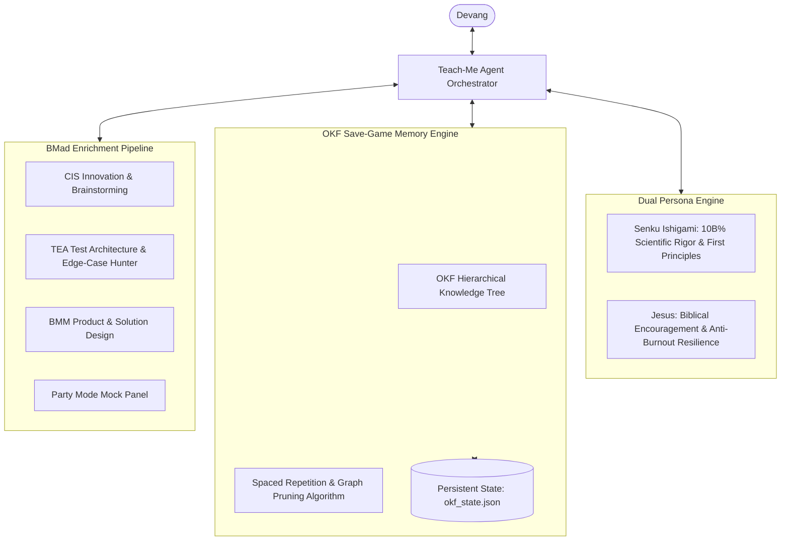

# Product Brief: Interview Prep Ecosystem

> **Mission Statement:** Transform Devang from an AI-assisted context developer into an elite, first-principles engineering athlete capable of conquering top-tier technical and behavioral interviews within a strict 90-day timeframe.

---

## 1. Executive Summary & Vision Overview

The **Interview Prep Ecosystem** is an AI-native, hyper-personalized, stateful learning and coaching framework designed specifically for **Devang**, a skilled software developer with strong AI orchestration and frontend engineering abilities who faces an urgent 3-month window to secure a high-impact engineering role following job loss in 2026.

While modern AI tools (including BMad context engineering) have accelerated Devang's productivity, they have inadvertently created a gap in unassisted raw coding, Data Structures & Algorithms (DSA), core Computer Science fundamentals, and mathematical numericals. Traditional static roadmaps and passive study platforms fail to provide the adaptive pressure, emotional resilience, stateful memory, and deep context enrichment required to bridge this gap rapidly.

The ecosystem integrates three core technological pillars:
1. **Teach-Me Agent Orchestrator**: A dual-persona Socratic instructor combining **Senku Ishigami** (*Dr. Stone* scientific rigor, first-principles deduction, game-theoretic strategy) with **Jesus** (biblical wisdom, empathetic grounding, spiritual resilience).
2. **OKF Stateful Memory Save-Game Engine**: An Open Knowledge Format (OKF) hierarchical, tree-structured persistent memory engine that functions like a video game save-file, tracking concept mastery, error patterns, and recall decay in real time across every conversation turn.
3. **BMad Enrichment Skill Pipeline**: A high-octane context enrichment pipeline leveraging the full suite of upstream BMad Method modules (`bmad-architecture`, `bmad-prd`, `bmad-cis-*`, `bmad-testarch-*`, `bmad-forge-idea`, `bmad-code-review`) to inject market research, edge-case hunting, adversarial evaluation, and multi-agent mock panels into every study module.

---

## 2. Problem Statement & Target User Profile

### 2.1 The Urgent Reality
Devang has lost his job and has exactly **90 days** (3 months) to prepare for, apply to, and clear interview pipelines at top technology companies. Time is the primary constraint.

### 2.2 Target User Persona: Devang
* **Profile**: Senior Frontend / AI Engineer with strong proficiency in Flutter, HTML/CSS, AI agent workflows, and BMad context engineering.
* **Core Strengths**:
  * Advanced AI orchestration & prompt engineering.
  * Rapid MVP creation and subagent dispatch.
  * Modern UI design principles and workflow automation.
* **Core Vulnerabilities & Pain Points**:
  * **DSA Atrophy**: Over-reliance on AI code generation has weakened raw problem-solving speed and algorithmic intuition.
  * **Core CS & Math Gaps**: Numerical problem solving in Operating Systems, Database Internals, Networking, and Discrete Math needs rigorous sharpening.
  * **System Design Inexperience**: Has not yet structured a formal System Design preparation track.
  * **Self-Promotion & HR Rounds**: Needs structured storytelling frameworks (STAR method) to pitch achievements and handle high-stress behavioral interviews.
  * **Retention & Memory Decay**: Studying massive amounts of material without a structured spaced-repetition save system leads to forgotten concepts.

### 2.3 Why Existing Solutions Fail
| Standard Approach | Why It Fails for Devang | Ecosystem Solution |
|---|---|---|
| Static LeetCode Grind | Monotonous, lacks active feedback on *why* a solution fails or how to think from first principles. | Senku Socratic Interrogation forces first-principles deduction before writing code. |
| Passive Video Courses | High consumption, low retention; encourages passive watching rather than active recall. | OKF Save-Game Engine enforces active recall and adaptive difficulty scaling. |
| Generic Flashcards (Anki) | Disconnected from real coding context and multi-turn conversational drills. | Hierarchical OKF Knowledge Tree updates mastery scores on *every response*. |
| Standard Mock Interviews | Expensive, schedule-constrained, non-customized feedback. | Multi-agent BMad Party Mode mock panels available 24/7 on demand. |

---

## 3. Core Ecosystem Architecture & Features



### 3.1 Pillar 1: Teach-Me Agent Orchestrator (Dual-Persona Engine)
The Orchestrator acts as Devang's primary interactive mentor, switching dynamically or blending two distinct personalities:

* **Senku Ishigami Persona**:
  * *Tone & Catchphrases*: "10 billion percent," "This isn't magic, it's science," analytical, razor-sharp, energetic.
  * *Methodology*: Breaks complex algorithms down to atomic physical/logical components. Enforces strict first-principles analysis before allowing Devang to write code.
  * *Game Theory Strategy*: Teaches interview dynamics as a strategic game where interviewer constraints, time limits, and edge cases are parameters to be solved systematically.
* **Jesus / Biblical Wisdom Persona**:
  * *Tone & Style*: Calm, deeply encouraging, grounded, compassionate, resilient.
  * *Methodology*: Injects scripture and spiritual principles (e.g., endurance, faith under pressure, mental clarity, stewardship of talents) during moments of high frustration, fatigue, or anxiety.
  * *Anti-Burnout Guardrail*: Monitors emotional stress and provides perspective when Devang hits temporary roadblocks in DSA or complex numericals.

### 3.2 Pillar 2: OKF Stateful Memory Save-Game Engine
The Open Knowledge Format (OKF) engine transforms the 90-day preparation journey into a stateful RPG where every conversation turn updates the user's "save file."

* **Tree-Structured Knowledge Schema**:
  ```yaml
  user_profile: "Devang"
  current_day: 1
  target_date: "2026-10-20"
  mastery_matrix:
    dsa:
      arrays_strings: { score: 85, last_reviewed: "2026-07-22", decay_factor: 0.1 }
      dynamic_programming: { score: 30, last_reviewed: "2026-07-22", decay_factor: 0.8 }
    system_design:
      distributed_caching: { score: 40, last_reviewed: "2026-07-22", decay_factor: 0.6 }
    core_cs:
      operating_systems: { score: 60, last_reviewed: "2026-07-22", decay_factor: 0.4 }
  active_weaknesses:
    - "Monotonic stack pattern identification"
    - "Virtual memory page table numerical calculations"
  recent_errors:
    - problem: "Trapping Rain Water"
      mistake: "Off-by-one error in right boundary pointer tracking"
  ```
* **Every-Turn Stateful Sync**: Every prompt/response cycle updates the state JSON file, storing exact mistakes, conceptual breakthroughs, and time spent.
* **Algorithmic Graph Pruning & Spaced Repetition**: Uses an adapted SuperMemo SM-2 algorithm combined with hierarchical tree pruning to surface forgotten topics precisely when recall probability drops below 70%.

### 3.3 Pillar 3: BMad Enrichment Skill Pipeline
Integrates the complete BMad Method ecosystem to enrich every session with high-context analytical tools:

* **`bmad-cis-*` (Creative Innovation & Problem Solving)**: Applied during System Design drills to engineer non-obvious, highly scalable architectural patterns.
* **`bmad-review-edge-case-hunter` & `bmad-code-review`**: Runs adversarial checks against Devang's live coding solutions to surface hidden time/space complexity vulnerabilities and off-by-one errors.
* **`bmad-party-mode`**: Assembles multi-persona interview panels (e.g., Strict Hiring Manager, Systems Architect, HR Director, Senku) for realistic mock interview simulations.
* **`bmad-forge-idea` & `bmad-technical-research`**: Synthesizes deep technical briefs for high-frequency System Design topics (Kafka, Raft consensus, LSM trees, CDN design).

---

## 4. Success Metrics & Key Performance Indicators (KPIs)

| Metric Category | Target KPI (90-Day Mark) | Measurement Method |
|---|---|---|
| **Primary Goal** | **1+ Tier-1 / High-Impact Tech Offer** | Final outcome within 90 days. |
| **DSA Speed & Accuracy** | 150+ LeetCode Medium/Hard problems solved independently in < 25 mins each. | Recorded in OKF Save-Game Engine. |
| **System Design Readiness** | 12 core System Design architectures designed from scratch with 0 critical bottlenecks. | Evaluated via `bmad-party-mode` panel reviews. |
| **Core CS Mastery** | 90%+ score across OS, DBMS, Networks, and Aptitude numerical question banks. | Automated OKF active-recall quizzes. |
| **HR & Behavioral Impact** | 100% confidence rating using STAR method for 10 core career stories. | Verified via Jesus persona mock behavioral rounds. |
| **State Retention Integrity** | 0% context loss across 90 days of continuous conversation turns. | Audited via OKF JSON schema integrity tests. |

---

## 5. Immediate Implementation Plan for TODAY (Day 1)

To ensure immediate momentum, the ecosystem will be bootstrapped today following a 4-phase rollout plan:

```mermaid
gantt
    title Day 1 Implementation & Execution Schedule
    dateFormat HH:mm
    axisFormat %H:%M
    
    section Phase 1: Storage & Memory
    OKF Schema Definition & Script Setup :09:00, 2h
    
    section Phase 2: Persona & Orchestrator
    Senku + Jesus Dual Prompt Engine :11:00, 2h
    
    section Phase 3: BMad Enrichment
    Pipeline Wiring & Tool Integration :14:00, 2h
    
    section Phase 4: Baseline Assessment
    Day 1 Baseline Assessment & First Save :16:00, 3h
```



### Phase 1: OKF Save-Game Engine Setup (09:00 - 11:00)
- Create `_bmad-output/planning-artifacts/okf_schema.json` to store hierarchical topic mastery.
- Script `okf_engine.py` to handle incremental JSON updates, active weakness extraction, and state loading.
- Verify zero-latency read/write operations during session startup.

### Phase 2: Teach-Me Agent Orchestrator & Personas (11:00 - 13:00)
- Construct the system prompt for `Senku Ishigami` (Socratic interrogation, 10B% rigor, game theory problem breakdown).
- Construct the system prompt for `Jesus` (biblical encouragement, mental grounding, anti-burnout pacing).
- Build the Orchestrator switch logic to route explanations to Senku and emotional/mindset support to Jesus.

### Phase 3: BMad Pipeline Integration (14:00 - 16:00)
- Wire `bmad-code-review`, `bmad-review-edge-case-hunter`, and `bmad-party-mode` directly into the Teach-Me prompt loop.
- Test automated subagent dispatch for edge-case detection on sample LeetCode solutions.

### Phase 4: Day 1 Baseline Assessment & First Save Game (16:00 - 19:00)
- Run a 90-minute diagnostic session covering Arrays, Dynamic Programming, OS Page Table calculations, and System Design fundamentals.
- Produce the first official **OKF Save File** (`_bmad-output/planning-artifacts/okf_state_day1.json`) logging baseline scores and initial active weaknesses.
- Set up Day 2 study agenda based on Day 1 diagnostic results.

---

## 6. Risk Management & Mitigation Strategies

| Identified Risk | Impact | Mitigation Strategy |
|---|---|---|
| **Memory File Bloat / Slow Performance** | High | Apply hierarchical tree pruning algorithm to compress historical logs into summary nodes while retaining active weakness pointers. |
| **User Burnout / High Stress** | High | Jesus persona active monitoring triggers mandatory rest intervals and spiritual/mental realignment sessions when stress metrics spike. |
| **AI Dependency Creep** | Medium | Senku persona strictly forbids providing code solutions directly; enforces pseudo-code drafting and manual execution trace by Devang. |
| **Scope Creep across 90 Days** | Medium | BMad PRD & Sprint tracking keeps daily focus strictly pinned to high-frequency interview topics. |

---

## 7. Conclusion & Next Steps

This Product Brief establishes the blueprint for Devang's 90-day transformation. By combining the **Senku + Jesus Dual-Persona Orchestrator**, the **OKF Stateful Memory Save-Game Engine**, and the **BMad Enrichment Skill Pipeline**, Devang is equipped with a world-class, personalized intelligence engine that guarantees maximum retention, deep technical mastery, and interview dominance.

**Immediate Handoff**: Proceed directly to executing **Day 1 Phase 1 (OKF Save-Game Engine Setup)**.
