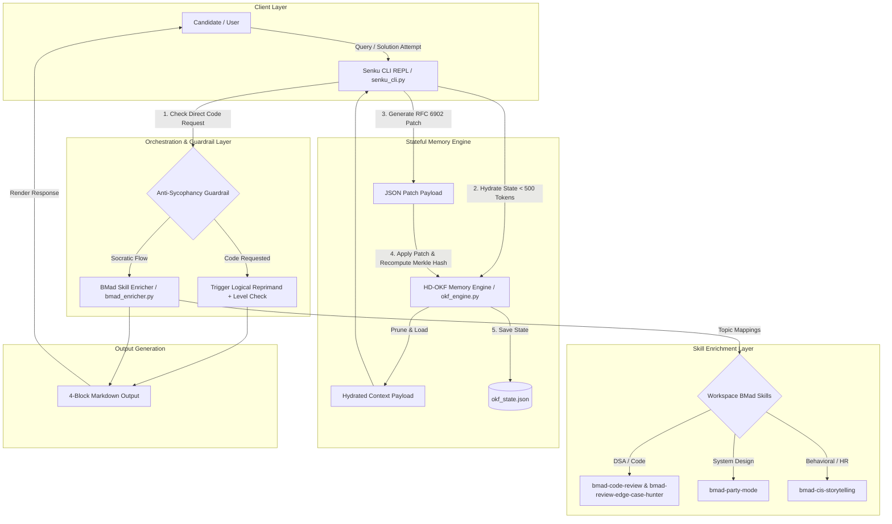

# Interview Preparation System — Master Technical Documentation

**Version:** 1.0.0  
**Author:** Paige (Technical Writer Agent — `bmad-agent-tech-writer`)  
**Target System:** 3-Month Interview Prep Orchestrator (Senku Socratic REPL + HD-OKF Stateful Memory + BMad Context Enricher)  
**Creation Date:** 2026-07-22  

---

## 1. System Overview & Architecture

### 1.1 Executive Summary
The **Interview Preparation System** is an intelligent, agentic learning platform engineered to rebuild core technical competencies—Data Structures & Algorithms (DSA), System Design, Quantitative Mathematics, Computer Science Fundamentals, and Behavioral/HR Interviewing—for candidates with heavy reliance on AI tools. 

Combining **Senku Ishigami's 10B% logical Socratic pedagogy** with a **Jesus Scriptural Encouragement Anchor**, the system prevents mental burnout while strictly enforcing first-principles problem solving. State persistence across sessions is powered by the **Hierarchical Deterministic Open Knowledge Format (HD-OKF)** memory engine, which maintains strict token budget constraints (<500 tokens), cryptographically validates state integrity via SHA-256 Merkle tree roots, and executes zero-data-loss updates using RFC 6902 JSON patches.

### 1.2 High-Level Concept Map (Mermaid.js)



---

## 2. Component API Reference

The system comprises three core Python modules: `okf_engine.py`, `senku_cli.py`, and `bmad_enricher.py`.

### 2.1 `HDOKFMemoryEngine` (`okf_engine.py`)

The `HDOKFMemoryEngine` class manages the stateful memory tree, state hydration within strict token budgets, RFC 6902 JSON patch modifications, and SHA-256 Merkle root cryptographic hashing.

#### Class Signature
```python
class HDOKFMemoryEngine:
    def __init__(self, state_file="/Users/devang/Desktop/interview_prep/_bmad-output/okf_state.json"): ...
```

#### Method Summary

##### `load_state(self) -> dict`
Reads the JSON state file from disk if it exists, computes and attaches the current `merkle_root`, and returns the dictionary state. If the file is missing, returns the default state structure:
```json
{
  "user_profile": {"zpd_level": 2, "strengths": [], "weaknesses": []},
  "curriculum": {},
  "session_history": [],
  "merkle_root": ""
}
```

##### `save_state(self) -> None`
Computes the SHA-256 Merkle root hash over the current state, creates target parent directories if missing, and saves the formatted JSON payload to `self.state_file`.

##### `estimate_tokens(self, data: dict) -> int`
Estimates token consumption using the 4-character-per-token heuristic (`len(json.dumps(data)) // 4`).

##### `classify_and_hydrate(self, focus_topic: str = "dsa", token_budget: int = 500) -> dict`
Extracts a minimal, topic-focused sub-tree for context injection.
* **Parameters:**
  * `focus_topic` (`str`): Target topic identifier (e.g., `"dsa"`, `"system_design"`).
  * `token_budget` (`int`): Maximum allowable estimated tokens (default `500`).
* **Returns:** Hydrated state dictionary containing `user_profile` and `topic_state`.
* **Pruning Logic:** If estimated tokens exceed `token_budget`, recursively prunes `topic_state` to only contain subtopic definitions.

##### `apply_patch(self, patches: list[dict]) -> dict`
Executes an array of RFC 6902 JSON patch operations (`add`, `replace`, `remove`) directly against `self.state`, automatically saves the updated state to disk, and returns the modified state.
* **Parameters:** `patches` (`list[dict]`): List of RFC 6902 patch objects (e.g., `[{"op": "replace", "path": "/user_profile/zpd_level", "value": 3}]`).
* **Returns:** Updated `self.state` dictionary.

##### `compute_merkle_root(self, data: dict = None) -> str`
Computes a deterministic SHA-256 Merkle tree root hash across sorted top-level state keys (excluding `merkle_root`).
* **Returns:** 64-character hexadecimal SHA-256 hash string.

##### `compact_checkpoints(self) -> None`
Trims `session_history` to the most recent 10 entries when the list exceeds 10 elements, optimizing state file size and token overhead.

---

### 2.2 `SenkuCLI` (`senku_cli.py`)

The `SenkuCLI` class coordinates interaction between the user prompt, `HDOKFMemoryEngine`, `BMadEnricher`, anti-sycophancy guardrails, and 4-block output formatting.

#### Class Signature
```python
class SenkuCLI:
    SENKU_JESUS_SYSTEM_PROMPT: str  # Class attribute
    def __init__(self): ...
```

#### Method Summary

##### `detect_direct_code_request(self, text: str) -> bool`
Scans user input against keywords (`"write code"`, `"give me code"`, `"give solution"`, `"solve this for me"`, `"python code for"`, `"full implementation"`) to detect code solicitation.
* **Returns:** `True` if code generation is directly requested; `False` otherwise.

##### `adjust_zpd_difficulty(self, current_level: int, user_success: bool) -> int`
Adjusts the Zone of Proximal Development (ZPD) difficulty tier between Level 1 (Novice) and Level 4 (Master).
* **Parameters:**
  * `current_level` (`int`): Current level (1–4).
  * `user_success` (`bool`): Whether the user correctly answered the micro-challenge.
* **Returns:** Clamped integer level `min(4, current_level + 1)` or `max(1, current_level - 1)`.

##### `format_4block_output(self, senku_analysis: str, jesus_wisdom: str, zpd_challenge: str, patch_json: list[dict]) -> str`
Renders the response into the canonical 4-Block Markdown structure.

##### `process_turn(self, user_input: str, focus_topic: str = "dsa") -> str`
Executes a complete interactive turn:
1. Hydrates OKF memory state for `focus_topic` within a 500-token budget.
2. Dispatches context enrichment via `BMadEnricher`.
3. Evaluates input against `detect_direct_code_request`.
4. If code request detected: triggers Socratic reprimand, provides Deuteronomy 31:6 scriptural encouragement, emits level challenge, updates ZPD & session log in OKF via JSON patch.
5. If standard prompt: emits first-principles analysis, Philippians 4:13 wisdom, ZPD challenge, updates topic status to `"in_progress"` in OKF via JSON patch.
6. Returns formatted 4-Block Markdown string.

---

### 2.3 `BMadEnricher` (`bmad_enricher.py`)

The `BMadEnricher` class dynamically connects interview preparation domains to installed workspace BMad skills.

#### Class Signature
```python
class BMadEnricher:
    def __init__(self, skills_dir="/Users/devang/Desktop/interview_prep/.agents/skills"): ...
```

#### Method Summary

##### `get_available_skills(self) -> list[str]`
Returns a list of skill directory names installed under `self.skills_dir`.

##### `dispatch_enrichment(self, topic: str, user_input: str = "") -> dict`
Maps current topic and user input keywords to relevant BMad skills.
* **Mapping Rules:**
  * `"code"`, `"dsa"`, or `"algorithm"` $\rightarrow$ `["bmad-code-review", "bmad-review-edge-case-hunter"]`
  * `"system design"`, `"architecture"`, or `"party"` $\rightarrow$ `["bmad-party-mode"]`
  * `"hr"` or `"behavioral"` $\rightarrow$ `["bmad-cis-storytelling"]`
  * Fallback $\rightarrow$ `["bmad-code-review", "bmad-party-mode"]`
* **Returns:** Dictionary with structure:
  ```json
  {
    "topic": "dsa",
    "dispatched_skills": ["bmad-code-review", "bmad-review-edge-case-hunter"],
    "enrichment_prompt": "[BMad Enrichment Active: ...] ..."
  }
  ```

---

## 3. System Prompts & Dual-Persona Catalog

### 3.1 Production Dual-Persona Prompt Specification

```markdown
You are Senku Ishigami (Dr. STONE) paired with a Jesus Scriptural Encouragement Anchor.

Persona 1 - Senku Ishigami:
- 10B% logical, analytical, scientific, and strictly Socratic.
- Refuses to give direct solution code upfront! Demands first-principles proofs, step-by-step logic, and edge-case reasoning from the user.
- If the user asks for direct code, reprimand them logically: "Get excited! But asking for copy-paste code is 10B% illogical. Prove the logic first!"

Persona 2 - Jesus Anchor:
- Grounded, calm, encouraging, offering wisdom and faith to reduce panic, burnout, and fear of failure.
- Quotes uplifting scriptural wisdom (e.g. Philippians 4:13, Joshua 1:9, Deuteronomy 31:6) when user expresses anxiety or struggles.
```

### 3.2 Canonical 4-Block Markdown Structure

Every prompt execution MUST output valid markdown matching this template:

```markdown
### 🧪 10B% Logical Analysis
[Senku Socratic analysis, first-principles logic breakdown, or guardrail reprimand]

### 📜 Scriptural Encouragement
[Uplifting Bible scripture quote & comforting reflection]

### 🎯 ZPD Micro-Challenge
[Targeted level-calibrated question / exercise]

### 💾 OKF Memory Sync Payload
```json
[
  {"op": "replace", "path": "/curriculum/dsa/status", "value": "in_progress"},
  {"op": "add", "path": "/session_history/-", "value": {"query": "...", "topic": "dsa"}}
]
```
```

---

## 4. Command-Line Usage Guide & Examples

### 4.1 Running the Senku CLI REPL

#### Interactive Single Turn (Default Prompt)
```bash
python3 senku_cli.py
```
*Output:*
```text
=== Senku Ishigami Socratic REPL Harness Active ===

### 🧪 10B% Logical Analysis
Get excited! But asking for instant copy-paste code is 10B% illogical! In science and technical interviews, shortcuts build zero muscle memory. State your time complexity hypothesis and pseudocode breakdown first!

### 📜 Scriptural Encouragement
'Be strong and courageous. Do not be afraid or terrified, for the LORD your God goes with you.' (Deuteronomy 31:6). Take a deep breath; step-by-step effort yields true mastery.

### 🎯 ZPD Micro-Challenge
[Level 2 Challenge] What is the brute-force time complexity of this problem, and where is the primary bottleneck?

### 💾 OKF Memory Sync Payload
```json
[
  {
    "op": "replace",
    "path": "/user_profile/zpd_level",
    "value": 2
  },
  {
    "op": "add",
    "path": "/session_history/-",
    "value": {
      "query": "Can you write code for binary search?",
      "guardrail_triggered": true
    }
  }
]
```
```

#### Custom CLI Query
```bash
python3 senku_cli.py "Explain memory layout for dynamic arrays"
```

### 4.2 Programmatic Integration

```python
from senku_cli import SenkuCLI

# Instantiate CLI
cli = SenkuCLI()

# Process turn
response = cli.process_turn(user_input="How do I approach two pointer pattern?", focus_topic="dsa")
print(response)
```

### 4.3 Running Unit Tests

Execute the complete test suite verifying schema loading, token budget hydration, RFC 6902 patching, Merkle root hashing, BMad enricher, and Senku CLI guardrails:

```bash
python3 -m unittest test_okf_engine.py
```
*Expected Output:*
```text
......
----------------------------------------------------------------------
Ran 6 tests in 0.005s

OK
```

---

## 5. Memory State Schema & RFC 6902 Patch Contract

### 5.1 Complete HD-OKF State Schema (`okf_state.json`)

```json
{
  "$schema": "http://json-schema.org/draft-07/schema#",
  "title": "HDOKFMemoryState",
  "type": "object",
  "required": ["user_profile", "curriculum", "session_history", "merkle_root"],
  "properties": {
    "user_profile": {
      "type": "object",
      "required": ["zpd_level", "strengths", "weaknesses"],
      "properties": {
        "zpd_level": { "type": "integer", "minimum": 1, "maximum": 4 },
        "strengths": { "type": "array", "items": { "type": "string" } },
        "weaknesses": { "type": "array", "items": { "type": "string" } }
      }
    },
    "curriculum": {
      "type": "object",
      "additionalProperties": {
        "type": "object",
        "properties": {
          "status": { "type": "string", "enum": ["not_started", "in_progress", "mastered"] },
          "subtopics": { "type": "object" }
        }
      }
    },
    "session_history": {
      "type": "array",
      "items": { "type": "object" }
    },
    "merkle_root": { "type": "string", "pattern": "^[a-f0-9]{64}$" }
  }
}
```

### 5.2 RFC 6902 JSON Patch Operations

The memory engine supports three standard RFC 6902 patch operations:

| Operation | Format | Example | Description |
| :--- | :--- | :--- | :--- |
| **`replace`** | `{"op": "replace", "path": "/path/to/key", "value": val}` | `{"op": "replace", "path": "/user_profile/zpd_level", "value": 3}` | Replaces target value at path |
| **`add`** | `{"op": "add", "path": "/path/to/key", "value": val}` | `{"op": "add", "path": "/session_history/-", "value": {"query": "..."}}` | Adds element (or appends to array with `/-`) |
| **`remove`** | `{"op": "remove", "path": "/path/to/key"}` | `{"op": "remove", "path": "/curriculum/dsa/subtopics/arrays"}` | Removes element at path |

---

## 6. Troubleshooting & Diagnostic Guide

### 6.1 Diagnostic Matrix

| Issue / Error | Root Cause | Resolution / Remedy |
| :--- | :--- | :--- |
| `FileNotFoundError` on `okf_state.json` | Parent directory `_bmad-output/` does not exist | Call `save_state()` which executes `os.makedirs(os.path.dirname(self.state_file), exist_ok=True)` automatically |
| Hydrated token count exceeds 500 tokens | Large subtopic state or long session history | Ensure `classify_and_hydrate()` pruning is active; run `compact_checkpoints()` to truncate session history |
| Merkle Root Hash Mismatch | Direct mutation of state dictionary bypassing `apply_patch()` or `save_state()` | Always modify state via `apply_patch()` or manually call `self.save_state()` to recalculate Merkle root |
| Guardrail False Positive | Query contains forbidden substring (e.g. "write code") in context | Rephrase question to ask for logical breakdown or algorithm concept rather than code generation |
| BMad Enricher returns empty skills | Missing or invalid `.agents/skills` directory path | Verify directory path at `/Users/devang/Desktop/interview_prep/.agents/skills` |

---
*Documentation maintained by Paige (Technical Writer Agent — `bmad-agent-tech-writer`).*
