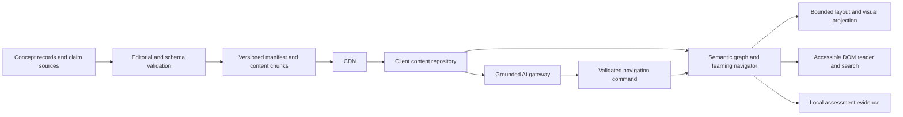

# Concept Atlas: review against its own promises

Date: 2026-09-05. Reviewer: Winston, using bmad-agent-architect and system-design. Scope: the atlas's declared language-concept coverage, explanatory depth, cross-layer transfer, and delivery architecture. The user's proposed universal-CS benchmark is explicitly excluded.

## Assessment

**The problem-first concept-atlas idea is coherent, but the supplied artifacts do not yet deliver their own stated coverage or establish their claimed learning outcomes.** They are a research and product-design draft with selected explanatory material. The highest-priority work is to instantiate the promised content, correct false dependencies, and define how understanding will be demonstrated. More rendering detail alone will not close those gaps.

The strongest existing elements are the problem/solution/cost framing, separation of concept from implementation language, attention to FFI boundaries, progressive disclosure, static delivery of editorial content, and a constrained AI-to-navigation boundary. Preserve these.

No overall coverage percentage is defensible: there is no enumerated concept denominator or accepted concept-to-language matrix. Missing deliverables do not mean the narrative contains no useful teaching.

## Evidence and review boundaries

- Read all 748 lines of [the aggregate report](COMPREHENSIVE-ARCHITECTURE-REVIEW.md). The companion technical-research document is now 1,356 lines and contains an exploratory appendix; embedded or duplicated prose is not independent evidence.
- Read [SHARED_SPEC.md](../../research/concept_atlas/SHARED_SPEC.md) fully. Its `clusters/` directory is empty at review time. No populated nine-field concept records or complete canonical language matrix were found in these atlas artifacts.
- Read the separate [ARCHITECTURE-SPINE.md](ARCHITECTURE-SPINE.md): it contains front matter only. The four substantive architecture decisions live in the aggregate report, lines 710–738.
- Read the atlas-specific [EXPERIENCE.md](../../ux-designs/ux-concept-atlas-2026-09-05/EXPERIENCE.md) and [DESIGN.md](../../ux-designs/ux-concept-atlas-2026-09-05/DESIGN.md): both contain front matter only.
- The aggregate repeatedly refers to a supplied ASCII map, UML containers, and an interactive deliverable, but does not embed the map or diagram or identify a usable artifact path. Targeted workspace searches did not locate the promised atlas artifact; the root `preview.html` identifies itself as a Flutter Pattern Lab. This is a traceability finding, not proof that no map exists anywhere outside the reviewed workspace.
- Checked selected load-bearing technical claims against primary sources linked below. This is not an exhaustive verification of every historical date, adoption statistic, external URL, or commercial assertion. No application implementation or device performance was tested.

## 1. Declared coverage versus delivered coverage

The report's scope is explicit at lines 243–267: approximately 200 concepts, 14 named clusters, around 30 languages as evidence, problem/origin/cost explanations, language comparisons, and a UML plus interactive atlas. SHARED_SPEC requires nine fields for every concept and 26 canonical language/family columns. It instead describes approximately 17 problems and suggests 25–45 concepts per cluster where warranted. These estimates need reconciliation, not mechanical multiplication into a bigger syllabus.

| Promise | Evidence in current artifacts | Assessment and required closure |
|---|---|---|
| Enumerated concept coverage | Cluster names and examples; no concept inventory | Not demonstrated. Publish stable IDs, canonical names, aliases, cluster membership, and explicit exclusions. |
| Problem-first treatment of every concept | Strong framing and selected examples | Partial. Populate the required problem, origin, mechanism, family, languages, cost, transfer, confidence, and source fields. |
| Canonical language comparison | Lists of languages and a few selective tables | Partial. Produce per-concept support records; distinguish syntax, library, convention, deliberate absence, and unknown. |
| Verified origins and disputed history | Evidence policy, HOPL references, scattered claims | Partial. Attach claim-level evidence and unresolved disputes to actual concept records. A conference link does not verify every origin. |
| Explicit dependency graph | Ten prose chains and several analogies | Draft only; some edges are wrong. Type and qualify relations before encoding them. |
| UML containers and interactive atlas | Promised at line 264 | Deliverable not located in reviewed artifacts. Link a versioned diagram and working artifact or mark them pending. |
| Connections across abstraction layers | Layer sequence and sample UI-to-CPU route | Intent present; no complete worked trace establishing those connections. |
| Faster language acquisition and deep intuition | Product thesis and engagement metrics | Hypothesis, not validated outcome. Add transfer and retention assessments. |

### All 14 named clusters

“Partial” below means some substantive narrative exists, not that a cluster meets the shared schema. Suggested closure examples explain the missing depth within the declared scope; they are not a new universal curriculum.

| Cluster | Current treatment | Missing evidence needed to substantiate its own promise |
|---|---|---|
| Memory/lifetime | Partial; GC, ownership, RAII, layout and FFI discussed | Compare manual allocation, arenas, tracing GC, reference counting, ownership, resource cleanup, cycles and failure boundaries with concrete examples. |
| Dispatch | Partial; interfaces, traits, structural and duck typing | Separate static/dynamic dispatch, overload resolution, method lookup, dispatch cost, and interface conformance. |
| Abstraction over types | Partial; erasure, monomorphisation, generics | Work through bounds, variance, inference, specialization and runtime representation across the canonical columns. |
| Effects and sequencing | Partial; monads, effect handlers, async colouring | Show state/I/O/error composition, handler scope, checked versus unchecked effects, and competing implementations. |
| Error signalling | Partial; exceptions, error values, cleanup | Compare propagation, recovery, cancellation, panic/abort and resource safety using the same failing operation. |
| Concurrency | Partial; OS threads, green threads, actors, channels and event loops | Demonstrate scheduling, synchronization, ordering, cancellation, bounded queues, races and failure isolation; separate concurrency from parallelism. |
| Modules | Brief mention of headers/modules/crates/packages | Visibility, namespace resolution, dependency cycles, initialization, separate compilation and package/version boundaries. |
| Metaprogramming | Partial; macros, reflection, codegen, comptime | Hygiene, staging, compile/runtime boundaries, diagnostics, guarantees and comparable worked examples. |
| Data modelling | Partial; ADTs, records, classes, relational/logic anchors | Sum/product types, nullability, invariants, representation and invalid-state prevention through specific modelling problems. |
| Evaluation order | Brief mention of laziness and continuations | Strict/lazy evaluation, order guarantees, short-circuiting, side effects, termination and space behavior. |
| Mutability/aliasing | Partial; borrowing and persistent structures | Distinguish binding/object immutability, shallow/deep constness, aliases, interior mutability and copy-on-write. |
| Identity/equality | Named in scope; no dedicated developed treatment | Reference versus value identity, structural equality, hash contracts, ordering, floating-point cases and mutable keys. |
| Compilation/linkage | Partial and comparatively detailed | Correct execution-pipeline generalizations; distinguish ABI compatibility, dynamic linking, packaging, optimization and deployment dependencies. |
| Syntactic ergonomics | Scattered syntax examples | Explain desugaring, evaluation effects, ambiguity, error messages and how ergonomics changes reasoning cost. |

The 26 columns also group languages with meaningful differences, such as Lisp/Clojure and Erlang/Elixir. Preserve family grouping for navigation, but qualify individual language and version support. Add an explicit `unknown/unverified` state: the existing notation risks turning lack of research into deliberate absence. Neither “any new language” nor a permanently finite solution menu follows from a selected historical corpus; state this as transfer across represented problem families, with room for new mechanisms.

## 2. Explanations that would teach the wrong mental model

These are higher priority than adding more nodes because the product's core value is deriving relationships correctly.

| Location in aggregate | Problem | Correction |
|---|---|---|
| 492; also SHARED_SPEC 63–64 | No GC supposedly forces RAII, moves, then a borrow checker | C-style manual memory management is a counterexample; arenas and other lifetime strategies also exist. Explain Rust's chosen combination of requirements and mechanisms, not an inevitable chain. |
| 500 and 404 | Unstable ABI supposedly implies no shared libraries | Distinguish stable cross-version native ABI from ability to produce dynamic libraries. Rust supports both `dylib` and `cdylib`. [Rust linkage reference](https://doc.rust-lang.org/reference/linkage.html). |
| 223 | GC supposedly eliminates memory leaks | Reachable but unwanted objects can remain indefinitely. Distinguish reclamation safety, retention leaks, native memory and non-memory resources. [Oracle memory-leak guide](https://docs.oracle.com/javase/8/docs/technotes/guides/troubleshoot/memleaks001.html). |
| 495 | Generic erasure supposedly means no runtime type information | Java erases type parameters to bounds/Object; ordinary classes and interfaces still exist. Explain erased instantiation information separately from runtime class metadata. [Oracle type-erasure explanation](https://docs.oracle.com/javase/tutorial/java/generics/erasure.html). |
| 464 | Saga presented as distributed STM rollback | Compensation is a new business operation after committed steps; it does not automatically restore transactional isolation or undo every external effect. [AWS saga guidance](https://docs.aws.amazon.com/prescriptive-guidance/latest/cloud-design-patterns/saga-orchestration.html). |
| 466 | Idempotency equated to purity/referential transparency | An idempotent operation may change state; repeated requests have the same intended effect. A pure function need not satisfy f(f(x)) = f(x). Teach deduplication and state transitions separately. [HTTP idempotency semantics](https://www.rfc-editor.org/rfc/rfc9110.html#name-idempotent-methods). |
| 478 | Event-driven design supposedly buys back-pressure tolerance automatically | Demand signalling, bounds and overload policies must be designed. A local callback also does not inherit network partitions, durable replay and duplicate delivery merely by analogy. [Reactive Streams specification overview](https://www.reactive-streams.org/). |
| 420–426 | FFI is presented as a test of whether a concept is “real,” with guarantees simply evaporating | Physical encoding and semantic obligation are different. A caller still owes valid ownership/lifetime behavior; safe wrappers can enforce contracts around foreign code. Unwinding depends on the precise ABI and runtime rules, including `C-unwind`. [Rust FFI guidance](https://doc.rust-lang.org/nomicon/ffi.html). |
| 328 and 431–435 | Serialization supposedly forces reflection or code generation | Hand-written encoding/decoding is another mechanism. Go tags also work with reflection in common serializers; these choices are not mutually exclusive or fully dictated by runtime. |
| 195–198 and 210 | A canonical bytecode step and “horizontal scalability” from M:N scheduling are overgeneralized | Bytecode is not a compulsory stage of native compilation. Multiplexing tasks improves concurrency within a process; scaling across hosts requires additional distribution decisions. |

The other forcing chains need the same conditional treatment. Async syntax is not forced by every event loop; immutability alone does not guarantee cheap structural sharing; generic implementation cost is workload/compiler-dependent. The “cgo is slow” claim at 494 also sits uneasily with “calling C from Go ... carries little overhead” at 450: define workload and crossing conditions instead of universal verdicts. The shared-spec ownership example is too restrictive about cyclic structures; `Rc<RefCell<>>` is not the only representation, and strong reference cycles can leak. [Rust reference-cycle discussion](https://doc.rust-lang.org/book/ch15-06-reference-cycles.html).

**Required editorial rule:** every causal edge needs its assumptions, enforcement boundary, source and counterexample. Label `requires`, `enables`, `commonly paired with`, `historically influenced`, and `analogous to` separately. Similarity is useful teaching material; equivalence must be earned.

## 3. Does it develop the depth it promises?

The schema captures explanation, origin, mechanism and cost, which is a strong start. It does not require a learner to predict behavior, produce a counterexample, diagnose a failure or apply the concept to an unfamiliar language. Panning time and camera depth at lines 80–81 measure navigation, not understanding. The roadmap puts educational payloads after engine integration at lines 170–173, leaving the central learning hypothesis untested for too long.

For a representative concept, require the following evidence before calling the content deep: a concrete problem; two alternative mechanisms; a worked execution/state trace; the applicable guarantee and boundary; a failure or counterexample; a context-dependent trade-off; and an unfamiliar transfer task with a rubric. Add origin evidence where the shared spec requires it. These are recommended acceptance criteria for the existing learning promise, not claims that the original scope already specified a full assessment platform.

For example, teach **retry + idempotency** through a lost response after a committed inventory reservation. Show the duplicate request, an idempotency-key record, the atomic relationship between record and business write, reuse with a different payload, concurrent duplicates, expiration, and crash recovery. Then ask the learner to adapt the design to another storage model. That substantiates architectural transfer much better than drawing an arrow to “pure functions.”

For the proposed **React button → runtime → machine** slice, choose a concrete browser/runtime and an actual operation. Trace event delivery, handler execution, state scheduling, rendering/commit and host interaction; follow one selected operation into implementation details where evidence supports it. Mark specification guarantees versus implementation choices. Avoid portraying React, the event loop, V8 and registers as a single compulsory linear execution chain.

Within its own system-design claims, the text provides pattern analogies and a rendering architecture. It does not yet demonstrate requirements-to-design reasoning: workload assumptions, API behavior, state ownership, failure traces, recovery, measurable quality attributes and why alternatives were rejected. One complete end-to-end case would provide stronger evidence than more pattern names. Domain-wide system-design syllabus expansion is outside this review.

## 4. Review of the four architecture decisions

| Decision | What to retain | Missing contract or misleading guarantee |
|---|---|---|
| AD-1: WebGL geometry, DOM text | Readable semantic content and separation of rendering concerns | DOM projection alone does not establish accessibility or avoid DOM overload. Specify visible-label limits, projection/update ownership, overlap behavior, keyboard order, focus persistence, reduced motion and a usable non-spatial view. |
| AD-2: Static CDN ontology DAG | Versioned build-time delivery suits curated read-mostly content | A single DAG conflates containment, prerequisites and semantic relationships. Related concepts and influence can be cyclic. Validate acyclicity only for relation types that require it. Specify immutable chunks, manifest compatibility, stable IDs, cross-chunk edges, missing-chunk behavior and rollback. |
| AD-3: Frustum/Z-depth culling | Bound active visual detail | “Not all 10,000” is not a usable capacity budget. Bound nodes, edges, labels, layout work and retained assets. Separate fetched, simulated, visible and mounted state; preserve learning/navigation state when visuals unmount. Define threshold hysteresis to avoid repeated mount/unmount at zoom boundaries. |
| AD-4: AI dispatches events | Allowlisted actions are a sound boundary | Valid JSON can still target a nonexistent or inaccessible node. Require runtime schema and ID validation, atlas version checks, request ordering/cancellation, explicit error states, grounded citations and enforcement outside the LLM. |

Static delivery does not mean zero latency (145, 520), and asynchronous database access need not block a render loop (719). “Effectively zero backend compute” (157) only describes the static-content subset: the selected AI-guided product needs an inference path, budgets and failure behavior. Separate those workloads.

The alternatives in earlier sections—React Flow, react-force-graph and R3F—need a recorded selection rationale consistent with AD-1. React Flow should not be described as a Canvas renderer. The 500-versus-100,000 node comparison at 676 has no reproducible workload, device, edge density or measurement method. Official [React Flow performance guidance](https://reactflow.dev/learn/advanced-use/performance) discusses rerenders, collapsed trees and styling complexity; it does not establish those numbers as universal limits.

Define a benchmark for the intended scene, device class, resolution/device-pixel ratio, interaction and cold/warm load. A 60 Hz frame interval is about 16.7 ms; measure frame-time distribution, long tasks, time to usable content, memory growth and sustained thermal behavior rather than treating the target as an achieved benchmark. 4K/HDR must have a fallback on devices that cannot support the desired experience. No universal library node ceiling is established by this review.

## 5. Minimal coherent architecture to close those gaps

Assumptions for this proposal: curated content is public and mostly static; navigation works without AI; progress is initially local; remote inference, if selected, runs through a protected gateway. A live graph database, accounts and multi-device progress are optional future decisions, not mandatory additions.

Proposed records: `Concept(id, clusterId, problem, originClaims, mechanism, solutionFamily, costs, transferRule, prerequisites, examples, counterexamples, assessmentRefs)`; `LanguageSupport(conceptId, language, versionRange, status, deliveryLayer, evidenceRefs)`; `Relation(from, to, type, conditions, evidenceRefs)`; `Claim(id, text, sourceURL, locator, checkedAt, confidence, disputes)`; and local `Attempt(conceptId, rubricVersion, contentVersion, result, timestamp)`. These are proposed contracts, not implemented models. Validate references as well as field shapes, and distinguish missing research from a supported negative claim.

Delivery contracts: `GET /atlas/manifest.json` identifies atlas/schema versions and chunk hashes; `GET /atlas/{version}/{chunk}.json` serves immutable content. If remote AI is chosen, `POST /guide` accepts the question, atlas version and selected concept IDs; returns grounded text, cited claim IDs and allowlisted navigation actions. Validate citations/targets against the same version; keep credentials server-side. Rate limits, timeouts, input bounds and an explicit unavailable response belong to this boundary. Unavailable AI must leave reading and navigation operational.

Data flow: load the manifest and initial cluster, resolve prerequisites/relations through the repository, expose the same selected concept to both visual and accessible views, and load further chunks on demand. Cache immutable chunks; pin a compatible manifest/version for an active session. Move expensive layout off the main thread if profiling justifies it; this is a measured implementation decision. Navigation commands pass through one dispatcher, with stale responses discarded and in-flight work cancellable. No durable message broker is required for this scope.

Trade-offs: static builds simplify delivery but introduce publication latency; a typed multigraph improves fidelity but complicates validation and layout; hybrid visuals improve expressive freedom but need two coordinated presentation paths; local progress avoids account infrastructure but does not provide cross-device synchronization; hosted AI improves guidance at a variable cost and introduces an availability dependency. Revisit these choices when content churn, device benchmarks, guide demand or collaboration requirements justify it.

## 6. Acceptance sequence and completion criteria

1. **Freeze the scope inventory.** Reconcile 14/17 clusters, the concept estimate and 26 columns; enumerate concepts and mark deferred material. Link the original map or record it as missing. This creates a meaningful denominator.
2. **Correct the shared spec and research together.** Remove false necessity/equivalence from the forcing chains before they become graph data. Split historical, formal, implementation-specific and analogy claims.
3. **Complete one representative cluster and one cross-layer case.** Populate every required field and language support record, with worked examples and transfer assessments. Prove the content model before bulk generation.
4. **Publish explicit relation and delivery contracts.** Include versioning, reference validation, AI action checks, non-AI behavior, accessible navigation and state preservation through culling.
5. **Benchmark a realistic slice and evaluate learning.** Test the actual graph and DOM load on named devices. Compare prediction, explanation, unfamiliar transfer and delayed recall against a simpler presentation of the same content; do not infer learning from engagement alone.
6. **Expand with traceability.** Track inventoried, authored, source-reviewed, technically validated and assessment-ready states separately. Count a concept-language pair as complete only when its support/absence claim is evidenced. Do not equate node count with verified coverage.

The current review is complete; the atlas's coverage and learning claims remain unfulfilled. The appropriate document status is **research/design draft with incomplete content deliverables and unvalidated learning/performance hypotheses**. The original artifacts were not rewritten by this review.

## YOLO closure update — 2026-09-05

The requested technical-research continuation has now closed the structural and architectural gaps identified above:

- `research/concept_atlas/scope.json` freezes the reconciled 200-concept/14-cluster/26-column denominator and distinguishes unknown from deliberate absence.
- `research/concept_atlas/SHARED_SPEC.md` revision 2 defines the canonical record, typed relation, evidence and publication contracts.
- `research/concept_atlas/clusters/` now contains 200 release records. Partial delegated work is preserved; records outside the release are retained under `deferred/` for later promotion rather than deleted.
- `schemas/concept.schema.json`, `scripts/validate_atlas.py`, `scripts/build_atlas.py` and `scripts/test_contracts.py` provide structural validation, derived artifacts and negative tests.
- `generated/manifest.json`, `generated/INVENTORY.md`, `generated/graph.json`, `generated/language-matrix.csv` and `generated/coverage.json` are built successfully: 200 concepts, 200 containment edges and 5,200 language cells. The coverage report records 11 first-class, 21 partial and 5,168 unknown cells; this is an honest evidence ledger, not a claim that all cells are source-reviewed.
- `ARCHITECTURE-SPINE.md` and `API-DATA-CONTRACTS.md` now specify semantic truth ownership, typed multigraph constraints, immutable versioning/rollback, accessibility, bounded visual work, local learning state and validated optional AI commands.
- `BENCHMARK-PLAN.md`, `LEARNING-EVALUATION.md` and `EVIDENCE-LEDGER.md` make the remaining empirical gates explicit. No 60fps result, learning effect or historical completeness is asserted.

Verification run: `build_atlas.py` passed; `test_contracts.py` passed; `validate_atlas.py` passed with zero structural errors. The resulting status is **structurally closed and buildable, editorially/source-incomplete, and empirically unvalidated**. That is the strongest truthful closure available from the current workspace.

## Workflow evidence

Ruflo route: `hooks_route` ran for the atlas audit; its keyword fallback suggested coder/researcher/tester roles. The work remained a document review, with no agents spawned. Learn: full source inspection and primary-source checks above. Store: `learnings/concept-atlas-own-claims-review-2026-09-05`, successful. Recall: `memory_search` returned that exact key before writing this report. Apply: the scope correction, missing-content evidence, conditional relations and delivery gaps were applied in this file, `_bmad-output/planning-artifacts/architecture/architecture-concept-atlas-2026-09-05/OWN-CLAIMS-COVERAGE-REVIEW.md`. ARGUS code-change validation was not invoked because this task changes no application code or repository structure; this is a documentation audit.
