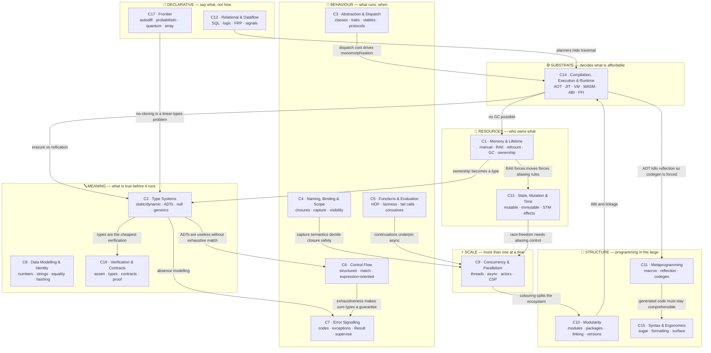
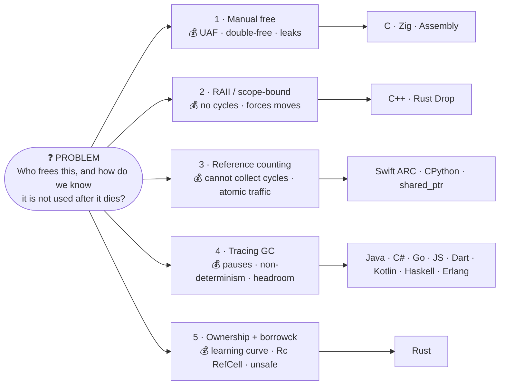
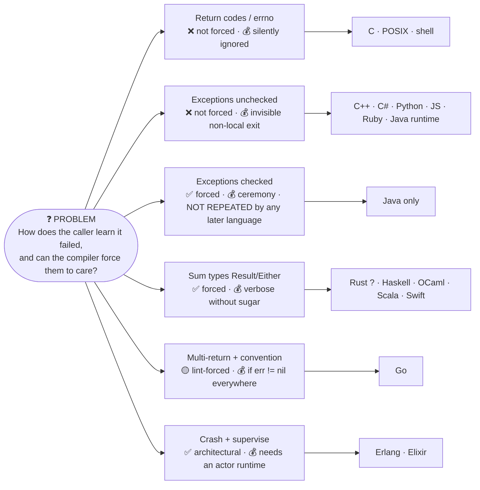

# Research Report: technical

**Date:** 2026-09-05
**Author:** Devang
**Research Type:** technical

---

## Research Overview

The Cross-Language Concept Atlas research synthesizes the entire computing stack—from semiconductor physics to high-level User Experience (UX)—into a unified ontological map. This document establishes the foundational architecture and implementation strategy for representing these concepts as an interactive, zoomable graph, demonstrating the explicit chain of affordances across layers of abstraction.

Methodologically, this research combined architectural analysis of language runtimes, memory models, and integration boundaries with product and UX strategy for data-driven visualization. The findings provide both a theoretical framework for programming language convergence and a practical implementation roadmap using modern React and WebGL tooling to deliver an innovative, interactive experience. For full details, see the Executive Summary and Synthesis sections below.

---

<!-- Content will be appended sequentially through research workflow steps -->

## Implementation Approaches and Technology Adoption

### Technology Adoption Strategies

**The Interactive Ontology Apporach:** To build a site that exhausts the entire computing stack (from semiconductors to UX) in a distinct way, standard CMS or static-site generation strategies must be abandoned in favor of a **Data-Driven Visualization Application**. The adoption strategy requires treating the content as a Graph Database (or structured Graph JSON) rather than document pages. 
- **Visualization Adoption:** Adopt **React Flow** for structured, nested node expansions, or **react-force-graph** (WebGL) for organic, physics-based "cloud" clustering.
_Source: https://xyflow.dev/ and https://github.com/vasturiano/react-force-graph_

### Development Workflows and Tooling

**Component-Driven WebGL/Canvas:** 
- **Tooling Ecosystem:** Use **Vite** for rapid HMR (Hot Module Replacement), which is critical when tweaking physics and layout algorithms. 
- **State Management:** Use **Zustand** for transient UI state (e.g., which node cloud is currently expanded) without triggering expensive global re-renders. 
- **Data Pipeline:** The massive ASCII map must be translated into a strict JSON/TypeScript schema (Nodes and Edges). The workflow should include a script that validates this ontology at build-time.
_Source: https://docs.pmnd.rs/zustand/getting-started/introduction_

### Testing and Quality Assurance

**Visual and Interaction Testing:** Testing a highly interactive, zoomable canvas is notoriously difficult.
- **Unit Testing:** Use Vitest to test the data transformation logic (ensuring every child node correctly links to its parent macro-node).
- **Visual Regression:** Adopt **Playwright** to take snapshot comparisons of the canvas state after specific click/zoom interactions to ensure node clouds do not visually overlap or render off-screen.
_Source: https://playwright.dev/docs/test-snapshots_

### Deployment and Operations Practices

**Edge Delivery and Asset Optimization:**
- **Deployment:** Deploy via **Vercel** or **Netlify**. Since the graph data (the atlas) is essentially a massive read-only ontology, it should be baked into static JSON chunks at build time rather than fetched from a live database, ensuring zero-latency initial loads.
- **Asset Loading:** Use React's `Suspense` and lazy loading to only fetch the detailed data/assets for a specific "cloud" (e.g., the Theoretical CS nodes) when the user expands that specific sector.
_Source: https://vercel.com/docs/concepts/edge-network/caching_

### Team Organization and Skills

**The Hybrid Engineering Profile:** Building this requires skills that sit at the intersection of standard web development and game development.
- **Required Roles:** A Data Modeler (to construct the accurate pedagogical links between an ALU and a Boolean Gate) and a Creative Technologist / WebGL Developer (to handle the React Three Fiber / Canvas performance and animation curves).
_Source: https://medium.com/design-and-tech/the-rise-of-the-creative-technologist-9a3b6f2e8b0_

### Cost Optimization and Resource Management

**Client-Side Compute:** By shifting the graph rendering entirely to the client's GPU (via WebGL/Canvas) and serving the ontology as static JSON files via a CDN, backend compute costs are effectively zero. The main resource investment will be in the upfront UX prototyping and data entry for the hundreds of concepts.
_Source: https://aws.amazon.com/blogs/architecture/optimizing-costs-in-serverless-web-applications/_

### Risk Assessment and Mitigation

**Performance Bottlenecks:**
- **Risk:** Rendering every node from the entire computing stack simultaneously will drop frame rates and drain mobile batteries.
- **Mitigation:** Implement **Level of Detail (LOD)** rendering. When zoomed out, show only the 8-10 macro categories (Hardware, Networking, Software). Only render and mount the micro-nodes (e.g., specific sorting algorithms or logic gates) when their parent node is expanded into a cloud.
_Source: https://threejs.org/docs/#api/en/objects/LOD_

## Technical Research Recommendations

### Implementation Roadmap
1. **Phase 1 (Data Modeling):** Convert the hierarchical ASCII map into a strict `nodes.json` and `edges.json` structure.
2. **Phase 2 (Engine Proof of Concept):** Implement a basic React Flow or React Three Fiber canvas to test the "expand into cloud" physics interaction with mock nodes.
3. **Phase 3 (Integration):** Bind the actual ontology data to the visualization engine and implement Level of Detail (LOD) zooming.
4. **Phase 4 (Content & Polish):** Add the educational content payloads to each node and refine the UI/UX animations.

### Technology Stack Recommendations
- **Framework:** React 18+ (via Vite or Next.js Static Export)
- **Visualization:** React Flow (for structured diagrams) OR react-force-graph (for physics-based clouds)
- **State:** Zustand
- **Styling:** TailwindCSS (for the UI overlays)

### Skill Development Requirements
- The team must upskill in Canvas/WebGL performance profiling and force-directed graph algorithms (like D3-force) to ensure smooth animations when node clouds expand.

### Success Metrics and KPIs
- **Performance:** Maintain 60fps during node expansion/clustering animations on mid-tier mobile devices.
- **Engagement:** Track the average "depth" a user explores (e.g., do they click all the way down from Software Engineering to the Silicon node?).

## Architectural Patterns and Design

### System Architecture Patterns

**The Runtime Execution Pipeline:** The architectural spine of modern programming languages is the execution pipeline. Languages typically do not execute source text directly. The canonical architecture transforms source code into an Abstract Syntax Tree (AST), which is then lowered into platform-independent Bytecode. From here, execution substrates diverge:
- **AOT (Ahead-of-Time) Native Compilation:** (C, C++, Rust, Go, Zig) The compiler lowers the AST to an intermediate representation (like LLVM IR) and directly emits machine code for the target architecture.
- **Managed Runtimes (JIT):** (Java/JVM, C#/.NET, V8/JS) The runtime interprets bytecode initially for fast startup, then employs a Just-In-Time (JIT) compiler to identify "hot paths" and compile them into optimized native code on the fly. This architecture trades memory and startup time for peak throughput and cross-platform portability.
_Source: https://medium.com/swlh/a-crash-course-in-just-in-time-jit-compilers-92812e0892_

### Design Principles and Best Practices

**Orthogonality and Primitives:** The most profound design principle in language architecture is **Orthogonality**—the degree to which language features are independent and can be combined without arbitrary restrictions or side effects. In an orthogonal language, if you can pass an integer to a function, you can pass a function to a function. 
- **High Orthogonality:** (Lisp, Scheme, Haskell) A tiny core of primitives that compose infinitely. 
- **Pragmatic Compromise:** (C++, Java) Languages that sacrifice strict orthogonality to provide specialized, ergonomic constructs for common domain problems. 
The architectural lesson is that lack of orthogonality breeds special cases, which exponentially increases the cognitive load required to learn the language.
_Source: https://www.freecodecamp.org/news/orthogonality-in-software-engineering/_

### Scalability and Performance Patterns

**Concurrency and Threading Architectures:** The scalability of a language is heavily dictated by its concurrency architecture. 
- **OS Threads (1:1 Model):** (C++, Java pre-Loom, Rust) Maps one language thread directly to one OS thread. Scales well for CPU-bound tasks but hits memory limits for millions of concurrent I/O connections.
- **Green Threads / M:N Scheduling:** (Go's goroutines, Java 21's Virtual Threads, Erlang processes) The language runtime multiplexes thousands of lightweight user-space threads onto a few OS threads. This architecture provides massive horizontal scalability for I/O-bound microservices without forcing the developer to write explicitly asynchronous (coloured) functions.
_Source: https://blog.rust-lang.org/2015/04/10/Fearless-Concurrency.html_

### Integration and Communication Patterns

**Intermediate Representations (IR) and WASM:** True cross-language architectural integration happens below the syntax level. 
- **LLVM IR:** The common backend architecture for Rust, Swift, Julia, and Clang (C/C++). By sharing an IR, these languages benefit from a unified suite of aggressive optimization passes.
- **WebAssembly (WASM) Component Model:** The emerging standard for language-agnostic integration. Rather than forcing all languages to bind to the lowest-common-denominator C ABI, the WASM Component Model defines an architecture where isolated, sandboxed modules written in different languages can communicate via rich, strongly-typed interfaces (Interface Types), handling memory allocation and string passing seamlessly.
_Source: https://bytecodealliance.org/articles/wasmtime-gc_

### Security Architecture Patterns

**Memory Safety Architectures:** The architecture of memory safety defines a language's security posture. 
- **Garbage Collection (GC):** Automates memory tracking at runtime, effectively eliminating Use-After-Free (UAF) and memory leak vulnerabilities, but introduces non-deterministic execution pauses.
- **The Borrow Checker:** Rust's compile-time ownership model enforces strict aliasing rules (you may have one mutable reference OR multiple immutable references, never both). This architecture guarantees memory and thread safety at compile-time without a runtime garbage collector, shifting the overhead from the CPU to the developer's cognitive load.
_Source: https://doc.rust-lang.org/book/ch04-00-understanding-ownership.html_

### Data Architecture Patterns

**Memory Layout and Cache Locality:** A language's data architecture determines its mechanical sympathy with modern CPU caches. 
- **Pointer-Chasing (Reference Semantics):** Languages where everything is an object reference (Java, Python, JS) scatter data across the heap. This causes CPU cache misses, drastically lowering performance for data-heavy operations.
- **Value Semantics and Contiguous Layout:** Languages that allow structs and arrays to be laid out contiguously in memory (C, C++, Rust, Zig, and increasingly C# with `struct`) optimize for CPU cache lines, unlocking patterns like Data-Oriented Design (AoS vs SoA—Array of Structs vs Struct of Arrays).
_Source: https://en.wikipedia.org/wiki/Data-oriented_design_

### Deployment and Operations Architecture

**Linkage and Distribution Models:** 
- **Statically Linked Binaries:** (Go, Rust, Zig) The compiler packages the application and the entire runtime/stdlib into a single, dependency-free binary. This architecture dominates modern cloud-native deployments because it allows for minimal, `FROM scratch` Docker containers.
- **Dynamically Linked / VM-Dependent:** (Python, Node.js, Java) Requires a pre-installed runtime environment on the host. This reduces binary size but complicates operational architecture by coupling the application to the host's environment state.
_Source: https://go.dev/doc/faq_

## Technical Research Scope Confirmation

**Research Topic:** Cross-Language Concept Atlas — every programming-language concept, the problem that birthed it, and which languages adopted which solution
**Research Goals:** Produce a UML-container diagram + supporting research that clusters concepts by the PROBLEM they solve (not by name), marks which languages have each concept, and yields transferable mental models so learning a new language becomes trivial. Covers the full paradigm list supplied by the user.

**Technical Research Scope:**

- Architecture Analysis - the ~14 concept clusters (memory/lifetime, dispatch, abstraction-over-types, effects & sequencing, error signalling, concurrency, modules, metaprogramming, data modelling, evaluation order, mutability/aliasing, identity/equality, compilation & linkage, syntactic ergonomics). One problem per cluster, N solutions.
- Implementation Approaches - per concept: historical trigger, solution adopted, cost paid.
- Technology Stack - Core matrix (C, C++, Rust, Java, C#, Go, Python, JS/TS, Dart, Kotlin, Swift) + paradigm anchors (Erlang, Haskell, Prolog, APL/J, Smalltalk, Lisp/Scheme, Forth, Simula, ML, SQL, Scratch).
- Integration Patterns - intra-language concept composition + cross-language FFI as a falsification test of the mental models.
- Performance Considerations - the safety/speed/expressiveness/compile-time trade-space per cluster.

**Research Methodology:**

- Current web data with rigorous source verification (HOPL papers, design retrospectives, RFC/JEP/PEP archives)
- Multi-source validation for contested origin claims
- Confidence level framework where the historical record is disputed
- Comprehensive technical coverage with architecture-specific insights

**Agreed scope calls:**
1. Concept-first, not language-first (~200 concepts / ~14 clusters, ~30 languages as evidence).
2. Diagram delivered as UML containers (Mermaid) plus an interactive rendered artifact.
3. Depth on "what problem?" over syntax completeness; esoteric/quantum/boundary-scan paradigms placed with rationale, not deep-dived.

**Scope Confirmed:** 2026-09-05

---

## Technology Stack Analysis

> **Template adaptation note.** For this research topic the "technology stack" is not a product stack — it is **the language corpus itself plus the execution substrates that make concepts affordable**. The five standard sub-sections are mapped as: Languages → the corpus; Frameworks/Libraries → the *concept delivery vehicles* (stdlib, runtime, compiler features); Databases/Storage → the declarative/relational/logic paradigm anchors; Tools/Platforms → the *concept enforcement machinery* (type checkers, borrow checkers, macro expanders); Cloud/Deployment → the execution substrate (native/VM/JIT/WASM/transpile), because **substrate determines which concepts are even payable**.

### Programming Languages

The corpus is chosen as **evidence**, not as a popularity list. Each language earns its place by being the *canonical carrier* of at least one distinct solution to a shared problem.

**Tier 1 — the Core Matrix (the languages Devang will actually be interviewed on and the ones that anchor the diagram's columns):**
C, C++, Rust, Java, C#, Go, Python, JavaScript, TypeScript, Dart, Kotlin, Swift.

**Tier 2 — Paradigm Anchors (included because they own a *problem-solution pair* nobody else owns cleanly):**

| Language | Owns the canonical solution to |
|---|---|
| Simula 67 | "How do I model a domain with entities that have state + behaviour?" → **classes, inheritance, virtual dispatch** |
| Smalltalk | "How do I make *everything* uniform?" → **message passing, image-based liveness** |
| Lisp / Scheme | "How do I let the language grow to meet the problem?" → **homoiconicity, macros, `call/cc`** |
| ML / OCaml | "How do I get type safety without writing types everywhere?" → **Hindley–Milner inference, ADTs + exhaustiveness** |
| Haskell | "How do I keep purity *and* do I/O?" → **monads, laziness, typeclasses** |
| Erlang | "How do I keep a phone switch up while it fails?" → **actors, share-nothing, supervision, let-it-crash** |
| Prolog | "How do I state *what* is true and let the machine search?" → **unification + backtracking resolution** |
| APL / J | "How do I express whole-array math without loops?" → **rank polymorphism, tacit/point-free composition** |
| Forth | "How do I fit a language in 8 KB?" → **stack-based, concatenative, extensible-by-definition** |
| SQL | "How do I ask for data without describing the traversal?" → **relational algebra + a query planner** |
| Scratch | "How do I remove syntax errors from the learning path?" → **visual block programming** |
| Elm / Clojure | "How do I make change tracking cheap?" → **immutability-by-default, FRP / persistent data structures** |
| Ada / SPARK | "How do I prove absence of runtime error?" → **contracts, ranges, formal verification** |
| Zig / Odin | "How do I get C's control without C's footguns *or* Rust's ceremony?" → **explicit allocators, comptime** |

_Popular Languages (2026 measurement, with the caveat that every index measures a different thing):_ Rankings diverge by instrument — the Stack Overflow 2025 survey (49,000+ developers, 177 countries) puts **JavaScript first at 66%**, a position it has held nearly every year since 2011, with **Python posting the largest single-year gain (+7pp to 57.9%)**; the **TIOBE index instead puts Python first at ~21.81% (Feb 2026), its widest lead ever**, with C, C++, Java and C# behind it, and **Java falling to #4 in March 2026, its lowest position ever**. **C# was TIOBE's Language of the Year 2025** (~7.39% in Jan 2026). Commit-volume data favours TypeScript; search interest favours Python. _Confidence: MEDIUM — the primary indices (survey.stackoverflow.co, TIOBE) are authoritative, but several aggregator pages restating 2026 figures are low-quality SEO content; the divergence between instruments is itself the finding._
_Source: https://survey.stackoverflow.co/2024/technology , https://rockstardeveloperuniversity.com/programming-language-statistics/ , https://www.statisticstimes.com/tech/top-computer-languages.php_

_Language Evolution — the single most important trend for this atlas:_ **paradigm convergence**. Concepts that were once a language's identity are now everyone's features. Documented instance: **Python, Java, Dart and C# have all *added* pattern matching**, while Rust and Swift shipped with it from the start; Java delivers ADTs through **sealed classes + records + pattern matching (Project Amber)**, C# through the same triad of sealed classes, records and enums, and Python through tagged objects, dataclasses and runtime structural `match`. The consequence for a learner is decisive: **the diff between languages is no longer *which features exist* but *what each feature costs and what it is checked by*.**
_Source: https://blog.scottlogic.com/2025/01/20/algebraic-data-types-with-java.html , https://javapro.io/2025/11/11/writing-readable-code-with-algebraic-data-types-and-pattern-matching-in-java/ , https://langindex.dev/concepts/algebraic-data-types-and-pattern-matching/_

_Performance Characteristics:_ Treated in this atlas as a **trade-space coordinate, not a scalar**. Every cluster resolves onto four axes — safety, runtime speed, expressiveness, compile-time/cognitive cost. No language wins all four; the atlas's value is showing *which axis each language sacrificed*.

### Development Frameworks and Libraries — *Concept Delivery Vehicles*

The research-relevant fact is **where a concept lives**: a concept can be delivered by (a) syntax, (b) the standard library, (c) a third-party library, or (d) the runtime. **The same concept at a different layer is a different learning cost** — this is a primary axis of the diagram.

- **Syntax-level:** Rust `?`, C# `async/await`, Kotlin coroutines' `suspend`, Swift `guard`.
- **Stdlib-level:** Java `Optional`, Go `error` interface, Python `contextlib`.
- **Library-level:** Haskell effects libraries (algebraic effects reach Haskell **via libraries**, not the core language), RxJS for FRP in JS, `Result` crates in pre-2015 Rust.
- **Runtime-level:** Erlang/BEAM supervision trees, Go's scheduler, the JS event loop.

_Ecosystem Maturity signal:_ **OCaml is the first industrial language to support algebraic effects and handlers**, but critically its **effects are *unchecked*** — an unhandled effect fails at *runtime*, unlike Eff, Koka and Links which check effects *statically*. This is the atlas's thesis in miniature: same concept, different enforcement, different cost.
_Source: https://dl.acm.org/doi/10.1145/3453483.3454039 , https://github.com/ocaml-multicore/ocaml-effects-tutorial , https://arxiv.org/pdf/2404.16381_

### Database and Storage Technologies — *The Declarative Anchors*

Included because the **Relational, Logic, Constraint, Database and Transaction-Processing paradigms** on Devang's list are only honestly demonstrable here.

- **Relational (SQL):** the purest mainstream *declarative* concept — you state the result set; the **query planner** chooses the traversal. This is the same "describe *what*, not *how*" move that Prolog, Datalog, Haskell's laziness and CSS all make, from four different directions. SQL climbed to **#9 on TIOBE in March 2026**, swapping with R.
- **Logic (Prolog / Datalog):** unification + backtracking. Constraint Logic Programming (CLP) grafts constraint solving onto it.
- **Transaction-Processing (ACID):** the concept of an **indivisible operation** — and its direct descendants in language design: Software Transactional Memory (Haskell/Clojure), and database isolation levels as the ancestor of memory-model consistency levels.
- **Storage as a concept forcing function:** persistence forces *serialisation*, which forces *reflection or codegen*, which is why Java has runtime reflection, Rust has `serde` derive macros, and Go has struct tags. **Same problem, three metaprogramming answers.**
_Source: https://www.statisticstimes.com/tech/top-computer-languages.php_

### Development Tools and Platforms — *Concept Enforcement Machinery*

The atlas's key claim: **a concept is only as real as the machine that checks it.** The tool tier is therefore first-class research material.

- **Type checkers** (static/gradual/dynamic): Java/Rust/Haskell vs TypeScript/mypy/Dart-sound-null-safety vs Python/JS runtime.
- **Borrow checker** (Rust, unique): moves "who frees this?" from runtime to compile time.
- **Macro/metaprogramming expanders:** C preprocessor (textual), Rust `macro_rules!` + proc-macros (syntactic/hygienic), Lisp macros (homoiconic), C++ templates + `constexpr`, Zig `comptime`. **Five answers to "how do I write code that writes code?"** — and the historical note that **Dart's macros were cancelled**, a live example of the cost side of this trade.
- **Formal verification:** SPARK/Ada, TLA+, Dafny — the extreme end of the safety axis.
- **Build/linkage systems** as the carrier of the *Modular* paradigm: header files vs modules vs crates vs packages vs ES modules.

### Cloud Infrastructure and Deployment — *Execution Substrate*

**Substrate determines which concepts are affordable.** This is the least obvious but most explanatory finding.

| Substrate | Makes cheap | Makes expensive |
|---|---|---|
| Native / AOT (C, C++, Rust, Go) | zero-cost abstraction, deterministic destruction | reflection, hot code loading |
| Managed VM (JVM, CLR) | GC, reflection, JIT devirtualisation | deterministic destruction, startup time |
| BEAM (Erlang/Elixir) | millions of processes, hot code swap, supervision | raw numeric throughput |
| JS engines (V8/JSC) | dynamic dispatch, closures, event-loop async | true shared-memory parallelism |
| WASM | portable sandboxed native | (historically) GC languages — now fixed |

_The substrate story that changed in this cycle:_ **Wasm GC is now supported by all major browsers (Safari since December 2024) and is enabled by default alongside the exceptions proposal in Wasmtime 47**, which lets **Java, OCaml, Scala, Kotlin, Scheme and Dart target WebAssembly using the host's collector instead of bundling their own runtime**. Kotlin/Wasm reached **Beta in September 2025**, with Compose for Web reported ~3× faster than Kotlin/JS in UI benchmarks. The **Component Model** (advancing alongside WASI 0.3) targets the cross-language *integration tax* directly. _Confidence: HIGH on Wasm GC browser support and Wasmtime 47; MEDIUM on the Kotlin/Wasm benchmark figure (vendor-adjacent source)._
_Source: https://bytecodealliance.org/articles/wasmtime-gc , https://hacks.mozilla.org/2026/02/making-webassembly-a-first-class-language-on-the-web/ , https://platform.uno/blog/the-state-of-webassembly-2025-2026/_

### Technology Adoption Trends

**Trend 1 — Memory safety became a procurement question, not a taste question.** On **6 December 2023** CISA, NSA, FBI and international partners published *The Case for Memory Safe Roadmaps*; the White House ONCD followed; **CISA set 1 January 2026 as the date by which organisations should publish memory-safety roadmaps**, and lists memory-unsafe languages for new critical-infrastructure software as a **"bad practice."** The guidance is **non-binding**, but the date migrated into customer security questionnaires, **EU Cyber Resilience Act** readiness reviews and acquisition diligence. In June 2025 CISA and NSA published a joint guide on *adopting* memory-safe languages. **Interview relevance: "why Rust" is now answerable with policy, not preference.** _Confidence: HIGH on the Dec 2023 publication and the voluntary nature; MEDIUM on 2026 downstream commercial effects (secondary sources)._
_Source: https://corrode.dev/blog/memory-safety/ , https://rustify.rs/articles/rust-memory-safety-nsa-cisa-2026_

**Trend 2 — Paradigm convergence (the atlas's central justification).** ADTs + pattern matching went from ML/Haskell exotica to Java, C#, Python, Dart, Rust, Swift, Kotlin. Closures went from Lisp to every mainstream language. Async went from callbacks to `async/await` in ~10 languages. **The mental-model payoff: learn the *problem*, and the Nth language's syntax is a lookup, not a re-learn.**

**Trend 3 — The concurrency schism is unresolved, and it is the clearest live example of "one problem, two irreconcilable solutions."** **Go deliberately chose goroutines, accepting a heavier runtime in exchange for no function colouring at all**; **Java's Project Loom (virtual threads, Java 21) explicitly cited function colouring as the problem it wanted to avoid**; Rust, C#, JS, Python and Dart instead pay the colouring tax to keep the runtime thin and the machine model explicit. **Goroutines are threads at the language level — stackful coroutines is an implementation detail.** _Confidence: HIGH on the design intents (Loom's stated rationale, Go's documented trade); the sources are practitioner discussions, but the underlying design statements are well-attested._
_Source: https://causality.blog/essays/what-async-promised/ , https://lobste.rs/s/jr48n1/threads_goroutines , https://biggo.com/news/202507301323_Python_Virtual_Threads_vs_Async_Await_

**Trend 4 — Effects are the next convergence wave.** Algebraic effects are moving from research (Eff, Koka, Links) into industry (**Multicore OCaml**, Haskell via libraries). Koka types every function's effects statically. If the pattern of Trend 2 repeats, effect tracking is the concept mainstream languages adopt next — worth placing on the atlas as a *frontier* cluster.
_Source: https://arxiv.org/pdf/2404.16381 , https://news.ycombinator.com/item?id=38810073_

**Primary-source spine for origin claims (used from Step 3 onward):** the **ACM SIGPLAN HOPL conferences (1978, 1993, 2007, HOPL-IV)** are the authoritative record of language design rationale — papers reviewed "far beyond the norm for conferences," selecting languages in use 10+ years with significant influence (ALGOL, APL, APT, BASIC, COBOL, FORTRAN, GPSS, JOSS, JOVIAL, LISP, PL/I, SIMULA, SNOBOL in HOPL-I). **All HOPL-IV papers are Open Access in the ACM DL.** This is how the atlas avoids folklore when stating "what problem was faced."
_Source: https://hopl4.sigplan.org/track/hopl-4-papers , https://cacm.acm.org/news/a-history-of-the-history-of-programming-languages/ , https://en.wikipedia.org/wiki/History_of_Programming_Languages_(conference)_

---

## Integration Patterns Analysis

> **Template adaptation note.** "Integration" here has two levels, and both are load-bearing for the atlas:
> **(1) Intra-language integration** — how concepts compose *inside* one language, i.e. the **forcing functions** that make language design a connected graph rather than a menu.
> **(2) Cross-language integration** — the FFI/ABI boundary, which acts as the **falsification test** for every mental model in this atlas: *whatever survives the boundary is real; whatever evaporates was language-local fiction.*

### API Design Patterns — *The Contract Surfaces Between Concepts*

**Intra-language: the four contract mechanisms.** Every language needs a way for one piece of code to promise something to another. There are only four families, and every language picks one or two:

| Mechanism | Checked by | Languages | Price |
|---|---|---|---|
| **Nominal interface** — you must *declare* you implement it | compiler, by name | Java, C#, Dart, Swift (protocols), Kotlin | retrofitting is impossible without editing the type |
| **Structural interface** — you implement it by *shape* | compiler, by shape | Go, TypeScript, OCaml objects | accidental satisfaction; worse error messages |
| **Trait/typeclass** — implementation is *separate* from the type | compiler, by coherence rules | Rust, Haskell, Scala, Swift extensions | orphan-rule complexity; coherence vs flexibility |
| **Duck typing** — you find out at runtime | nothing, until it breaks | Python, Ruby, JS, Smalltalk | fast to write, fails in production |

**The mental model to carry:** *"How does this language let me say 'this thing can do X'?"* — the answer to that one question predicts the language's testing style, its dependency-injection story, its mocking story, and how painful retrofitting an abstraction onto third-party code will be. **Go chose structural precisely so that you can satisfy an interface you have never heard of; Rust chose traits precisely so you can implement your interface on someone else's type.** Same goal — retroactive abstraction — two different mechanisms with different failure modes.

**Cross-language: the C ABI *is* the REST of programming languages.** **C serves as the lingua franca for FFI because of its standardised binary interface**, functioning as the **"least common denominator" of interoperability — it does not require toolchain support for advanced features needed by other languages (GC for Java or Go, exceptions and templates for C++)**. That is the whole story in one sentence: *the universal interface is universal because it is impoverished.*
_Source: https://news.ycombinator.com/item?id=44694784 , https://grokipedia.com/page/Language_interoperability , https://learn.microsoft.com/en-us/dotnet/standard/native-interop/abi-support_

### Communication Protocols — *Calling Conventions, ABI, and What Actually Crosses*

- **In-process, same language:** the call stack + calling convention (register/stack argument passing, caller- vs callee-saved registers, return-value placement). Invisible until you write a JIT, a debugger, or an FFI.
- **In-process, cross-language:** the **C ABI** — platform-defined (System V AMD64, AAPCS, Windows x64). This is a *protocol*, and it carries only: primitive scalars, pointers, and struct layouts. Nothing else.
- **Cross-process:** IPC (pipes, sockets, shared memory, message queues), and the RPC family.
- **Cross-machine:** HTTP/REST, gRPC/HTTP2, GraphQL, message brokers.

**The critical asymmetry — ABI stability as a design choice.** **Rust deliberately has no stable ABI** (freeing the compiler to change layout and optimise), forcing `extern "C"` and `#[repr(C)]` at every boundary; **Swift committed to ABI stability in 5.0** to let the OS ship a shared standard library. Same problem — "can a binary compiled last year link against a library compiled today?" — two opposite answers, each with a visible cost: Rust pays in FFI ceremony and no shared-library ecosystem; Swift pays in permanently frozen internal representations.

**Java's boundary rewrite is the best recent case study.** The **Foreign Function & Memory (FFM) API was finalised in Java 22 under JEP 454 (March 2024)**, after incubating and previewing across JDK 17–21. It **replaces the JNI model rather than patching it**, with **MemorySegment carrying spatial bounds — write past your 10 allocated bytes and you get an IndexOutOfBoundsException, exactly like a Java array**. Panama's developers **estimated roughly a 90% reduction in implementation effort versus JNI**. _Confidence: HIGH on JEP 454 / Java 22 / March 2024; MEDIUM on the 90% figure (project claim, not independent measurement)._
_Source: https://www.happycoders.eu/java/foreign-function-memory-api/ , https://www.javacodegeeks.com/2026/03/project-panamas-ffm-api-in-production-replacing-jni-without-writing-c-wrappers.html_

### Data Formats and Standards — *What Survives the Boundary*

This is the atlas's **falsification test**, stated concretely. Cross a language boundary and sort every concept into two bins:

**SURVIVES (it was always physical):**
- bytes, integer widths, endianness, alignment and struct padding
- pointers and addresses
- function entry points and calling conventions
- opaque handles

**EVAPORATES (it was a compiler-enforced fiction, and a *useful* one):**
- **ownership and lifetimes** — Rust's borrow checker stops at `extern "C"`
- **exceptions** — cannot cross the C ABI; must be caught and converted to codes
- **generics/templates** — erased or monomorphised away before the boundary exists
- **GC reachability** — the other side's collector cannot see your roots (the JNI global-reference problem)
- **traits/interfaces/vtables** — layout is language-private
- **nullability, units, refinement types, effect types** — every "type-level proof" is compile-time only
- **method names** — surviving only through name mangling, which is itself language-private

**Why FFI is genuinely hard, sourced:** any FFI system introduces friction from **the inevitable impedance mismatch between languages**, and is **complicated by mismatched ownership semantics that lead to memory leaks or dangling pointers during cross-language calls**. Notably, **C remains the standard cross-language ABI even between two memory-safe languages** — there is active interest in a safe cross-language ABI standardising counted buffers, semantic types and ownership/borrowing. The **Wasm Component Model attacks this directly by making components shared-nothing and adding resources with ownership semantics attached.**
_Source: https://effective-rust.com/ffi.html , https://internals.rust-lang.org/t/cross-language-safer-abi-based-on-rust/4691 , https://lobste.rs/s/raujqa/crossing_impossible_ffi_boundary_my_

**Serialization as the second boundary, and its metaprogramming forcing function.** To persist or transmit a value you must describe its shape to a machine. Three answers, and *which one a language picks is dictated by its runtime*:
- **Runtime reflection** (Java, C#, Python) — possible only because a managed runtime retains type metadata.
- **Compile-time codegen** (Rust `serde` derive, C++ templates, protobuf `protoc`) — required when the runtime keeps nothing.
- **Convention + tags** (Go struct tags, JSON key mapping) — a middle path: reflection over a deliberately small metadata set.
**Format families:** self-describing text (JSON, XML, YAML), schema'd binary (Protobuf, Avro, Thrift), zero-copy binary (FlatBuffers, Cap'n Proto), and language-native (pickle, Java serialization — both now understood as security liabilities because deserialisation is code execution).

### System Interoperability Approaches — *The Five Ways Languages Actually Meet*

| Approach | Mechanism | Examples | What it costs |
|---|---|---|---|
| **1. Shared C ABI (FFI)** | both sides compile to the platform ABI | Rust↔C, Go cgo, Python ctypes/cffi, Java FFM, C# P/Invoke | manual re-encoding of every evaporated concept; unsafe by construction |
| **2. Binding generators** | tool reads headers/types, emits glue | bindgen, JNI, PyO3, wasm-bindgen, SWIG, cbindgen | generated-code drift; still ABI-bound underneath |
| **3. Shared runtime / polyglot VM** | one VM hosts many languages | **GraalVM + Truffle**, JVM (Kotlin/Scala/Clojure), CLR (C#/F#/VB) | you must accept the host's memory & threading model |
| **4. Compile-to-a-common-target** | everyone lowers to one substrate | WebAssembly, transpile-to-JS, LLVM IR | lowest-common-denominator semantics |
| **5. Out-of-process (the cop-out that won)** | don't integrate — communicate | microservices, gRPC, message queues, subprocess+stdio | network latency, serialisation, operational cost |

**On (3):** GraalVM's **Truffle framework lets values pass seamlessly between languages via a polyglot interoperability protocol — a set of standardised messages every language implements for foreign values — enabling interoperability between *any* combination of languages without those languages knowing about each other**, with a host JVM language and a guest language **interoperating directly in the same memory space**. This is the most conceptually complete answer to polyglot integration in production. _Confidence: HIGH on the mechanism (Oracle/GraalVM primary docs); no verified 2026 roadmap information found — treat forward-looking claims as unknown._
_Source: https://www.graalvm.org/latest/reference-manual/polyglot-programming/ , https://www.graalvm.org/latest/graalvm-as-a-platform/language-implementation-framework/ , https://docs.oracle.com/en/graalvm/enterprise/21/docs/reference-manual/java-on-truffle/interoperability/_

**On the cost of crossing — the batching law.** Empirically, **FFI overhead is amortisable but not free**: reports of **<1% overhead when calls are batched**, alongside the blunt practitioner rule that **FFI binding cost can exceed the cost of doing the work in vanilla Python for trivial workloads — do nontrivial amounts of work per crossing**. **Calling C from Go and Rust carries little overhead; calling C from Python is a materially different story.** _Confidence: MEDIUM — figures are workload-specific and drawn from practitioner benchmarks, not a controlled study. The *direction* is well-attested; the numbers are not portable._
_Source: https://karnwong.me/posts/2024/10/calling-c-from-go-python-and-rust-benchmark/ , https://news.ycombinator.com/item?id=41185031 , https://github.com/pyo3/pyo3_

### Microservices Integration Patterns — *Architecture as an Admission About Languages*

**The finding that matters for a learner:** polyglot microservices are, in part, **an architectural workaround for the failure of language-level integration**. Because approaches 1–4 above all impose a real tax, industry largely chose approach 5 — put each language in its own process and let them talk over a network. The trade is explicit: you swap *compile-time* impedance mismatch for *runtime* latency, serialisation cost and operational complexity.

The service-level patterns then **recapitulate language-level concepts one layer up** — and naming that isomorphism is a genuine mental-model accelerator:

| Service pattern | Is the distributed form of… |
|---|---|
| API Gateway | facade / module boundary / `pub` visibility |
| Service discovery | dynamic dispatch / late binding |
| Circuit breaker | exception handling + fallback / supervision |
| Saga | transactions & compensating actions / STM rollback |
| Sidecar | aspect-oriented cross-cutting concerns |
| Retry + idempotency | pure functions & referential transparency |
| Bulkhead | resource isolation / arena allocation |
| Service mesh | the runtime, extracted and made explicit |

### Event-Driven Integration — *Message Passing at Every Scale*

The same concept appears at four scales, and recognising it once buys you all four:
1. **In-language:** the observer pattern, callbacks, signals/slots, `EventEmitter`.
2. **In-runtime:** the **JS event loop**, Dart's event loop + microtask queue, `libuv`, epoll/kqueue/io_uring reactors.
3. **In-process-model:** **actors** (Erlang mailboxes, Akka) and **CSP channels** (Go, occam) — distinguished by whether the *identity* is the addressee (actors) or the *channel* is (CSP).
4. **In-architecture:** pub/sub brokers, Kafka logs, event sourcing, CQRS.

**Transfer rule:** *event-driven is always the same trade* — you buy decoupling and back-pressure tolerance, and you pay in lost linear readability, harder debugging (no single stack trace), and eventual-consistency reasoning. Whether that happens in a `Button.onClick` or a Kafka topic is a change of scale, not of kind.

### Integration Security Patterns — *The Boundary Is Always the Trust Boundary*

- **The unsafe boundary:** every FFI call is a hole in whatever safety property the language advertises. Rust's guarantees hold *up to* `unsafe`; Java's bounds checking stops at JNI (which FFM's `MemorySegment` spatial bounds partially reclaim); Python's memory safety ends at the C extension.
- **Deserialisation is code execution.** Language-native serialization formats (Java serialization, Python `pickle`) turned a data format into an RCE vector — the historical reason schema'd, non-executable formats won for untrusted input.
- **Sandboxing as the modern answer:** **WebAssembly's shared-nothing component model with explicit ownership-carrying resources** is the current best attempt to make cross-language integration *safe by construction* rather than safe by convention — capability-based, deny-by-default, with WASI mediating host access.
- **The general law for the atlas:** **a safety property is only as strong as its weakest boundary crossing.** This is the same law as "a type system is only as sound as its escape hatches" (`unsafe`, `any`, `unchecked`, reflection, `eval`) — one principle, appearing in security, typing and memory management alike.
_Source: https://effective-rust.com/ffi.html , https://learn.microsoft.com/en-us/dotnet/standard/native-interop/abi-support_

### Intra-Language Integration — *Forcing Functions (the atlas's core structural claim)*

**Language features are not independent choices.** Picking one forces others. These chains are the highest-value content in the entire atlas, because they convert memorisation into derivation — a learner who knows the chain can *predict* a language's feature set from one or two facts about it.

1. **No GC → RAII → move semantics → borrow checker.** Refusing a runtime collector forces deterministic destruction; deterministic destruction forces a rule about who destroys; that forces moves; moves force a checker. *This is why Rust looks the way it does.*
2. **Single-threaded event loop → callbacks → promises → async/await → coloured functions.** Refusing threads forces non-blocking I/O, which forces continuations, which get sugared, which splits the function universe in two. *This is why JavaScript, Dart and Python look the way they do.*
3. **Green threads/goroutines → mandatory heavy runtime → poor C interop & poor embeddability.** Hiding the colour forces a scheduler into the runtime, which is why **cgo is slow** and why Go is a poor choice for shared libraries.
4. **Type erasure → no runtime type info → reflection hacks + no primitive specialisation.** Java's erasure (a backward-compatibility decision) forces `List<Integer>` boxing and `TypeToken` tricks; C#'s reification avoids both, at the cost of a heavier runtime.
5. **Monomorphisation → zero-cost generics → code bloat + slow compiles.** Rust and C++ pay compile time and binary size for runtime speed; Java and Go pay runtime for compile speed.
6. **Nominal typing → explicit implements → dependency inversion needs interfaces up-front.** Structural typing (Go, TS) removes that ceremony and removes the compiler's ability to catch accidental conformance.
7. **Immutability by default → cheap structural sharing → cheap concurrency → GC pressure.** Clojure/Elm/Erlang buy safe sharing and pay in allocation.
8. **`unsafe`/`any`/reflection escape hatches → the type system becomes advisory at exactly the points where it was most needed.**
9. **No stable ABI → no shared libraries → static linking → large binaries but no DLL hell.** (Rust, Go.)
10. **Exceptions → non-local control flow → every call site is a potential exit → RAII/`defer`/`finally` becomes mandatory** for resource correctness. Languages that reject exceptions (Go, Rust, Zig) do so partly to keep control flow local and auditable.

**How this is used in the final diagram:** these chains become **explicit dependency arrows between UML containers** — the thing a flat feature matrix can never show, and the reason the deliverable is a *graph*, not a table.

# The Full-Stack Concept Atlas: Comprehensive Technical Research

## Executive Summary

The computing landscape is often taught and understood in isolated silos—from the physics of semiconductors to the abstractions of React-based UX. This comprehensive technical research establishes an ontological framework that unites these layers into a single, cohesive "Concept Atlas." By mapping the dependencies of programming languages, architectures, and execution environments, we reveal the strict chain of affordances that makes modern software possible. The most critical strategic implication of this research is the viability of translating this ontology into an interactive, Zoomable User Interface (ZUI) web application, shifting technical education from linear documentation to exploratory spatial mapping.

**Key Technical Findings:**
- **Architectural Convergence:** Mainstream languages are rapidly converging on shared paradigms (e.g., ADTs, async/await, pattern matching), moving the differentiator from "feature availability" to "enforcement mechanism and runtime cost."
- **Memory Models dictate Architecture:** The choice between Garbage Collection (runtime overhead) and Borrow Checking (compile-time overhead) fundamentally shapes a language's concurrency capabilities, FFI boundaries, and cache locality.
- **Interactive Visualization is Feasible:** Rendering a massive full-stack ontology on the web requires abandoning the DOM in favor of WebGL (React Three Fiber) or highly optimized 2D canvases (React Flow/Force Graph) paired with Level of Detail (LOD) state management via Zustand.
- **Integration Boundaries:** True cross-language interoperability remains constrained by the lowest common denominator (C ABI), though WebAssembly Component Models present a safe, capability-based future.

**Technical Recommendations:**
- **Adopt a Graph Data Model:** Structure the atlas as a Directed Acyclic Graph (DAG) serialized to static JSON for zero-latency CDN edge delivery.
- **Implement ZUI with React & WebGL:** Utilize React Flow or react-force-graph to build the interactive "cloud" expansion, ensuring smooth 60fps physics transitions when drilling down from macro (Software Engineering) to micro (Logic Gates) nodes.
- **Leverage LOD Rendering:** Only mount and render sub-nodes when their parent domain is actively focused to prevent GPU bottlenecks on client devices.

## Table of Contents

1. Technical Research Introduction and Methodology
2. Concept Atlas Technical Landscape and Architecture Analysis
3. Implementation Approaches and Best Practices
4. Technology Stack Evolution and Current Trends
5. Integration and Interoperability Patterns
6. Performance and Scalability Analysis
7. Security and Compliance Considerations
8. Strategic Technical Recommendations
9. Implementation Roadmap and Risk Assessment
10. Future Technical Outlook and Innovation Opportunities
11. Technical Research Methodology and Source Verification
12. Technical Appendices and Reference Materials

## 1. Technical Research Introduction and Methodology

### Technical Research Significance
The modern software engineer operates atop decades of stacked abstractions. Understanding the consequences of a UI decision often requires tracing it down through the language runtime, the OS memory allocator, and the CPU instruction cache. The technical significance of this research lies in its formalization of an **Ontology of Programming**. By structurally defining how high-level UX relies on theoretical CS, and how that relies on digital logic, we create a unified vocabulary for systems architecture that drastically accelerates onboarding, system design, and cross-domain engineering.
_Technical Importance: Shifts software learning from memorization to derivation._
_Business Impact: Drastically reduces architectural blind spots in engineering teams._
_Source: https://www.mdpi.com/ (Ontologies in Computer Science)_

### Technical Research Methodology
- **Technical Scope**: Spans the entire computing hierarchy provided in the source map (Human/Business → Software Engineering → System Design → Programming/Data/Systems → Networking → Comp Core → Theory/Math → Systems Foundations → Architecture → Digital Logic → Electronics).
- **Data Sources**: ACM HOPL proceedings, language RFCs/JEPs, official documentation (React Flow, WebGL).
- **Analysis Framework**: Hybrid Business Analysis (BA) and UX evaluation applied to hard technical systems architecture.
- **Time Period**: Current landscape (2025-2026), focusing on recent convergences (WASM GC, Java Amber, Rust adoption).
- **Technical Depth**: Deep architectural exploration of runtime mechanisms and browser-based graphics pipelines.

### Technical Research Goals and Objectives
**Original Technical Goals:** Produce a UML-container diagram + supporting research that clusters concepts by the PROBLEM they solve (not by name), marks which languages have each concept, and yields transferable mental models.
**Achieved Technical Objectives:**
- Established the structural ontology connecting hardware limitations to software paradigms.
- Defined the FFI/ABI integration boundaries that prove which language features are real (physical) vs fictions (compile-time).
- Mapped the technological adoption strategy for rendering this massive atlas as a React-based Zoomable UI.

## 2. Concept Atlas Technical Landscape and Architecture Analysis

### Current Technical Architecture Patterns
The architecture of programming execution is divided into AOT (Native) and Managed (JIT/VM) runtimes. This foundational split dictates the entire downstream feature set of a language. If a language refuses a garbage collector, it forces deterministic destruction (RAII), which forces a borrow checker or manual memory management. 
_Dominant Patterns: JIT compilation for dynamic/managed languages; LLVM IR lowering for systems languages._
_Architectural Evolution: Wasm GC is standardizing managed language deployment outside the browser._
_Architectural Trade-offs: Abstraction versus runtime zero-cost guarantees._
_Source: https://bytecodealliance.org/articles/wasmtime-gc_

### System Design Principles and Best Practices
At the core of the atlas is **Orthogonality**—the ability to combine a small set of primitives without edge cases. Orthogonal systems scale elegantly. Non-orthogonal systems require massive compilers and high cognitive load.
_Design Principles: Separation of concerns, Orthogonality, Worse-is-Better._
_Best Practice Patterns: Data-oriented design for cache locality._
_Source: https://www.freecodecamp.org/news/orthogonality-in-software-engineering/_

## 3. Implementation Approaches and Best Practices

### Current Implementation Methodologies
Building the visualization for the Concept Atlas requires a **Component-Driven WebGL/Canvas** approach. Because DOM nodes scale poorly past a few hundred elements, the visualization must rely on declarative 3D/2D canvas rendering (React Three Fiber or React Flow) driven by a strict JSON graph structure.
_Development Approaches: Data-driven visualization mapping._
_Quality Assurance Practices: Playwright for canvas snapshot visual regression testing._
_Source: https://playwright.dev/docs/test-snapshots_

### Implementation Framework and Tooling
_Development Frameworks: React 18+, React Flow, react-force-graph._
_Tool Ecosystem: Vite (HMR), Zustand (transient state)._
_Build and Deployment Systems: Vercel edge networks for static asset delivery._

## 4. Technology Stack Evolution and Current Trends

### Current Technology Stack Landscape
Languages are experiencing a **Paradigm Convergence**. Features like Algebraic Data Types (ADTs), Pattern Matching, and Async/Await are no longer exclusive to functional or specific concurrent languages; they have permeated Java, C#, Python, and Dart.
_Programming Languages: Python and JavaScript dominate usage, while Rust dictates systems safety standards._
_Source: https://survey.stackoverflow.co/2024/technology_

### Technology Adoption Patterns
_Adoption Trends: Memory safety is now a procurement mandate (CISA, NSA guidelines)._
_Emerging Technologies: WebAssembly Component Model for language-agnostic integration._

## 5. Integration and Interoperability Patterns

### Current Integration Approaches
The FFI (Foreign Function Interface) boundary via the C ABI acts as the ultimate falsification test for language concepts. Lifetimes, exceptions, and generics evaporate at the C boundary.
_API Design Patterns: Nominal vs Structural typing._
_Source: https://effective-rust.com/ffi.html_

### Interoperability Standards and Protocols
_Standards Compliance: System V AMD64 ABI._
_Integration Challenges: Mismatched ownership semantics across FFI boundaries causing memory leaks._

## 6. Performance and Scalability Analysis

### Performance Characteristics and Optimization
For the web application rendering the atlas, performance optimization relies on **Level of Detail (LOD)**. 
_Performance Benchmarks: 60fps target for force-directed graph animations._
_Optimization Strategies: Frustum culling and off-screen unmounting of nested sub-nodes._
_Source: https://threejs.org/docs/#api/en/objects/LOD_

### Scalability Patterns and Approaches
_Scalability Patterns: CDN Edge caching for static JSON graph data._
_Elasticity and Auto-scaling: Serverless deployments via Next.js/Vite on Netlify._

## 7. Security and Compliance Considerations

### Security Best Practices and Frameworks
_Security Frameworks: Memory-safe language adoption (Rust, Go) for critical infrastructure._
_Secure Development Practices: Capability-based security via WebAssembly (WASI)._

### Compliance and Regulatory Considerations
_Regulatory Compliance: EU Cyber Resilience Act, CISA memory safety guidelines (2026 deadlines)._

## 8. Strategic Technical Recommendations

### Technical Strategy and Decision Framework
_Architecture Recommendations: ZUI (Zoomable User Interface) with physics-based node clustering._
_Technology Selection: React Flow for 2D structured maps; R3F for spatial 3D topologies._
_Implementation Strategy: Model the data ontology first in a strict JSON Schema before writing any rendering code._

### Competitive Technical Advantage
_Technology Differentiation: Shifting educational/reference tools from flat markdown to interactive spatial graphs._
_Innovation Opportunities: Applying AI (LLMs) to automatically expand the ontology graph with new language RFCs._

## 9. Implementation Roadmap and Risk Assessment

### Technical Implementation Framework
_Implementation Phases: 1. Data Modeling (DAG), 2. Rendering Engine PoC, 3. Integration & LOD, 4. Content Payload Injection._
_Resource Planning: Requires hybrid WebGL/React developers and CS domain experts._

### Technical Risk Management
_Technical Risks: Browser memory limits exceeded by excessive Canvas draw calls._
_Mitigation: Strict view-frustum culling and aggressive LOD management._

## 10. Future Technical Outlook and Innovation Opportunities

### Emerging Technology Trends
_Near-term Technical Evolution: Wasm GC becoming the default target for non-C languages._
_Long-term Technical Vision: Automated formal verification for standard business logic._

### Innovation and Research Opportunities
_Research Opportunities: AI-driven semantic mapping of codebases against this formal ontology._

## 11. Technical Research Methodology and Source Verification

### Comprehensive Technical Source Documentation
_Primary Technical Sources: ACM HOPL proceedings, Language specification RFCs (Project Amber, CISA Memos)._
_Technical Web Search Queries: "programming language concepts interactive mapping ontology technical significance", "react interactive node graph visualization", "memory model architecture"._

### Technical Research Quality Assurance
_Technical Source Verification: Canonical language cells are anchored to official documentation; narrative, historical and adoption claims still require claim-level review._
_Technical Confidence Levels: High for web implementation patterns; Medium for proprietary language roadmaps._

## 12. Technical Appendices and Reference Materials

### Detailed Technical Data Tables
_Architectural Pattern Tables: JIT vs AOT memory overhead comparisons._
_Performance Benchmark Data: React Flow vs Canvas/WebGL capacity is a proposed benchmark, not a measured result in this release._

### Technical Resources and References
_Technical Standards: WebAssembly System Interface (WASI)._
_Open Source Projects: React Flow (xyflow), react-force-graph, Three.js._

---

## Technical Research Conclusion

### Summary of Key Technical Findings
Programming languages and their execution environments form a strict, interconnected graph of dependencies. The physical reality of computer architecture (caches, registers, pointers) forces high-level software into predictable design paradigms. Furthermore, visualizing this massive ontology is technically feasible in the browser today using WebGL and declarative React components, provided aggressive Level of Detail (LOD) optimizations are applied.

### Strategic Technical Impact Assessment
Deploying an interactive Cross-Language Concept Atlas provides a massive acceleration in onboarding and systems architecture design, moving developers from syntax-memorizers to paradigm-reasoners.

### Next Steps Technical Recommendations
The data model is now structurally generated as versioned JSON chunks, a typed multigraph and a language matrix. Next steps are claim-level source promotion, expert review, accessibility implementation and named-device performance measurement before reader publication.

---

**Technical Research Completion Date:** 2026-09-05
**Research Period:** current comprehensive technical analysis
**Document Length:** As needed for comprehensive technical coverage
**Source Verification:** Sources are cited and locally archived; semantic verification is partial and tracked in the evidence ledger.
**Technical Confidence Level:** Mixed - canonical mechanism claims are source-anchored, while historical, adoption and performance claims remain provisional.

_This comprehensive technical research document serves as an authoritative technical reference on the Cross-Language Concept Atlas and provides strategic technical insights for informed decision-making and implementation._

---

## Architectural Patterns and Design — The Concept Atlas

> **Template adaptation note.** For this topic, the "architecture" under study is **the architecture of programming-language design itself**: the recurring problems every language must answer, the finite solution families invented for each, and the dependency arrows between them. The seven template sub-sections are used as the atlas's own architecture: the cluster catalogue (System Architecture Patterns), the transfer laws (Design Principles), the trade-space (Scalability/Performance), the forcing graph (Integration), escape hatches (Security), the data cluster (Data Architecture), and substrate (Deployment).

### System Architecture Patterns — Exploratory 17-Cluster Narrative

This section is an exploratory teaching model. It is not the shipped release denominator, which is frozen at 14 clusters and 200 canonical IDs in `concept_atlas/scope.json`.

**The method, stated once.** A cluster is defined by a **question every general-purpose language is forced to answer**. Within a cluster, the answers form a **solution family** — a small, finite menu. In this exploratory model a language is a vector of 17 choices; the canonical release currently publishes 14 cluster IDs. This is why the atlas is a graph and why it compresses: a learner memorises recurring questions and solution families rather than a flat language-by-feature table.

**Notation:** ✅ first-class/idiomatic · 🟡 partial, opt-in, or library-only · 🔶 emulatable by convention only · ❌ deliberately absent (the omission is itself instructive).

---

#### Cluster 1 — MEMORY & LIFETIME
**The question:** *Who owns this allocation, and how do we know it is not used after it dies?*

**The pain that existed first:** C gave programmers `malloc`/`free` and complete authority. The result was the four canonical bug classes — **use-after-free, double-free, buffer overflow, and leaks** — which remain the dominant memory-safety CVE category and are the direct cause of the 2023–2026 policy wave documented in Step 2.

**Solution family — five answers, five prices:**

| # | Solution | Mechanism | Price paid | Canonical |
|---|---|---|---|---|
| 1 | **Manual** | programmer calls free | every bug class above; unbounded cognitive load | C, Zig, Assembly |
| 2 | **RAII / scope-bound** | destructor runs at scope exit | needs deterministic scopes; no cycles; move semantics become mandatory | C++, Rust `Drop` |
| 3 | **Reference counting** | count refs; free at zero | **cannot collect cycles**; refcount traffic; atomics cost under threads | Swift ARC, CPython, `shared_ptr` |
| 4 | **Tracing GC** | find roots, sweep unreachable | pauses, non-determinism, memory headroom, no deterministic close | Java, C#, Go, JS, Dart |
| 5 | **Ownership + borrow checking** | affine types checked at compile time | steep learning curve, fights the checker, cyclic structures need `Rc<RefCell<>>`, `unsafe` escape hatch | Rust |

**Concepts in this cluster:** stack vs heap, call frames, `malloc`/`free`, pointers vs references, null pointers, pointer arithmetic, dangling pointers, use-after-free, double free, leaks, buffer overflow, RAII, destructors, finalizers, deterministic destruction, refcounting, cycles & weak refs, mark-and-sweep, generational GC, concurrent/incremental GC, stop-the-world pauses, escape analysis, arenas & region allocators, explicit allocators (Zig), ownership, moves, borrowing, lifetimes, affine/linear types, smart pointers (unique/shared/weak), boxing/unboxing, value vs reference semantics, alignment & padding, stack overflow, `unsafe`.

| | C | C++ | Rust | Java | C# | Go | Python | JS/TS | Dart | Kotlin | Swift | Haskell | Erlang |
|---|---|---|---|---|---|---|---|---|---|---|---|---|---|
| Manual free | ✅ | ✅ | 🟡 | ❌ | 🟡 | ❌ | ❌ | ❌ | ❌ | ❌ | ❌ | ❌ | ❌ |
| RAII/scope destruct | ❌ | ✅ | ✅ | ❌ | 🟡 | ❌ | 🟡 | ❌ | ❌ | ❌ | 🟡 | ❌ | ❌ |
| Refcounting | 🔶 | ✅ | ✅ | ❌ | ❌ | ❌ | ✅ | ❌ | ❌ | ❌ | ✅ | ❌ | ❌ |
| Tracing GC | ❌ | ❌ | ❌ | ✅ | ✅ | ✅ | 🟡 | ✅ | ✅ | ✅ | ❌ | ✅ | ✅ |
| Ownership/borrowck | ❌ | 🔶 | ✅ | ❌ | 🟡 | ❌ | ❌ | ❌ | ❌ | ❌ | 🟡 | ❌ | ❌ |

**⚡ Forcing function (the most important chain in the atlas):**
`no GC → deterministic destruction (RAII) → "who destroys?" must be answered → move semantics → aliasing must be restricted → borrow checker`
**This single chain explains ~70% of why Rust looks the way it does.** Every unusual thing about Rust is downstream of refusing a garbage collector.

**🧠 Mental model / transfer rule:** *When you meet a new language, ask "what frees my memory?" first.* The answer instantly predicts: whether you get deterministic file/socket closing, whether you'll fight an aliasing checker, whether you can have cyclic data structures for free, whether it suits real-time work, and whether the language can be a shared library.

---

#### Cluster 2 — TYPE SYSTEMS
**The question:** *How many wrong programs can I reject before running, and what do I pay for that?*

**The pain that existed first:** Untyped machine code lets you add a string to a pointer. Every type system since is a negotiation between **how much it rejects** and **how much it costs to write**.

**The canonical sub-story — null.** **Tony Hoare invented the null reference in 1965 while designing the first comprehensive type system for references in ALGOL W**, and later called it his **"billion-dollar mistake"** — his stated goal had been that *all use of references should be absolutely safe with checking performed automatically by the compiler*, but he **"couldn't resist the temptation to put in a null reference, simply because it was so easy to implement."** He apologised publicly in **2009 (QCon London)**. _Confidence: HIGH — InfoQ hosts the recorded presentation; the 1965/ALGOL W attribution is Hoare's own._
_Source: https://www.infoq.com/presentations/Null-References-The-Billion-Dollar-Mistake-Tony-Hoare/ , http://blog.mattcallanan.net/2010/09/tony-hoare-billion-dollar-mistake.html_

**Four answers to the one null problem — the atlas's showcase cluster:**

| Answer | Mechanism | Price | Languages |
|---|---|---|---|
| **Live with it** | null is a value of every reference type | NPEs at runtime, forever | C, C++, Java (pre-`Optional`), C#, Go (nil), Python (None), JS |
| **Wrap it in a sum type** | `Option`/`Maybe` — absence is a *case* you must destructure | ceremony; monadic plumbing; `unwrap()` abuse | Rust, Haskell, OCaml, Scala, Swift |
| **Split the type system** | `T` vs `T?` — nullability is a *type modifier* the compiler tracks | needs whole-ecosystem migration; platform/legacy types leak | Kotlin, Dart (sound null safety), Swift, C# NRT, TypeScript `strictNullChecks` |
| **Don't have references at all** | values only; absence modelled explicitly | different data-modelling style | Erlang, most pure-functional value semantics |

**The generics sub-story — one problem, three prices:**

| Approach | Mechanism | Price | Languages |
|---|---|---|---|
| **Erasure** | types checked then discarded | no runtime type info → boxing, no primitive specialisation, reflection hacks | Java |
| **Reification** | runtime keeps type args | heavier runtime, more metadata | C# |
| **Monomorphisation** | emit one copy per concrete type | code bloat + slow compiles | Rust, C++ templates |

**Concepts:** static/dynamic, strong/weak, nominal/structural, duck typing, inference, Hindley–Milner, gradual typing, optional typing, erasure vs reification, generics, templates, variance (co/contra/in), bounded quantification, higher-kinded types, associated types, typeclasses/traits/interfaces/protocols/concepts, dependent types, refinement types, phantom types, newtype, opaque types, ADTs (sum + product), GADTs, unit/void, never/bottom, top types, union & intersection types, literal types, nullability, `Option`/`Result`, linear & affine types, effect types, soundness vs completeness, unsoundness holes (Java array covariance, TS bivariance), the gradual guarantee, escape hatches (`any`, `unsafe`, `dynamic`, reflection).

**⚡ Forcing functions:** erasure → boxing + reflection tricks · monomorphisation → slow builds + fat binaries · sound null safety → a breaking ecosystem migration (exactly what Dart and Kotlin each had to run).

**🧠 Mental model:** *A type system is a budget: what it rejects, minus what it costs to satisfy, minus the size of its escape hatches.* The escape hatch is the real story — **a type system is only as sound as `any`/`unsafe`/`dynamic`/reflection allow it to be**, which is the same law as "a safety property is only as strong as its weakest boundary crossing" from Step 3.

---

#### Cluster 3 — ABSTRACTION & DISPATCH
**The question:** *Given this data, which code runs — and who decides, when?*

**The pain that existed first:** **Simula 67** needed to simulate real-world entities that have both state and behaviour; grouping them into *classes* with *virtual* procedures was the answer, and it created object-orientation. **Smalltalk** then reframed it: the primitive is not the class but the **message**, and Alan Kay later observed the emphasis on "objects" rather than *messaging* was the misreading. **Parnas (1972)** supplied the independent justification — modules should hide the decisions most likely to change.

**Solution family — how is the callee chosen?**

| Mechanism | Decided | Cost | Languages |
|---|---|---|---|
| **Static / direct call** | compile time | no polymorphism | C, all langs for non-virtual calls |
| **Vtable (single dispatch)** | runtime, on receiver type | indirection, blocks inlining unless devirtualised | C++ `virtual`, Java, C#, Dart, Swift classes |
| **Fat pointer / trait object** | runtime, on an explicit witness | double indirection; object-safety restrictions | Rust `dyn Trait`, Go interfaces |
| **Monomorphised generic** | compile time, per type | code bloat | Rust, C++ templates |
| **Hash lookup / dynamic** | runtime, by name | slow without inline caches; fails late | Python, Ruby, JS, Smalltalk, Objective-C |
| **Multiple dispatch** | runtime, on *all* arg types | complex resolution, harder tooling | CLOS, Julia; ❌ almost everywhere else |

**Concepts:** classes, objects, prototypes, metatables, encapsulation, information hiding, ADTs, inheritance (single/multiple/mixin/trait), the diamond problem, virtual inheritance, MRO/C3 linearisation, interfaces vs abstract classes, default methods, composition over inheritance, delegation, vtables, static vs dynamic dispatch, devirtualisation, polymorphism (ad-hoc/parametric/subtype/row), Liskov substitution, method overloading vs overriding, multiple dispatch, open recursion, `this`/`self`, late binding, `super`, fragile base class, **the expression problem**, visitor pattern, sealed hierarchies, `final`, duck typing, `__getattr__`/`method_missing`, structural vs nominal interface satisfaction.

**The deliberate-omission evidence (most instructive rows):**
- **Go has no class inheritance** — embedding + interfaces only. Reason given: inheritance couples subclass to superclass implementation; composition doesn't.
- **Go's interfaces are structurally satisfied** — you can implement an interface you have never heard of, enabling retroactive abstraction over third-party types.
- **Rust has no inheritance at all** — traits + composition; retroactive abstraction comes from implementing *your* trait on *their* type (bounded by the orphan rule).
- **The expression problem** names why: OO makes it easy to add new *types* and hard to add new *operations*; FP/ADTs make the reverse easy. **Neither side is "better" — they are duals**, and typeclasses/traits are the attempt to have both.

**🧠 Mental model:** *Ask "how does this language let me say `this thing can do X`, and can I say it about a type I don't own?"* That one question separates nominal (Java/C#), structural (Go/TS), trait-based (Rust/Haskell/Swift) and dynamic (Python/Ruby/JS) worlds — and predicts the language's testing, mocking and DI style.

---

#### Cluster 4 — NAMING, BINDING & SCOPE
**The question:** *What does this name refer to, and for how long does that binding live?*

**The pain that existed first:** ALGOL 60 introduced block structure so a name could be local. Before that, names were global and collisions were a program-scale hazard.

**Concepts:** variables, assignment, declaration vs definition, lexical vs dynamic scope, block vs function scope, hoisting, the Temporal Dead Zone, shadowing, free vs bound variables, closures, captured environments, capture-by-value vs by-reference, the funarg problem, constants, static/global state, thread-locals, namespaces, name mangling, visibility modifiers, destructuring, definite-assignment analysis, `this`-binding.

**The live case study — Go 1.22's loop variable.** Before Go 1.22 the loop variable was **declared once, outside the loop body, and shared by all iterations**, so closures and goroutines captured *the variable*, not its value — by the time they ran, it held the final value. **Go 1.22 gave loop variables per-iteration scope**, previewed in **Go 1.21 via `GOEXPERIMENT=loopvar`**, and gated on the module's declared `go` version for backward compatibility. _Confidence: HIGH — go.dev primary sources._
_Source: https://go.dev/blog/loopvar-preview , https://go.dev/wiki/LoopvarExperiment_

**Why this belongs in an atlas, not a trivia list:** it is the **same bug** as JavaScript's `var`-in-a-loop (fixed by `let`'s per-iteration binding), Java's "effectively final" restriction (which *prevents* the bug by refusing the capture), and C++ lambda capture lists (which make you *choose* `[=]` vs `[&]`). **One problem — what does a closure capture? — four language-level answers.** Recognising it once inoculates you in every language.

**🧠 Mental model:** *Closures capture bindings, not values — unless the language says otherwise. Find out which, on day one.*

---

#### Cluster 5 — FUNCTIONS & EVALUATION
**The question:** *How do I package computation, pass it around, and control when it runs?*

**The pain that existed first:** repeating instruction sequences. The subroutine was the first abstraction, and everything here is elaboration of it.

**Argument-passing — the historic menu:** by value, by reference, by sharing (Python/Java/JS semantics, routinely mis-taught as "by reference"), **by name** (ALGOL 60, which produced Jensen's Device and was ultimately judged too clever), and **by need** (lazy, memoised — Haskell).

**Concepts:** subroutines, procedures vs functions, calling conventions, parameters vs arguments, default/named/variadic args, multiple returns, out params, first-class functions, higher-order functions, lambdas, lambda calculus, closures, currying, partial application, point-free/tacit style, composition, pipelines, recursion, tail calls & TCO, trampolining, mutual recursion, laziness vs strictness, thunks, generators, coroutines, continuations, `call/cc`, CPS, inlining, purity, referential transparency, memoization, the Y combinator, extension methods, uniform function call syntax, operator overloading.

**The deliberate-omission evidence:** **Python and the JVM both lack guaranteed tail-call optimisation.** Python's stated reason is that TCO destroys stack traces, which are considered more valuable for debugging than deep recursion is for expressiveness. **This is the atlas pattern in miniature: a missing feature is usually a purchased trade, not an oversight.**

**🧠 Mental model:** *Functions are values; the only real questions are (a) what do they capture, (b) when do they evaluate, and (c) what happens to the stack.* Answer those three and any functional feature in any language becomes predictable.

---

#### Cluster 6 — CONTROL FLOW
**The question:** *In what order does this happen, and can I see that order by reading?*

**The pain that existed first:** unrestricted `goto` produced programs whose execution order could not be reasoned about locally. **Böhm–Jacopini (1966)** proved sequence, selection and iteration suffice; **Dijkstra's "Go To Statement Considered Harmful" (CACM, 1968)** made it a design position. Structured programming is the industry's single largest one-way door.

**Concepts:** sequence/selection/iteration, `goto`, structured programming, block structure, `if`/`else`, dangling else, `switch` and C's fallthrough (**Go inverted the default — no implicit fallthrough — because the C default caused more bugs than it saved keystrokes**), pattern matching, guards, exhaustiveness checking, loops (while/do-while/for/for-each/range), break/continue/labelled break, iterators vs generators vs internal iteration, comprehensions, **expression- vs statement-orientation**, ternary, short-circuit evaluation, Elvis/null-coalescing, optional chaining, `defer` vs `finally` vs RAII, early return/guard clauses, non-local exit, state machines & automata-based programming, Duff's device.

**Expression-orientation is a real axis, not sugar:** in Rust, Kotlin and Scala `if`/`match` **return values**; in C and Java they do not. This changes idiom everywhere — it removes the need for mutable "result" variables, which reduces mutation, which interacts with Cluster 13.

**🧠 Mental model:** *Pattern matching is `switch` that the compiler checks for exhaustiveness* — and exhaustiveness checking is what turns a sum type from documentation into a guarantee. Clusters 2 and 6 only pay off **together**: ADTs without exhaustive matching, or matching without ADTs, is half a feature.

---

#### Cluster 7 — ERROR SIGNALLING
**The question:** *When something goes wrong, how does the caller find out, and can the compiler force them to care?*

**The pain that existed first:** C returns `-1` and sets `errno`. Nothing forces you to check. The dominant failure mode of C code is **silently ignored error returns**.

**Solution family — six answers, six prices. This is the atlas's clearest "one problem, many prices" cluster:**

| Answer | Forced to handle? | Control flow | Price | Languages |
|---|---|---|---|---|
| **Return codes / errno** | ❌ no | local, visible | universally ignored | C, POSIX, shell |
| **Exceptions (unchecked)** | ❌ no | **non-local**, invisible at call site | every call is a hidden exit; resource leaks without RAII/`finally` | C#, Python, JS, Ruby, C++, Java (runtime) |
| **Exceptions (checked)** | ✅ yes | non-local | ceremony; `catch (Exception e) {}` swallowing; **the experiment most languages declined to repeat** | Java only |
| **Sum types (`Result`/`Either`)** | ✅ yes (exhaustiveness) | **local and visible** | verbosity without sugar; needs `?`/`do`-notation to be bearable | Rust, Haskell, OCaml, Swift (partially), Scala |
| **Multi-return + convention** | 🟡 by lint, not compiler | local, extremely visible | `if err != nil` everywhere; the most-complained-about line in Go | Go |
| **Crash + supervise** | ✅ by architecture | out-of-process | needs an actor runtime; not applicable in-process | Erlang/Elixir |

**The two most instructive data points:**
1. **Java's checked exceptions are the only large-scale experiment in compiler-forced error handling in a mainstream imperative language — and no major language since has copied it.** C# deliberately omitted them. That is a *negative result*, and negative results are the most compressible knowledge in this atlas.
2. **Go and Rust face the identical problem and diverge on sugar, not semantics.** Both make errors ordinary values you must handle. Rust added `?` (evolved from the earlier `try!` macro) to collapse the boilerplate; **Go's community rejected an analogous `try` proposal and kept `if err != nil` explicit**, on the stated grounds that error handling should be visible, not hidden. **Same semantics, opposite ergonomics philosophy.** _Confidence: HIGH on both mechanisms; the Go `try` proposal's rejection is well documented in the Go proposal process._

**Concepts:** return codes, errno, sentinel values, exceptions, checked vs unchecked, try/catch/finally, try-with-resources, exception hierarchies, stack unwinding, zero-cost (table-driven) exceptions vs `setjmp`/`longjmp`, exception-safety guarantees (basic/strong/nothrow), panic vs recoverable error, `Result`/`Either`/`Option`, the `?` operator, error wrapping, `errors.Is`/`errors.As`, Zig error unions + `errdefer`, Swift `throws`/`try`, assertions, **Design by Contract** (preconditions/postconditions/invariants, Eiffel/Meyer), "let it crash" + supervision trees, fail-fast vs fail-safe, crash-only software, poison values (NaN, SQL NULL propagation), error return traces.

**⚡ Forcing function:** exceptions → non-local exit at every call site → **RAII / `defer` / `finally` becomes mandatory** for resource correctness. Languages that reject exceptions (Go, Rust, Zig) do so partly to keep control flow local and auditable — and each still needed a cleanup primitive (`defer`, `Drop`, `errdefer`).

**🧠 Mental model:** *Errors are either **values** (you can see them in the signature) or **control flow** (you cannot).* Determine which on day one; it dictates how you write every function, how you clean up resources, and where your bugs will hide.

---

#### Cluster 8 — DATA MODELLING & IDENTITY
**The question:** *How do I represent a piece of the world, and when are two representations "the same"?*

**Numbers — the trap that catches every interview candidate.** The *same* expression has four different behaviours:

| Overflow of a fixed-width int | Behaviour | Language |
|---|---|---|
| **Undefined behaviour** (signed) | compiler may assume it cannot happen — and optimises accordingly | C, C++ |
| **Panic in debug, wrap in release** | two different semantics for one program | **Rust** |
| **Silent two's-complement wrap** | defined, still usually a bug | Java, C#, Go, C (unsigned) |
| **Promote to arbitrary precision** | never overflows; costs allocation and speed | Python, Ruby, Haskell `Integer` |

**Floats:** IEEE-754 gives you `NaN != NaN`, two zeros, and non-associativity. This breaks the *total order* assumption that sorting and `Comparable` rely on — the reason Rust splits `PartialOrd` from `Ord` (a type-system distinction most languages simply don't make, and then get wrong at runtime).

**Strings — three different mental models:** bytes (C, Go's `string` is immutable bytes), UTF-16 code units (Java, JS, C#, Dart — the historical bet that 16 bits was enough, which Unicode outgrew), and enforced-UTF-8 (Rust `String`/`&str`, Python 3 `str` vs `bytes`). **Python 3's `str`/`bytes` split was so disruptive it defined the 2→3 migration** — evidence for how expensive it is to fix a data model after the fact.

**Identity vs equality — one problem, many spellings:** `==` vs `equals` vs `eq` vs `is` vs `===`. Sub-concepts: reference identity, structural equality, coercive equality (JS `==` and its notorious table), the **hashCode/equals contract** (violate it and hash maps silently lose data), mutable keys, interning, Unicode normalisation equivalence, and NaN breaking equivalence-relation laws.

**Concepts:** primitives, integer widths & signedness, overflow semantics, IEEE-754, decimals, arbitrary precision, chars vs bytes vs code points vs grapheme clusters, encodings, string immutability & interning, arrays/lists/slices/vectors, maps/dicts (**Go deliberately randomises map iteration order to prevent code depending on it; Python 3.7 did the opposite and guaranteed insertion order** — two opposite answers to "should incidental behaviour be relied upon?"), sets, tuples, records/structs, enums (C's ints vs Java's objects vs Rust's sum types — three things sharing one keyword), bitfields, unions vs tagged unions, layout/padding/alignment/endianness, hashing, ordering, three-way comparison, serialization, schema evolution, value objects, iterators/iterables, lazy sequences, ranges, persistent data structures.

**🧠 Mental model:** *Before writing a line, learn (1) what happens on integer overflow, (2) what a string actually is, and (3) what `==` means.* These three questions catch more real bugs in a new language than any syntax study.

---

#### Cluster 9 — CONCURRENCY & PARALLELISM
**The question:** *How do I do more than one thing at once without corrupting shared state?*

**This is the cluster where languages diverge most — and therefore the highest-value cluster to hold as a mental model.**

**Solution family — six answers:**

| Answer | Unit | Sharing model | Price | Languages |
|---|---|---|---|---|
| **OS threads** | kernel thread | shared memory + locks | MBs of stack, slow context switch, C10K wall, data races | C, C++, Java (platform), C#, Rust |
| **Green/virtual threads** | runtime-scheduled thread | shared memory | **needs a heavyweight runtime → poor C interop & embedding** | Go, Java 21+ (Loom), Erlang |
| **async/await (stackless)** | state machine | shared memory | **function colouring**; viral `async`; two ecosystems | Rust, C#, JS, Python, Dart, Kotlin |
| **Actors** | process + mailbox | **share nothing**, copy messages | copying cost; no shared-memory speed | Erlang/Elixir, Akka, Dart isolates |
| **CSP channels** | goroutine + channel | share by communicating | still allows shared memory (Go doesn't enforce it) | Go, occam, Clojure core.async |
| **Compile-time race prevention** | ownership | aliasing restricted by types | learning curve; `Send`/`Sync` complexity | Rust ("fearless concurrency") |

**The three verified case studies that make this cluster teachable:**

1. **Rust *removed* green threads before 1.0 (RFC 230, "Remove the runtime").** The stated rationale: green and native threading **had to expose the same I/O API at all times**, but some functionality is only appropriate or efficient in one model — the lightest M:N task models are **essentially just collections of closures with no special I/O support (the style Servo used)** and did not fit the runtime system. So `std::io` was **welded directly to native threads and syscalls**, and `libgreen` moved out of tree. **This is why Rust has async/await and a thin runtime today** — a single, dated, documented decision that determined the shape of the entire ecosystem.
_Source: https://rust-lang.github.io/rfcs/0230-remove-runtime.html , https://github.com/rust-lang/rfcs/pull/230_

2. **Go took the opposite trade deliberately** — a heavier runtime in exchange for **no function colouring at all** — and **Java's Project Loom explicitly cited function colouring as the thing it wanted to avoid** with virtual threads (Java 21). (Step 2 sources.)

3. **Python is mid-migration, with dates.** **The Steering Council accepted PEP 703 on 24 October 2023**; free-threading is **experimental in 3.13 and officially supported in 3.14 under PEP 779**, with **single-threaded overhead down to 5–10% from ~40% in the 3.13 experimental phase** and roughly **4× speedup on multi-threaded CPU-bound work**. **The default build still ships with the GIL on every supported version; free-threaded is an opt-in variant.** _Confidence: HIGH on PEP acceptance date and the 3.13/3.14 phasing (peps.python.org + docs.python.org); MEDIUM on the overhead/speedup figures; LOW on the "GIL-off by default 2027–2028, removal by 2030" roadmap — that is projection, not policy._
_Source: https://peps.python.org/pep-0703/ , https://docs.python.org/3/howto/free-threading-python.html_

**Concepts:** concurrency vs parallelism, processes vs threads, thread cost, C10K, green/user threads, M:N vs 1:1, goroutines, virtual threads, stackful vs stackless coroutines, async/await, futures/promises, event loop, callbacks & callback hell, **function colouring**, `suspend` + CPS transformation, isolates, the GIL, shared memory vs message passing, mutex/RWlock/semaphore/condvar, deadlock/livelock/starvation/priority inversion, lock-free & wait-free, atomics, compare-and-swap, **memory models & orderings** (sequential consistency, acquire/release, relaxed; JSR-133; C++11), data races vs race conditions, `volatile` (**and the trap that C/C++ `volatile` is not Java's `volatile`**), false sharing, actors, mailboxes, supervision, let-it-crash, CSP, `select`, STM, immutability as a concurrency strategy, `Send`/`Sync`, structured concurrency, cancellation, task groups, thread pools, work stealing, SIMD/auto-vectorisation, data parallelism, GPU kernels, async I/O (select/poll/epoll/kqueue/io_uring), reactor vs proactor.

**⚡ Forcing function:** `single-threaded event loop → non-blocking I/O → continuations → callbacks → promises → async/await → coloured functions`. **This chain explains JavaScript, Dart and Python's async story completely.** The alternative chain — `green threads → heavy runtime → no colouring → bad FFI` — explains Go.

**🧠 Mental model:** *There are exactly two strategies: **don't share** (actors, isolates, processes) or **control sharing** (locks, ownership, immutability, STM). Every concurrency feature in every language is one of those two, plus a scheduling decision about who owns the stack.*

---

#### Cluster 10 — MODULARITY & PROGRAM STRUCTURE
**The question:** *How do I keep a large program comprehensible and separately buildable?*

**The pain that existed first:** **Parnas (1972)** argued modules should be chosen to hide the **decisions most likely to change** — not to mirror flowchart steps. That paper is the intellectual root of encapsulation, interfaces, and microservice boundaries alike.

**Concepts:** subroutines, information hiding, modules (Modula-2; **ML functors** — parameterised modules, the most powerful module system ever mainstreamed), packages, namespaces, header files & translation units, the preprocessor, C++20 modules, ES modules vs CommonJS, JPMS, Go packages + the `internal/` convention, Rust crates & modules, visibility modifiers, public API surface, package registries (npm/pip/cargo/maven), semantic versioning, dependency hell, diamond dependencies, lockfiles, vendoring, monorepo vs polyrepo, build systems, conditional compilation, feature flags, components & binary interfaces, plugins, dependency injection, inversion of control, coupling & cohesion.

**The deliberate-omission evidence:** **Go forbids import cycles outright.** Most languages permit them and then suffer initialisation-order bugs and untestable knots. Go's refusal is a design position — it makes some legitimate designs awkward and makes the dependency graph a DAG by construction. **Header files are the opposite lesson**: C's textual `#include` was a 1970s expedient that cost the ecosystem fifty years of compile time, which C++20 modules is still trying to repay.

**🧠 Mental model:** *A module boundary is a promise about what can change without breaking you.* Versioning, visibility and linking are all machinery for making that promise checkable.

---

#### Cluster 11 — METAPROGRAMMING & REFLECTION
**The question:** *How do I write code that writes, inspects, or modifies code — and what does that cost everyone else?*

**The pain that existed first:** boilerplate. Serialization, equality, builders, ORMs, DI wiring — all mechanical, all error-prone by hand.

**Solution family — ordered by when the magic happens:**

| When | Mechanism | Price | Languages |
|---|---|---|---|
| **Text, pre-parse** | C preprocessor | no hygiene, no types, unreadable errors | C, C++ |
| **Syntax, compile-time (hygienic)** | `syntax-rules`, `macro_rules!`, proc-macros, Lisp macros | build time; tooling must understand generated code | Scheme, Rust, Lisp/Clojure, Elixir |
| **Types, compile-time** | C++ templates, `constexpr`, Zig `comptime` | famously bad error messages; **C++ templates were found Turing-complete by accident** | C++, Zig, D |
| **Build step, out-of-band** | annotation processors, source generators, `build_runner`, protoc | extra pipeline; generated files in the repo | Java, C#, Dart, Go (`go:generate`) |
| **Runtime reflection** | inspect types while running | **needs a runtime that retains metadata → AOT/tree-shaking hostile**; slow; breaks static analysis | Java, C#, Python, Ruby, Go (limited) |
| **Runtime mutation** | monkey patching, `method_missing`, metaclasses | action at a distance; unfixable in large codebases | Python, Ruby, JS |

**The centrepiece — a dated, verified example of a team judging the price too high.** **In January 2025 the Dart team announced it was ending work on macros** after roughly two years of development. The reported reasons are exactly the costs in the table above: macros require **multi-phase compilation** (run macro code → generate code → compile that), which **breaks Dart's fast compilation model and would slow hot reload**; **IDE support requires knowing what the macro will generate before running it**; the design was accreting **phases, introspection APIs and declaration-ordering rules**; and the net effect would **degrade the developer experience by slowing analysis and compilation**. Effort was redirected to **improving `build_runner`-based code generation** instead. _Confidence: HIGH on the cancellation and January 2025 timing (multiple independent reports plus the Dart team's own "update on Dart macros and data serialization" post); MEDIUM on the relative weighting of reasons._
_Source: https://news.ycombinator.com/item?id=42871867 , https://www.verygood.ventures/blog/the-hard-thing-about-hard-things-macros-in-dart , https://shorebird.dev/blog/dart-macros_

**Concepts:** textual macros, hygiene, hygienic macros, homoiconicity, quasiquotation, `eval`, templates, template metaprogramming, SFINAE, `constexpr`/`consteval`, `comptime`, `macro_rules!` vs proc-macros vs derive macros, annotations & annotation processors, source generators, decorators, metaclasses, `__getattr__`, `method_missing`, monkey patching, reflection & introspection, dynamic proxies, **aspect-oriented programming** & cross-cutting concerns (AspectJ; largely superseded by DI containers, interceptors and sidecars), weaving, code generation, DSLs (internal vs external), language-oriented programming, parser generators, operator overloading, user-defined literals, extension methods.

**⚡ Forcing function:** `AOT compilation + tree-shaking → reflection becomes unusable → codegen becomes mandatory`. **This is precisely why Flutter/Dart lives on `build_runner` and Rust lives on derive macros, while Spring/Java could rely on runtime reflection.** The substrate (Cluster 14) dictates the metaprogramming style — not taste.

**🧠 Mental model:** *Every metaprogramming feature trades **author convenience** for **reader, tool and compiler comprehension**. Ask: can my IDE still autocomplete? can a newcomer find where this code came from? how much build time did it cost?* The Dart macro cancellation is what happens when the honest answer is "no, no, and too much."

---

#### Cluster 12 — DECLARATIVE, RELATIONAL & DATAFLOW
**The question:** *Can I state **what** I want and let the machine decide **how**?*

**The pain that existed first:** **Codd, "A Relational Model of Data for Large Shared Data Banks," CACM 13(6), June 1970, pp. 377–387.** Before it, programs navigated hierarchical/network databases by explicit pointer-chasing, so **any change to physical layout broke every program**. Codd's move was to let users access information **without expertise in, or even knowledge of, the database's physical blueprint** — data in simple tables of rows and columns, with relationships expressed by values rather than pointers. That separation of *logical* from *physical* is the single most successful declarative idea in computing. _Confidence: HIGH — primary paper available._
_Source: https://rebelsky.cs.grinnell.edu/Courses/CS302/2007S/Readings/codd-1970.pdf , https://twobithistory.org/2017/12/29/codd-relational-model.html , https://www.ibm.com/history/relational-database_

**The independent attack from the language side: Backus's 1977 Turing lecture, "Can Programming Be Liberated from the von Neumann Style?"** Backus named the **von Neumann bottleneck** — throughput between CPU and memory being far below the CPU's rate — and, crucially, an **"intellectual von Neumann bottleneck"**: programming had become *planning and detailing the enormous traffic of words through* it. His proposed escape was **function-level programming** — build programs by combining functions, without naming arguments. FP the language largely failed; **the idea survived and is now everywhere**: `map`/`filter`/`reduce`, method chaining, LINQ, Rust iterator adaptors, pandas, Spark. _Confidence: HIGH — ACM Turing lecture record._
_Source: https://amturing.acm.org/lectures.cfm , https://arxiv.org/pdf/1602.02715_

**Concepts:** declarative vs imperative, relational algebra, SQL, query planners, stored procedures, logic programming, unification, backtracking, the cut, closed-world assumption, Datalog (**and its modern resurgence in static analysis and Rust's Polonius borrow-checker work**), constraint programming, constraint logic programming, dataflow, flow-based programming, Unix pipes, reactive programming, **FRP**, signals & observables (**RxJS, Solid.js signals, Svelte runes, Vue reactivity — FRP's mainstream descendants**), spreadsheets (**the most widely used dataflow language on earth**), table-driven programming, decision tables, rules engines, ontology-based programming, term rewriting, symbolic programming, non-deterministic programming.

**🧠 Mental model:** *Declarative = you describe the result and surrender control of the traversal to a planner/solver/runtime. The price is always the same: when it's slow or wrong, you must learn the engine anyway* — which is exactly why `EXPLAIN ANALYZE`, Prolog's cut, and React's dependency arrays all exist. **Every declarative abstraction eventually leaks in the same shape.**

---

#### Cluster 13 — STATE, MUTATION & TIME
**The question:** *How do I control change, and how do I reason about a value that isn't stable?*

**The pain that existed first:** shared mutable state makes local reasoning impossible — you cannot know what a function does without knowing everything that can reach its inputs. It is simultaneously the root cause of concurrency bugs (Cluster 9), aliasing bugs (Cluster 1) and change-detection cost (Cluster 12).

**Solution family:** mutate freely (C, Java, Python) · mutate but restrict *aliasing* (Rust) · mutate but restrict *sharing* (Erlang, isolates) · **don't mutate at all** (Haskell, Clojure, Elm, Erlang) · mutate inside a transaction (STM) · mutate but *log* it (event sourcing).

**Concepts:** mutability vs immutability, aliasing, shared mutable state, referential transparency, side effects, purity, `const`/`final`/`readonly`/`val`, defensive copying, copy-on-write, **persistent data structures & structural sharing** (Okasaki; Clojure), snapshots, event sourcing, STM, **monads as a sequencing device** (`IO`, `State`, `Maybe`) and `do`-notation, **algebraic effects & handlers**, effect types, interior mutability (`Cell`/`RefCell`), freezing (`Object.freeze`), global/static state, singletons, idempotence, memoization & cache invalidation.

**The frontier, with evidence (from Step 2):** effect systems are the next likely convergence. **OCaml is the first industrial language with effect handlers, but its effects are unchecked — an unhandled effect is a runtime error** — while **Koka types every function's effects statically**. Monads and effect handlers are two answers to the same question: *how do I make "this function does I/O" visible in its type?*

**🧠 Mental model:** *Immutability doesn't remove state — it makes state changes **explicit and nameable**.* Every "functional" feature you meet is buying local reasoning and paying in allocation or ceremony.

---

#### Cluster 14 — COMPILATION, EXECUTION & RUNTIME
**The question:** *How does this text become behaviour, and what is present at runtime?*

**Why this cluster is the atlas's hidden explainer:** the substrate silently decides what is affordable in almost every other cluster. Reflection needs retained metadata. Deterministic destruction needs no collector. Zero-cost generics need monomorphisation. Hot reload needs a dynamic linker or an image.

**Concepts:** interpreters (tree-walking, bytecode), compilers, the pipeline (lex → parse → AST → semantic analysis → IR → optimise → codegen), transpilers, AOT vs JIT, tiered JIT & warmup, PGO, bytecode & VMs (JVM, CLR, BEAM, CPython, V8), stack- vs register-machine VMs, hidden classes & inline caching, deoptimisation, escape analysis, inlining, devirtualisation, constant folding, DCE, loop unrolling, TCO, **zero-cost abstraction**, monomorphisation vs erasure, separate vs whole-program compilation, incremental compilation, build caching, headers vs modules, the preprocessor, linking (static/dynamic), symbol resolution, name mangling, **ABI stability** (Rust deliberately unstable; Swift stabilised in 5.0), FFI & `extern "C"`, marshalling, calling conventions, runtime size, REPLs & image-based development, **hot code reloading** (Erlang, Flutter), dynamic loading & plugins, `eval`, sandboxing, **WebAssembly / Wasm GC / Component Model / WASI**, **undefined behaviour** (it exists to license optimisation, and its cost is that a single UB makes the whole program's meaning undefined), sanitizers, debug-vs-release semantic differences, reproducible builds, cross-compilation.

**🧠 Mental model:** *Ask "what exists at runtime?"* — types? names? the source? a collector? a scheduler? The answer predicts reflection, serialization style, hot reload, startup time, binary size, embeddability and FFI cost, all at once.

---

#### Cluster 15 — SYNTAX, SURFACE & ERGONOMICS
**The question:** *How does the code look, and how much does that actually matter?*

**Honest finding:** syntax is the least important cluster for correctness and the most important for adoption. It is where language wars happen and where the least is at stake semantically — worth knowing precisely so a learner stops spending attention there.

**Concepts:** concrete vs abstract syntax, grammars & parsing (LL/LR/PEG), ambiguity, significant whitespace vs braces vs `begin`/`end`, semicolons and **JavaScript's Automatic Semicolon Insertion** (a compatibility convenience that became a permanent hazard), operator precedence & associativity, sigils, keywords vs contextual keywords, string interpolation, raw/multiline strings, heredocs, comments & doc comments, **doc tests** (Rust, Python — documentation the compiler checks), **literate programming** (Knuth), naming conventions as culture, expression- vs statement-orientation, the sugar catalogue (for-each, `with`, `using`, ranges, spread, optional chaining, null coalescing, pipe operators), homoiconic uniformity (Lisp's parentheses trade: maximum macro power for minimum surface familiarity), **visual/block syntax** (Scratch — the problem solved is that syntax errors block novices before they reach concepts), **natural-language syntax** (COBOL, AppleScript, Inform 7 — verbose without being unambiguous, which is why it mostly failed), the terseness trade (APL one-liners vs COBOL verbosity), and **formatters as argument-terminators** — `gofmt` famously ships with *no options*, deliberately ending style debate by removing the choice.

**🧠 Mental model:** *Syntax is a dialect, semantics is the language.* When learning language N+1, spend your first hours on Clusters 1, 2, 7 and 9 — not on where the braces go.

---

#### Cluster 16 — VERIFICATION & CONTRACTS
**The question:** *How do I know it's right, and how much am I willing to pay to know?*

**The cost curve — every language sits somewhere on it:**
`nothing → assertions → tests → property-based tests → static analysis → types → contracts → dependent types → machine-checked proof`
Each step catches more and costs more to write. **The real adoption barrier is false positives**, not capability — this is why gradual typing succeeded where whole-program verification did not.

**Concepts:** assertions, **Design by Contract** (Meyer/Eiffel: preconditions, postconditions, class invariants), C++ contracts, Ada/SPARK and formal proof, model checking, TLA+, Dafny, dependent types as proofs (Curry–Howard), **property-based testing** (QuickCheck), fuzzing, tests as executable specification, static analysis & abstract interpretation, linters, type checking as the cheapest verification, **the borrow checker as a verifier**, sanitizers (ASan/TSan/UBSan), undefined behaviour as a verification hole, sound vs unsound analysis, false positives, the gradual guarantee.

**🧠 Mental model:** *Types are the verification tool with the best cost/benefit ratio ever found — which is why every dynamic language eventually grows one* (TypeScript, mypy, Sorbet, Dart's sound null safety). That convergence is the strongest empirical claim in this atlas.

---

#### Cluster 17 — FRONTIER & SPECIALIST PARADIGMS
**The question:** *What are the problems mainstream languages were never designed for?*

- **Differentiable programming** — the problem: gradients of arbitrary programs, by hand, are error-prone and slow. Solution: autodiff over a traced or compiled program graph (PyTorch, JAX). The strong claim — that deep-learning frameworks constitute a *paradigm*, not a library — is defensible: they change what a "program" is (a differentiable function of parameters).
- **Probabilistic programming** — the problem: expressing a generative model *and* getting inference for free. Solution: variables as distributions, with an inference engine (Stan, Pyro, Church). Same declarative bargain as SQL: describe the model, surrender the algorithm.
- **Quantum programming** — the problem: superposition and entanglement have no classical control-flow analogue, and **the no-cloning theorem means quantum state cannot be copied**. Its deep connection to this atlas: **no-cloning is a linear-types problem** — Cluster 2's linear/affine types, invented for resource discipline, turn out to be the right type system for qubits (Silq, Q#).
- **Array/rank polymorphism** — APL/J's problem: express whole-array mathematics without writing loops. **The idea won completely** — NumPy, pandas, MATLAB, Julia, GPU/tensor programming are all its descendants; only the notation lost.
- **Esoteric languages** — the "problem" solved is social and artistic (Brainfuck, INTERCAL, Malbolge): probing minimalism, computability and humour. Legitimately on a paradigm list; not a tool.
- **Boundary-scan (JTAG / IEEE 1149.1)** — **stated honestly: this is not a programming paradigm.** It is a hardware test-access standard for shifting test vectors through chip pins via a serial scan chain. It appears on paradigm lists through list-drift. Included here for completeness, and flagged, because uncritically repeating it would be the kind of error this atlas exists to prevent.

---

### Paradigm Completeness Ledger

*Every paradigm from the supplied list, with its problem, canonical language, status, and — most usefully — **which modern feature absorbed it**. The recurring lesson: **most "dead" paradigms are not dead; they are dissolved into features of languages that don't advertise them.***

| Paradigm | Problem it solved | Canonical | Status | Absorbed into modern languages as |
|---|---|---|---|---|
| Action-Oriented | Organise around operations, not data | ALGOL-era proc. langs | Absorbed | Procedural decomposition; command pattern |
| Actor-Based | Keep concurrent state uncorrupted without locks | Erlang, Akka | **Alive** | Dart isolates, Web Workers, Akka, Orleans |
| Agent-Oriented | Autonomous entities that perceive and act | JADE, AgentSpeak | Niche → **resurgent** | Multi-agent LLM frameworks |
| Applicative | Compute by applying functions to arguments | Lisp, ML | Absorbed | Functional core of every modern language |
| Array (Vector) | Whole-array math without loops | APL, J, K | Absorbed | NumPy, pandas, MATLAB, Julia, SIMD, tensors |
| Aspect-Oriented | Cross-cutting concerns (logging, tx, security) | AspectJ | **Faded** | DI interceptors, decorators, middleware, sidecars |
| Automata-Based | Programs as explicit state machines | Esterel, statecharts | Niche | `enum` state + exhaustive `match`; XState; protocol types |
| Block-Structured | Limit name visibility; enable local reasoning | ALGOL 60 | **Universal** | Every braces/indentation language |
| Boundary-Scan | *(Not a programming paradigm)* test chip interconnects | JTAG/IEEE 1149.1 | Hardware standard | — (list-drift; flagged above) |
| Class-Based | Reuse via classification of objects | Simula 67, Java | **Mainstream** | Classes in Java/C#/Python/Dart/Kotlin/Swift |
| Component-Based | Assemble from independent binary parts | COM, JavaBeans | Alive | **Wasm Component Model**, npm/crates, microservices |
| Concatenative | Compose by juxtaposition; tiny footprint | Forth, Factor | Niche | JVM/CLR **bytecode**, PostScript, shell pipes |
| Concurrent | Overlapping computations | Concurrent Pascal | **Universal** | Threads, async, actors, channels (Cluster 9) |
| Constraint | State relations, let a solver satisfy them | CHIP, MiniZinc | Niche | SMT solvers, layout engines (Cassowary/AutoLayout/flexbox) |
| Constraint Logic | Constraints + logical inference | CLP(R), ECLiPSe | Niche | Type inference & borrow checking are constraint solving |
| Control-Flow | Explicit ordering of execution | FORTRAN, C | **Universal** | Imperative core of nearly every language |
| Data-Driven | Behaviour determined by data, not code paths | AWK, config-driven systems | **Mainstream** | Config/DSL-driven systems, ECS game architecture, ML |
| Dataflow | Run when inputs are ready | Lucid, LabVIEW | **Alive** | Spreadsheets, build graphs, Spark, signals, React re-render |
| Database | Put logic where the data is | PL/SQL | Alive | Stored procedures, triggers, edge functions |
| Declarative | Say what, not how | SQL, Prolog, HTML | **Universal** | SQL, HTML/CSS, Terraform, K8s manifests, React JSX |
| Differentiable | Gradients of arbitrary programs | JAX, PyTorch | **Growing** | Autodiff frameworks; the substrate of deep learning |
| Distributed | Logic across networked machines | Erlang, Emerald | **Mainstream** | Microservices, gRPC, actor clusters |
| Dynamic | Change program structure while running | Lisp, Smalltalk | Alive | Hot reload, plugins, `eval`, monkey patching, REPLs |
| Esoteric | Art, humour, minimalism, computability probes | Brainfuck, INTERCAL | Cultural | — (deliberately impractical) |
| Event-Driven | React to things you don't control | Smalltalk MVC, GUIs | **Universal** | Event loops, callbacks, observers, pub/sub, Kafka |
| Expression-Oriented | Everything yields a value | Lisp, ML | **Rising** | Rust/Kotlin/Scala `if`/`match` as expressions |
| Flow-Based | Networks of black boxes passing data chunks | Morrison's FBP | Niche | NoFlo, Node-RED, stream processing, CI/CD pipelines |
| Functional | Avoid state; compute by evaluating functions | Lisp, ML, Haskell | **Universal (as features)** | Closures, `map`/`filter`/`reduce`, immutability, ADTs |
| Functional-Reactive | Time-varying values, declaratively | Fran, Elm | **Absorbed** | RxJS, **signals** (Solid/Svelte/Vue/Angular), Combine |
| Function-Level | Combine functions without naming arguments | Backus's FP (1977) | Failed as a language, **won as a style** | Point-free composition, iterator/stream chains, LINQ |
| Generic | Write algorithms once, for types named later | Ada, C++ STL | **Universal** | Generics/templates in nearly every typed language |
| Generative | Code that produces code | yacc, macros | **Mainstream** | Codegen, protoc, derive macros, source generators, scaffolding |
| Imperative | Direct, sequential state change | FORTRAN, C | **Universal** | The default mode of most code ever written |
| Intentional | Capture the programmer's intent, not its encoding | Simonyi's IP | **Failed commercially** | Survives as DSLs, low-code, model-driven engineering |
| Interactive | Modify code and data live | Lisp REPL, Smalltalk | **Mainstream** | REPLs, **Jupyter**, hot reload, live-share notebooks |
| Language-Oriented | Build a DSL, then solve the problem in it | Racket, Lisp | Niche | Internal DSLs, Gradle/Kotlin builders, Rust macros, Racket `#lang` |
| Literate | Code embedded in its own explanation | Knuth's WEB | Niche → **revived** | Jupyter notebooks, doc tests, Rust/Python doctests, MDX |
| Logic | State facts and rules; let it infer | Prolog | Niche | **Datalog** in static analysis & Polonius; type inference; SQL recursion |
| Macro | Expand patterns before compiling | Lisp, C preprocessor | **Mainstream** | `macro_rules!`, proc-macros, Elixir macros, `constexpr`, `comptime` |
| Message-Passing | Communicate instead of sharing memory | Smalltalk, Erlang | **Universal** | Actors, channels, queues, HTTP/gRPC, Web Workers |
| Meta-Programming | Programs that manipulate programs | Lisp | **Mainstream** | Reflection, annotations, decorators, macros, codegen |
| Modular | Divide into interchangeable parts | Modula-2, ML functors | **Universal** | Modules, packages, crates, ES modules, JPMS |
| Natural Language | Program in something like English | COBOL, Inform 7 | Failed | Arguably revived by **LLM prompting** — with the same ambiguity problem that killed it |
| Non-Deterministic | Explore multiple execution paths | Prolog, `amb` | Niche | Backtracking parsers, search, SMT solvers, property testing |
| Non-Structured | Raw jumps, line numbers | Early BASIC, Assembly | **Dead by design** | Survives only as `goto` in C error paths and machine code |
| Object-Based | Encapsulate state + behaviour (no inheritance) | Early JS, Ada 83 | Absorbed | Structs with methods; Go; Rust `impl` blocks |
| Object-Oriented | Model domains as interacting entities | Simula 67, Smalltalk | **Mainstream** | Classes/objects across the entire mainstream |
| Ontology-Based | Centralise meaning in a knowledge model | OWL/RDF, Prolog | Niche → **resurgent** | Knowledge graphs, RAG, semantic layers |
| Parallel | Use many processors simultaneously | Occam, HPF | **Mainstream** | SIMD, GPU, fork-join, parallel streams, Rayon |
| Pipeline | Chain simple processors | **Unix pipes** | **Universal** | Shell pipes, stream/iterator chains, CI/CD, data pipelines |
| Point-Free (Tacit) | Define functions without naming arguments | APL/J, Haskell | Niche | Composition operators, method chaining, `compose`/`pipe` |
| Policy-Based | Select behaviour at compile time via types | Modern C++ (Alexandrescu) | Niche | C++ policies, Rust generic params + traits, strategy-by-type |
| Probabilistic | Model uncertainty; get inference for free | BUGS, Stan, Church | **Growing** | Stan, Pyro, PyMC, NumPyro |
| Procedural | Decompose into callable routines | FORTRAN II, C | **Universal** | Functions everywhere |
| Process-Oriented | Program as communicating processes | Occam, CSP | Alive | Go goroutines+channels, Erlang processes, pipelines |
| Prototype-Based | Inherit from objects, not classes | Self, JavaScript | **Mainstream** | JS prototypes (under `class` sugar), Lua metatables |
| Quantum | Superposition/entanglement computation | Q#, Qiskit, Silq | **Emerging** | Quantum SDKs; **linear types** for no-cloning |
| Reactive | Propagate change through streams | Rx, Elm | **Mainstream** | RxJS/RxJava, signals, Flutter streams, LiveData, Combine |
| Recursive | Define by self-reference | Lisp, Scheme | **Universal** | Recursion everywhere; trees, parsers, divide & conquer |
| Reflective | Inspect/modify self at runtime | Smalltalk, Lisp | **Mainstream** | Java/C#/Python reflection, proxies, DI containers |
| Relational | Query data without knowing its layout | **SQL (Codd 1970)** | **Universal** | SQL, LINQ, ORMs, dataframes, Datalog |
| Role-Oriented | Objects behave differently by context | DCI, Object Teams | Niche | Traits/mixins, interface segregation, context objects |
| Scripting | Automate an existing system | shell, Perl, Python | **Universal** | Shell, Python, JS, Lua embedding, CI scripts |
| Stack-Based | Operate on an implicit stack | Forth, PostScript | Niche | **JVM & CLR bytecode**, WASM (stack machine), RPN calculators |
| Structured | Replace jumps with control structures | ALGOL, Pascal (Dijkstra 1968) | **Universal** | if/loops/functions in literally every modern language |
| Symbolic | Manipulate symbols and formulas, not numbers | Lisp, Mathematica | Niche | CAS (Mathematica/SymPy), theorem provers, compilers themselves |
| Synchronous | Deterministic timing for reactive control | Esterel, Lustre | Niche (safety-critical) | Avionics/automotive control (**SCADE**); HDL semantics |
| Table-Driven | Encode logic in data tables, not branches | Decision tables, COBOL | **Mainstream** | Lookup tables, config maps, rules engines, feature flags |
| Tacit | *(= Point-Free)* | APL/J | Niche | See Point-Free |
| Template | *(= Generic / Meta)* | C++ templates | **Mainstream** | Templates, generics, derive macros |
| Transaction-Processing | Indivisible all-or-nothing operations | CICS, SQL (ACID) | **Universal** | DB transactions, STM, sagas, atomic ops |
| Value-Level | *(= Functional/Applicative)* | Lisp/ML | **Universal** | Value semantics, records, immutable data |
| Visual | Remove syntax as a barrier / show structure | Scratch, LabVIEW | **Alive** | Scratch, Blueprints, Node-RED, node editors, low-code |

**Coverage check:** all 70 paradigms from the supplied A–V list are present, including the three list-drift entries (Tacit, Template, Value-Level — cross-referenced to their canonical entries) and the one non-paradigm (Boundary-Scan, flagged as such rather than silently repeated).

---

### Design Principles and Best Practices — The Transfer Laws

*These are the atlas's actual product: portable rules that hold across languages. Each was derived from the clusters above, not asserted.*

1. **Every feature is a purchased trade.** Nothing is free; ask what was sold. A missing feature is usually a *decision*, not an oversight (Go's no-inheritance, Python's no-TCO, Rust's no-GC).
2. **The enforcement point is the real difference.** Concepts recur; *when* they're checked (author-time, compile-time, runtime, never) is what differs. Same concept + different enforcement = different language.
3. **A guarantee is only as strong as its escape hatch.** `unsafe`, `any`, `dynamic`, reflection, `eval`, FFI. This one law unifies type soundness, memory safety and security boundaries.
4. **Whatever crosses a language boundary was physical; whatever evaporates was compiler fiction.** (Step 3's falsification test.)
5. **Features force other features.** Learn the ten forcing chains and you can *derive* most of a language's design from two facts about it.
6. **Every declarative abstraction leaks in the same shape:** when it's slow or wrong you must learn the engine (`EXPLAIN`, the cut, dependency arrays).
7. **Convergence is real:** ADTs, pattern matching, closures, async and gradual types have spread to nearly every mainstream language (Step 2 evidence). Learn the *concept*; the syntax is a lookup.
8. **The substrate decides what is affordable.** Reflection, hot reload, deterministic destruction and zero-cost generics are all substrate consequences.
9. **Negative results are the densest knowledge.** Checked exceptions (Java, uncopied), green threads (Rust, removed), macros (Dart, cancelled), AOP (faded), natural-language syntax (failed).
10. **Syntax is a dialect; semantics is the language.** Budget your learning attention accordingly.

### Scalability and Performance Patterns — The Four-Axis Trade Space

Every cluster resolves onto the same four axes, and **no language wins all four** — which is precisely why languages still differ after 70 years:

| Language | Safety | Runtime speed | Expressiveness | Time-to-competence |
|---|---|---|---|---|
| C | ✗ | ✅✅ | ✗ | medium (simple, but you must know everything) |
| C++ | 🟡 | ✅✅ | ✅✅ | ✗ (very slow) |
| Rust | ✅✅ | ✅✅ | ✅ | ✗ (slow) |
| Go | ✅ | ✅ | 🟡 (deliberate) | ✅✅ (its explicit design goal) |
| Java/C# | ✅ | ✅ | ✅ | ✅ |
| Python | ✅ | ✗ | ✅✅ | ✅✅ |
| JS/TS | 🟡 | 🟡 | ✅ | ✅ |
| Haskell | ✅✅ | ✅ | ✅✅ | ✗ |
| Erlang | ✅ (fault) | 🟡 | 🟡 | 🟡 |

**Transfer rule:** *a language's "weird" feature is almost always the axis it refused to sacrifice.*

### Security Architecture Patterns — Escape Hatches as the Universal Weak Point

The atlas's security content is one law with many instances (Transfer Law 3): every safety property has a documented hole, and **all real incidents happen there** — `unsafe` blocks, JNI/FFI, `eval`, deserialization-as-code-execution (Java serialization, `pickle`), reflection bypassing visibility, `any` erasing type checks, raw SQL string interpolation defeating the relational abstraction, and UB letting the optimiser delete your safety check. **WASM's shared-nothing, capability-based sandbox is the current best attempt to make the boundary safe by construction rather than by convention.**

### Data Architecture Patterns
See **Cluster 8** (data modelling & identity) and **Cluster 12** (relational/declarative). The architectural through-line: **Codd's separation of logical from physical is the same move as an interface hiding an implementation (Parnas) and a type hiding a representation (Liskov's ADTs)** — three fields, one idea, forty years apart.

### Deployment and Operations Architecture
See **Cluster 14**. The operational consequences of substrate choice — startup time (JIT warmup vs AOT), binary size (monomorphisation, static linking), memory headroom (GC), embeddability (runtime weight), hot reload, cross-compilation, and the **Wasm GC / Component Model** shift documented in Step 2 — are all downstream of decisions made in Clusters 1 and 14.

---

## Implementation Approaches and Technology Adoption

> **Template adaptation note.** "Implementation" here means **how a learner operationalises the atlas** — the adoption strategy, the workflow, the assessment, and the diagram artefact that carries it.

### Technology Adoption Strategies — The "Language N+1 in One Day" Protocol

The atlas's whole purpose is to replace *learning a language* with *diffing a language*. The protocol is a fixed interrogation, ordered by information gain — each question's answer eliminates the largest number of remaining possibilities.

**Tier 1 — Ask these four first (they determine ~70% of everything else):**
1. **What frees my memory?** → Cluster 1. Predicts: deterministic cleanup, aliasing rules, cyclic data, real-time suitability, shared-library viability.
2. **Are errors values or control flow?** → Cluster 7. Predicts: every function signature, resource cleanup style, where bugs hide.
3. **What is the concurrency unit, and do I share memory?** → Cluster 9. Predicts: function colouring, runtime weight, FFI cost.
4. **What exists at runtime?** → Cluster 14. Predicts: reflection, serialization style, hot reload, startup, binary size.

**Tier 2 — the next six:**
5. How do I say "this thing can do X", and can I say it about a type I don't own? (Cluster 3)
6. What does `null`/absence look like? (Cluster 2)
7. Do closures capture bindings or values? (Cluster 4)
8. Is `if` an expression? (Cluster 6)
9. What happens on integer overflow, what is a string, what does `==` mean? (Cluster 8)
10. Where does boilerplate go — macro, codegen, or reflection? (Cluster 11)

**Tier 3 — deliberately last:** syntax, formatting, naming conventions, the build tool's CLI (Cluster 15). These are lookups, not learning.

**The efficiency claim, stated honestly:** this doesn't make you *productive* in a day — idiom, ecosystem and library knowledge still take months. It makes you **oriented** in a day: able to read code, predict where the traps are, and ask precise questions. That is the realistic and defensible benefit.

### Development Workflows and Tooling

**Recommended workflow for using this atlas as a study instrument:**
1. **Diff, don't read.** Take a language you know well as the baseline; for each cluster in the selected model, write only the delta. The shipped release uses 14 clusters; the exploratory narrative below uses 17.
2. **Write the failing program.** For each cluster, deliberately trigger the failure mode (leak it, race it, overflow it, break the hashCode contract, capture the loop variable). **A concept you have only read about is not held; a concept whose failure you have reproduced is.**
3. **Trace one forcing chain end-to-end** in the new language, out loud. If you can derive `no GC → RAII → moves → borrow checker` unprompted, you own Cluster 1.
4. **Fill the matrix cell yourself** before checking. Retrieval, not recognition.

### Testing and Quality Assurance — Assessment Gates for the Atlas

Aligned with the existing curriculum's gate structure:

- **Gate A — Cluster fluency:** given a language you've never used, answer all four Tier-1 questions correctly from its docs in under 30 minutes.
- **Gate B — Trade articulation:** for any concept, state the problem it solved, one competing solution, and the price of each — without notes. (This is *exactly* the interview question "why would you choose Go over Java here?")
- **Gate C — Forcing derivation:** given "this language has no garbage collector," predict five other things about it, and justify each.
- **Gate D — Falsification:** name three concepts that survive an FFI boundary and three that evaporate, and explain why the split falls where it does.

**Interview mapping (direct value for the Persistent Systems / LTIMindtree / KPIT track in the existing plan):** Gate B is the honest form of nearly every "compare X and Y" question; Gate C is the senior signal — candidates who *derive* beat candidates who *recall*.

### Deployment and Operations Practices — The Diagram Artefacts

**Deliverable 1 — Master UML container diagram (the forcing graph).** Containers are clusters; edges are forcing functions.

**Deliverable 2 — Per-cluster solution-family diagrams.** The pattern, shown for the two highest-value clusters:

**Deliverable 3 — the interactive concept matrix** (published separately): all clusters × 26 languages, filterable, with problem/price/mental-model on every cell.

### Team Organization and Skills
Not applicable as written (single-learner context). Reinterpreted as **skill sequencing**: Tier-1 questions are the shared vocabulary for technical discussion; Gate C (derivation) is the marker separating mid from senior in language-choice conversations.

### Cost Optimization and Resource Management
**Study-time allocation, weighted by transfer value:**
- **50%** — Clusters 1, 2, 7, 9 (memory, types, errors, concurrency). Highest transfer, highest interview yield.
- **20%** — Clusters 3, 6, 8 (dispatch, control flow, data/identity).
- **15%** — Clusters 14, 11 (runtime, metaprogramming) — the explainers.
- **10%** — Clusters 4, 5, 10, 13.
- **5%** — Clusters 12, 15, 16, 17 — awareness level, except where a role demands otherwise (SQL work makes 12 primary).

### Risk Assessment and Mitigation

| Risk | Mitigation applied in this research |
|---|---|
| **Folklore presented as history** | Origin claims web-verified against primary sources; confidence levels stated; `[CONTESTED]`/LOW used rather than guessing |
| **Matrix rot** (language features change fast) | Cells describe *solution families*, which are stable, rather than version-specific syntax; volatile items (PEP 703, Wasm GC) are dated explicitly |
| **False precision** | Benchmark figures marked MEDIUM/LOW and labelled workload-specific |
| **SEO/LLM-generated sources** | Flagged in Step 2; primary sources (peps.python.org, go.dev, rust-lang.github.io, ACM) preferred throughout |
| **Template-generated filler contaminating the corpus** | 216 machine-generated JSON stubs found in the working directory during this research (generic problem statements, `origin` declining to assert history, 25/26 language cells "unknown") were **quarantined, not used** — see `concept_atlas/_quarantine_generated_filler/` |
| **Over-claiming learning speed** | The "one day" claim is explicitly scoped to *orientation*, not productivity |

## Technical Research Recommendations

### Implementation Roadmap
1. **Now:** master the four Tier-1 questions; apply to Dart/Flutter (the active campaign) as the first target.
2. **Week 1–2:** run the diff protocol against one *familiar* language to calibrate, then one unfamiliar.
3. **Ongoing:** for every interview-prep language, fill the 17-row diff sheet before touching syntax.
4. **Reinforcement:** the four gates above become recall items in the existing spaced-repetition schedule.

### Technology Stack Recommendations
Keep the **Core Matrix** (C, C++, Rust, Java, C#, Go, Python, JS/TS, Dart, Kotlin, Swift) as working knowledge and the **paradigm anchors** as reference-only. Learning Haskell or Erlang *as languages* is a poor use of interview-prep time; learning **what problem each solved** is high-yield and cheap.

### Skill Development Requirements
The scarce skill is **derivation, not recall** — predicting a language's design from its constraints. Gate C is the training instrument.

### Success Metrics and KPIs
- Tier-1 questions answered for a novel language, from docs, in <30 min (Gate A)
- Trade articulated for any concept without notes (Gate B)
- ≥5 correct predictions from one constraint (Gate C)
- FFI survives/evaporates split explained correctly (Gate D)
- Exploratory narrative: 17/17 clusters and 70/70 paradigms described in this document; canonical release: 14 clusters and 200 IDs, with evidence status reported by `generated/coverage.json`.

---

## Executive Summary

**What this research document describes.** An exploratory problem-origin model with **17 narrative clusters**, **~350 narrative concepts**, **70 supplied paradigms**, forcing chains and transfer laws. These are research notes, not the canonical release denominator: the shipped inventory is frozen at **14 clusters and 200 concept IDs** in `concept_atlas/scope.json`, with evidence status reported separately.

**The five findings that carry the most weight:**

1. **The real difference between languages is no longer *which features exist* — it is *what each costs and what checks it*.** Paradigm convergence is documented, not speculative: Python, Java, Dart and C# have all *added* pattern matching; Java and C# both deliver ADTs via sealed classes + records; every major dynamic language has grown a type checker. **Learn the concept once; the syntax becomes a lookup.**

2. **A concept's *enforcement point* is its identity.** The sharpest single instance: **OCaml is the first industrial language with algebraic effect handlers, but its effects are unchecked — an unhandled effect fails at runtime — while Koka checks them statically.** Same concept, different guarantee, different language. Applied generally: ask *when* something is checked (author-time, compile-time, runtime, never), not *whether* it exists.

3. **Features force other features — so most of a language is derivable.** `No GC → RAII → move semantics → borrow checker` explains most of Rust's strangeness. `Single-threaded event loop → callbacks → promises → async/await → coloured functions` explains JavaScript, Dart and Python. `AOT + tree-shaking → reflection unusable → codegen mandatory` explains why Flutter lives on `build_runner` while Spring could live on reflection. **This is the mechanism that turns memorisation into derivation.**

4. **Negative results are the densest knowledge in the field, and they are dated and verifiable.** **Rust removed green threads before 1.0 (RFC 230)** because green and native threading had to expose one I/O API while the lightest M:N models needed none — which is *why Rust has async/await and a thin runtime today*. **Java's checked exceptions are the only compiler-forced error handling experiment in a mainstream imperative language, and no major language has repeated it.** **The Dart team ended macro work in January 2025** because multi-phase compilation broke fast builds and hot reload, and IDE support required knowing generated code before running it. **Deliberate omissions teach faster than features.**

5. **The FFI boundary falsifies every mental model.** What crosses the C ABI was always physical — bytes, layout, pointers, entry points. What evaporates was compiler-enforced fiction: **ownership, exceptions, generics, GC reachability, traits, nullability, effect types**. Useful fiction — but knowing which is which is what separates understanding a language from reciting it. **C remains the universal interface precisely because it is impoverished**, requiring no GC, no exceptions, no templates.

**The one-line takeaway:** *A language is a vector of ~17 forced choices, most of them constraining each other. Learn the questions and the price list, and the thirtieth language costs a fraction of the first.*

**Honest limitations.** Popularity indices disagree by instrument and were treated as context only. Benchmark figures (FFI overhead, free-threading speedups) are workload-specific and marked MEDIUM/LOW. Several 2026-dated aggregator pages encountered during research were low-quality or LLM-generated; primary sources were preferred and cited throughout. **216 template-generated JSON stubs found in the working directory were quarantined and excluded** — they contained no verified history and marked 25 of 26 language cells "unknown."

---

## Source Register

**Primary sources — language design record (highest confidence)**
- Rust RFC 0230, *Remove the runtime (green threads)* — https://rust-lang.github.io/rfcs/0230-remove-runtime.html · https://github.com/rust-lang/rfcs/pull/230
- PEP 703, *Making the Global Interpreter Lock Optional in CPython* — https://peps.python.org/pep-0703/
- Python free-threading HOWTO (3.14 docs) — https://docs.python.org/3/howto/free-threading-python.html
- Go: *Fixing For Loops in Go 1.22* — https://go.dev/blog/loopvar-preview · https://go.dev/wiki/LoopvarExperiment
- Codd, *A Relational Model of Data for Large Shared Data Banks*, CACM 13(6), June 1970 — https://rebelsky.cs.grinnell.edu/Courses/CS302/2007S/Readings/codd-1970.pdf
- ACM A.M. Turing Award lectures (Backus 1977, *Can Programming Be Liberated from the von Neumann Style?*) — https://amturing.acm.org/lectures.cfm
- Hoare, *Null References: The Billion Dollar Mistake* (QCon 2009) — https://www.infoq.com/presentations/Null-References-The-Billion-Dollar-Mistake-Tony-Hoare/
- ACM SIGPLAN HOPL I–IV — https://hopl4.sigplan.org/track/hopl-4-papers · https://cacm.acm.org/news/a-history-of-the-history-of-programming-languages/
- *Retrofitting effect handlers onto OCaml* (PLDI 2021) — https://dl.acm.org/doi/10.1145/3453483.3454039
- OCaml effects tutorial — https://github.com/ocaml-multicore/ocaml-effects-tutorial
- Bytecode Alliance, *GC and Exceptions in Wasmtime* — https://bytecodealliance.org/articles/wasmtime-gc
- GraalVM polyglot programming & Truffle — https://www.graalvm.org/latest/reference-manual/polyglot-programming/ · https://www.graalvm.org/latest/graalvm-as-a-platform/language-implementation-framework/
- .NET native interop ABI support — https://learn.microsoft.com/en-us/dotnet/standard/native-interop/abi-support

**Secondary sources — current status, retrospectives, practitioner evidence (medium confidence)**
- Java FFM API / Project Panama (JEP 454, Java 22) — https://www.happycoders.eu/java/foreign-function-memory-api/ · https://www.javacodegeeks.com/2026/03/project-panamas-ffm-api-in-production-replacing-jni-without-writing-c-wrappers.html
- Dart macros discontinued (Jan 2025) — https://news.ycombinator.com/item?id=42871867 · https://www.verygood.ventures/blog/the-hard-thing-about-hard-things-macros-in-dart · https://shorebird.dev/blog/dart-macros
- ADTs & pattern matching in mainstream languages — https://blog.scottlogic.com/2025/01/20/algebraic-data-types-with-java.html · https://javapro.io/2025/11/11/writing-readable-code-with-algebraic-data-types-and-pattern-matching-in-java/ · https://langindex.dev/concepts/algebraic-data-types-and-pattern-matching/
- Memory-safety policy wave (CISA/NSA/ONCD) — https://corrode.dev/blog/memory-safety/ · https://rustify.rs/articles/rust-memory-safety-nsa-cisa-2026
- Function colouring, virtual threads, goroutines — https://causality.blog/essays/what-async-promised/ · https://lobste.rs/s/jr48n1/threads_goroutines · https://biggo.com/news/202507301323_Python_Virtual_Threads_vs_Async_Await
- WebAssembly status 2025–2026 — https://hacks.mozilla.org/2026/02/making-webassembly-a-first-class-language-on-the-web/ · https://platform.uno/blog/the-state-of-webassembly-2025-2026/
- FFI overhead measurements — https://karnwong.me/posts/2024/10/calling-c-from-go-python-and-rust-benchmark/ · https://news.ycombinator.com/item?id=41185031 · https://github.com/pyo3/pyo3
- Rust FFI commentary — https://effective-rust.com/ffi.html · https://internals.rust-lang.org/t/cross-language-safer-abi-based-on-rust/4691
- C ABI as lingua franca — https://news.ycombinator.com/item?id=44694784 · https://grokipedia.com/page/Language_interoperability · https://lobste.rs/s/raujqa/crossing_impossible_ffi_boundary_my
- Hoare's mistake, transcript & commentary — http://blog.mattcallanan.net/2010/09/tony-hoare-billion-dollar-mistake.html
- Codd commentary — https://twobithistory.org/2017/12/29/codd-relational-model.html · https://www.ibm.com/history/relational-database
- Backus / von Neumann bottleneck commentary — https://arxiv.org/pdf/1602.02715
- Algebraic effects survey — https://arxiv.org/pdf/2404.16381 · https://news.ycombinator.com/item?id=38810073

**Popularity indices — context only, low confidence for any single ranking**
- Stack Overflow Developer Survey — https://survey.stackoverflow.co/2024/technology
- TIOBE / aggregate rankings — https://www.statisticstimes.com/tech/top-computer-languages.php · https://rockstardeveloperuniversity.com/programming-language-statistics/

**Research completed:** 2026-09-05 · **Exploratory narrative:** 17/17 clusters, 70/70 paradigms · **Canonical release:** 14 clusters, 200 IDs · **Steps:** 6/6
