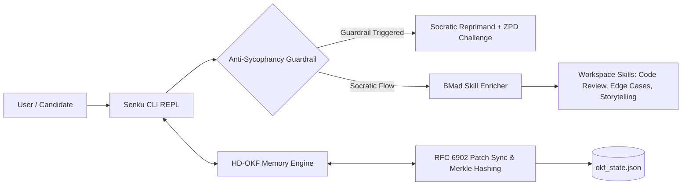

# Interview Preparation System — Documentation Hub

Welcome to the documentation hub for the **Interview Preparation System**, an agentic 3-month interview preparation orchestrator powered by **Senku Ishigami Socratic Pedagogy**, **Jesus Scriptural Encouragement**, **HD-OKF Stateful Memory**, and **BMad Ecosystem Skills**.

---

## 📚 Quick Navigation & Index

### Core Technical Documentation
* [Master Technical Documentation](file:///Users/devang/Desktop/interview_prep/_bmad-output/planning-artifacts/technical-documentation.md) — System Overview, Mermaid Architecture Diagram, API References for `HDOKFMemoryEngine`, `SenkuCLI`, and `BMadEnricher`, Dual-Persona Catalog, CLI Guide, RFC 6902 Patch Contract, and Troubleshooting Matrix.

### Planning Artifacts & Specifications
* [Vision & Core Strategy](file:///Users/devang/Desktop/interview_prep/vision.md) — Initial vision statement and background context.
* [Product Requirements Document (PRD)](file:///Users/devang/Desktop/interview_prep/_bmad-output/planning-artifacts/prd.md) — Full functional & non-functional requirements.
* [Product Brief](file:///Users/devang/Desktop/interview_prep/_bmad-output/planning-artifacts/product-brief.md) — Strategic alignment, goals, and target personas.
* [Senku Teach-Me Persona Spec](file:///Users/devang/Desktop/interview_prep/_bmad-output/planning-artifacts/senku-teach-me-persona-spec.md) — Production dual-persona system prompt & ZPD calibration rules.
* [OKF Memory Technical Research](file:///Users/devang/Desktop/interview_prep/_bmad-output/planning-artifacts/okf-memory-technical-research.md) — HD-OKF schema design, Merkle tree verification, and RFC 6902 specs.
* [Radically Innovative Prep Strategy](file:///Users/devang/Desktop/interview_prep/_bmad-output/planning-artifacts/radically-innovative-prep-strategy.md) — Strategic roadmap & multi-modal training plan.
* [Epics & Stories](file:///Users/devang/Desktop/interview_prep/_bmad-output/planning-artifacts/epics-and-stories.md) — Project breakdown into actionable epics and user stories.
* [Implementation Readiness Report](file:///Users/devang/Desktop/interview_prep/_bmad-output/planning-artifacts/implementation-readiness-report.md) — Verification gate report confirming 100% implementation readiness.
* [Course Correction Plan](file:///Users/devang/Desktop/interview_prep/_bmad-output/planning-artifacts/course-correction-plan.md) — Adaptive sprint adjustment guidelines.

---

## 🚀 Quick Start Guide

### 1. Run the Senku Socratic REPL CLI
```bash
# Run default turn
python3 senku_cli.py

# Pass custom prompt
python3 senku_cli.py "Explain memory layout of dynamic arrays"
```

### 2. Execute the Test Suite
```bash
python3 -m unittest test_okf_engine.py
```

---

## 🏗️ Architecture Summary



---
*Maintained by Paige (Technical Writer Agent — `bmad-agent-tech-writer`).*
