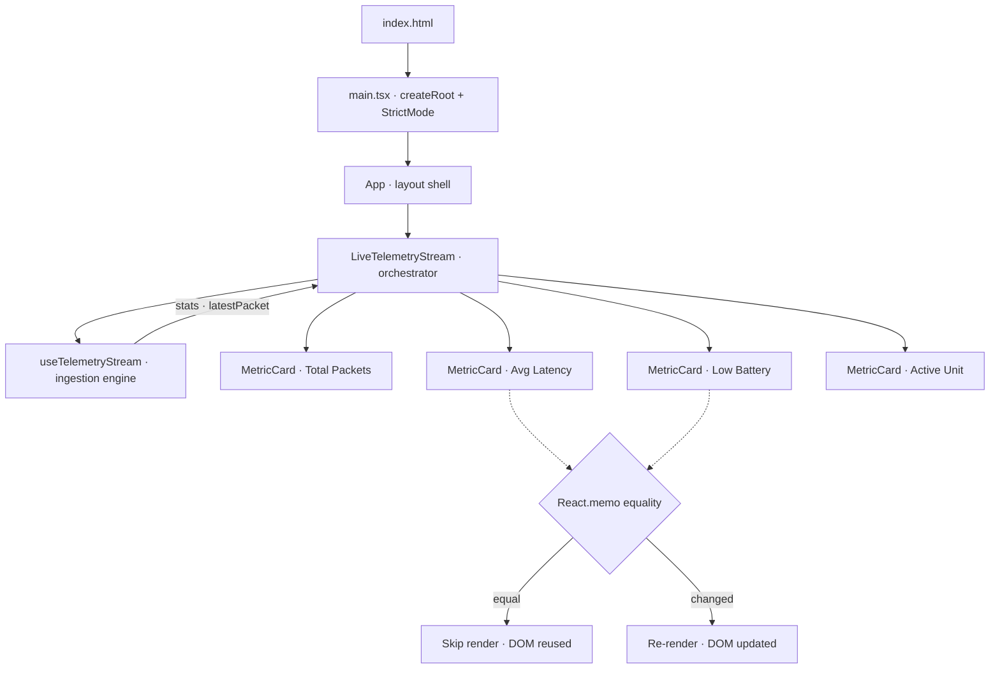
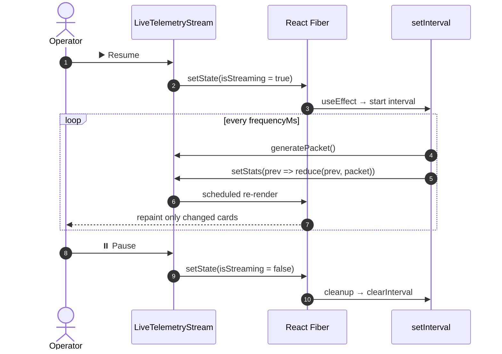

<div align="center">

# 🛰️ FleetPulse Nexus

### Mission Fleet Telemetry & Event-Ingestion Control Console

*A real-time React 19 dashboard that streams, aggregates, and visualizes live sensor
telemetry from a fleet of drones, rovers, and satellites — engineered as a masterclass in
high-frequency state updates and surgical render minimization.*

<br/>

[](https://react.dev)
[](https://www.typescriptlang.org)
[](https://vite.dev)
[](https://zustand-demo.pmnd.rs)
[](https://eslint.org)
[](#-license)
[](#)

</div>

---

## 📡 Table of Contents

- [Overview](#-overview)
- [Why It's Interesting](#-why-its-interesting)
- [Live Demo Behavior](#-live-demo-behavior)
- [Architecture at a Glance](#-architecture-at-a-glance)
- [Ingestion Loop](#-ingestion-loop)
- [Tech Stack](#-tech-stack)
- [Quick Start](#-quick-start)
- [Project Structure](#-project-structure)
- [Core Concepts](#-core-concepts)
- [Data Contracts](#-data-contracts)
- [Design System](#-design-system)
- [Scripts](#-scripts)
- [Documentation](#-documentation)
- [Roadmap](#-roadmap)
- [Contributing](#-contributing)
- [License](#-license)

---

## 🌌 Overview

**FleetPulse Nexus** simulates a live telemetry ingestion pipeline entirely in the
browser. A custom React hook synthesizes mock sensor packets on a configurable interval,
folds each one into a rolling aggregate, and paints the results across a grid of
memoized metric cards — repainting **only** the tiles whose data actually changed.

No backend. No network. Just a clean, fast, self-contained sandbox for studying how
React 19 behaves under continuous, high-frequency state churn.

> Think of it as a mission-control HUD where every widget earns its render.

---

## ✨ Why It's Interesting

| Focus | What this project demonstrates |
| :--- | :--- |
| ⚡ **High-frequency updates** | A `setInterval` loop pushes new state as often as every 100 ms. |
| 🧠 **Surgical re-renders** | `React.memo` with a **custom equality function** stops unchanged cards from re-rendering — visible via a live per-card render counter. |
| 🔁 **Effect discipline** | Timer setup/teardown inside `useEffect` with proper cleanup and **zero stale closures** (functional state updates + `useCallback`). |
| 📊 **O(1) aggregation** | Latency is tracked as a *cumulative moving average* — no history buffer. |
| 🎨 **Modern CSS** | Layered cascade (`@layer`), design tokens, **Display-P3 wide-gamut** color, glassmorphism, and WCAG 2.1 AA focus states. |
| 🧩 **Typed contracts** | Strict TypeScript domain models shared across hook and components. |

---

## 🎮 Live Demo Behavior

Once running, the console **starts streaming immediately**. From the control bar you can:

- **⏸️ Pause / ▶️ Resume** the ingestion loop
- **🔄 Reset** all counters and clear the feed
- **🎚️ Tune frequency** from `100 ms` → `2000 ms` with a live slider

Four metric tiles update in real time:

| Tile | Value | Alert rule |
| :--- | :--- | :--- |
| **Total Packets** | running count | — |
| **Average Latency** | rolling mean (ms) | `> 70 ms` → 🟡 warning |
| **Low Battery Alerts** | units under 20% | `> 5` → 🔴 critical (pulsing) |
| **Active Unit** | last-seen asset ID | — |

A raw **TELEMETRY INGESTION FEED** panel streams the latest packet as pretty-printed JSON.

---

## 🏗️ Architecture at a Glance



---

## 🔄 Ingestion Loop



---

## 🧰 Tech Stack

| Layer | Technology | Version |
| :--- | :--- | :--- |
| UI | [React](https://react.dev) | `^19.2.8` |
| DOM | React DOM | `^19.2.8` |
| Language | [TypeScript](https://www.typescriptlang.org) | `~6.0.2` |
| Build | [Vite](https://vite.dev) | `^8.2.0` |
| React plugin | `@vitejs/plugin-react` (Oxc) | `^6.0.4` |
| State (reserved) | [Zustand](https://zustand-demo.pmnd.rs) | `^5.0.15` |
| Lint | ESLint + typescript-eslint | `^10.8.0` / `^8.65.0` |

> ℹ️ Zustand is installed and a store file is scaffolded at `src/store/useFleetStore.ts`,
> but it's currently empty — all live state runs inside the `useTelemetryStream` hook.
> See [State Management](./docs/state-management.md).

---

## 🚀 Quick Start

**Prerequisites:** Node.js ≥ 20.19 (or ≥ 22.12). A `bun.lock` is committed, so **Bun** is
the first-class package manager — npm/pnpm/yarn work too.

```bash
# 1. Install
bun install            # or: npm install

# 2. Run the dev server (Fast Refresh)
bun run dev            # or: npm run dev

# 3. Open the printed http://localhost:5173 URL
```

Production build:

```bash
bun run build          # tsc -b  →  vite build   (type errors fail the build)
bun run preview        # serve the built dist/
```

---

## 📁 Project Structure

```
FleetPulse Nexus/
├── index.html                          # Vite HTML entry → mounts #root
├── src/
│   ├── main.tsx                        # React root (StrictMode)
│   ├── App.tsx                         # Layout shell + header
│   ├── components/telemetry/
│   │   ├── LiveTelemetryStream.tsx     # Orchestrator: controls · grid · raw feed
│   │   └── MetricCard.tsx              # Memoized metric tile (custom equality)
│   ├── hooks/
│   │   └── useTelemetryStream.ts       # Ingestion engine: timer + stats reducer
│   ├── store/
│   │   └── useFleetStore.ts            # Reserved Zustand store (empty)
│   ├── types/
│   │   └── telemetry.ts                # Domain contracts
│   └── index.css                       # Design system (tokens · glass · P3 · anim)
├── docs/                               # Full generated documentation set
└── vite / tsconfig / eslint            # Tooling configs
```

---

## 🧠 Core Concepts

### The memoization firewall
`LiveTelemetryStream` re-renders on **every** tick, but `MetricCard` is wrapped in
`React.memo` with a custom comparator:

```tsx
export const MetricCard = React.memo(
  MetricCardBase,
  (prev, next) =>
    prev.value === next.value &&
    prev.status === next.status &&
    prev.title === next.title
);
```

Only tiles whose `value`/`status`/`title` changed re-render. The `Renders: N` badge on
each card lets you *see* the reconciler skipping work in real time.

### Stale-closure-free streaming
The engine folds packets with a **functional updater** and keeps a stable generator
reference via `useCallback`, so the effect re-arms only when it should:

```ts
useEffect(() => {
  if (!isStreaming) return;
  const timer = setInterval(() => {
    const packet = generatePacket();
    setLatestPacket(packet);
    setStats(prev => /* cumulative moving average + counters */);
  }, frequencyMs);
  return () => clearInterval(timer);       // ← always cleaned up
}, [isStreaming, frequencyMs, generatePacket]);
```

---

## 📐 Data Contracts

```ts
interface TelemetryPacket {
  id: string;          // "pkt-1042"
  vehicleId: string;   // "DRONE-ALPHA"
  velocity: number;    // km/h
  batteryLevel: number;// %
  latencyMs: number;   // ms
  signalDbm: number;   // dBm (RSSI)
  timestamp: number;   // epoch ms
}

interface TelemetryStats {
  totalPackets: number;
  avgLatency: number;      // rolling mean
  lowBatteryCount: number; // battery < 20%
  isStreaming: boolean;
}

type MetricStatus = 'normal' | 'warning' | 'critical';
```

Full field specs, invariants, and UML: [`docs/types.md`](./docs/types.md).

---

## 🎨 Design System

`src/index.css` is a first-class artifact, not boilerplate:

- **Layered cascade:** `@layer reset, theme, base, components, utilities, animations`
- **Design tokens** for color, glow, radius, and easing curves
- **Display-P3 wide-gamut** color via `@supports (color: color(display-p3 …))`
- **Glassmorphism** cards with `backdrop-filter: blur + saturate`
- **Accessibility:** WCAG 2.1 AA `:focus-visible` rings, reduced visual noise
- **Motion:** a `pulse-critical` keyframe for critical-state cards

---

## 📜 Scripts

| Command | Description |
| :--- | :--- |
| `dev` | Start Vite dev server with Fast Refresh |
| `build` | Type-check (`tsc -b`) then bundle (`vite build`) |
| `preview` | Serve the production build locally |
| `lint` | Run ESLint across the project |

---

## 📚 Documentation

A complete, AI-ready documentation set lives in [`docs/`](./docs/):

| Doc | Contents |
| :--- | :--- |
| [Index](./docs/index.md) | Master navigation entry point |
| [Project Overview](./docs/project-overview.md) | Purpose, stack, classification |
| [Architecture](./docs/architecture.md) | Hierarchy, reconciliation guard, sequence |
| [Data Models / Types](./docs/types.md) | UML + field specs |
| [Source Tree Analysis](./docs/source-tree-analysis.md) | Annotated file-by-file map |
| [Component Inventory](./docs/component-inventory.md) | Props, memo behavior, styling contract |
| [State Management](./docs/state-management.md) | Hook state, reducer math, effect lifecycle |
| [Development Guide](./docs/development-guide.md) | Setup, conventions, extension, known issues |

---

## 🗺️ Roadmap

- [ ] Wire the reserved **Zustand** store (`useFleetStore.ts`) and subscribe via selectors
- [ ] Add **Vitest + React Testing Library** coverage (reducer math, memo, effect cleanup)
- [ ] Replace mock generator with a real **WebSocket / SSE** telemetry source
- [ ] Historical charts (velocity / battery / latency over time)
- [ ] Per-asset drill-down view and filtering
- [ ] Reconcile header inline-style tokens with `index.css` design tokens
- [ ] Remove legacy `src/App.css`

---

## 🤝 Contributing

1. Follow the existing structure: components in `src/components/<feature>/`, logic in
   `src/hooks/`, types in `src/types/`.
2. Respect `verbatimModuleSyntax` — use `import type` for type-only imports.
3. Prefer existing design tokens and utility classes over ad-hoc CSS.
4. Keep the tree type-clean; `bun run build` fails on TS errors.
5. Run `bun run lint` before opening a PR.

See the [Development Guide](./docs/development-guide.md) for details.

---

## 📄 License

Released under the **MIT License**. See `LICENSE` (add one if distributing).

<div align="center">

<br/>

**Built with React 19 · TypeScript · Vite** — *every render earns its place.* 🛰️

</div>
