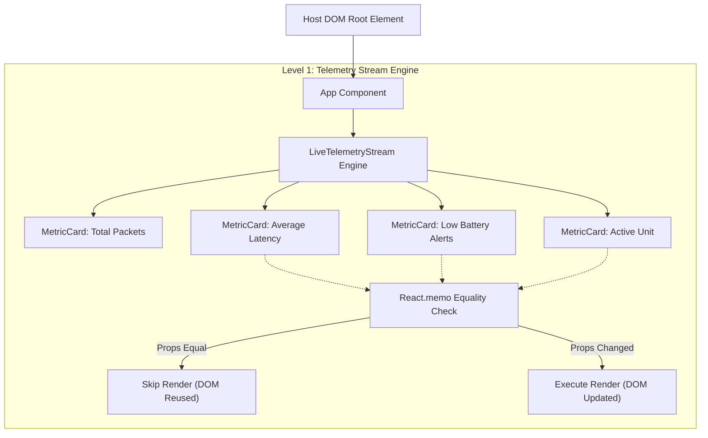
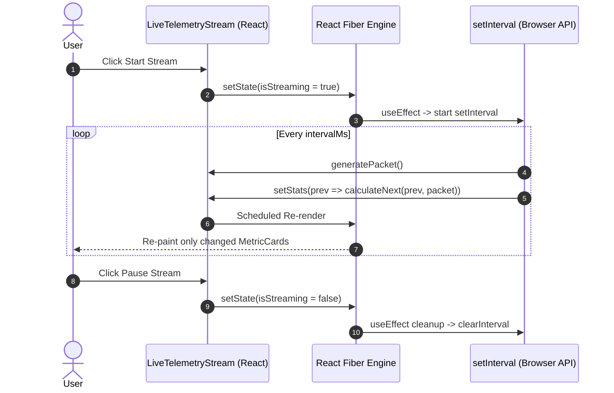

# FleetPulse Nexus: System Architecture & Reconciliation Flow

This document details the React component hierarchy, Fiber reconciliation guards, and event ingestion sequence for Level 1.

---

## 1. Component Hierarchy & Reconciliation Guard

---

## 2. Ingestion Loop & Memory Lifecycle (Sequence Diagram)

