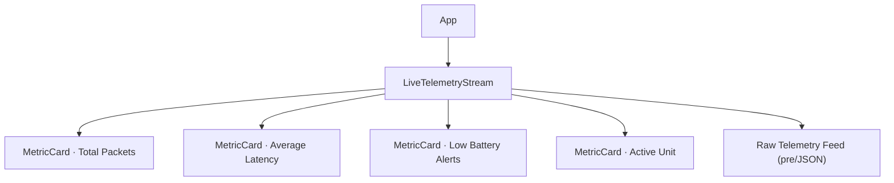

# Component Inventory — FleetPulse Nexus

Complete catalog of React components, their props, state ownership, and render behavior.

---

## Component Map

| Component | File | Type | Memoized | Owns State |
| :--- | :--- | :--- | :--- | :--- |
| `App` | `src/App.tsx` | Layout shell | No | No |
| `LiveTelemetryStream` | `src/components/telemetry/LiveTelemetryStream.tsx` | Orchestrator | No | Via `useTelemetryStream` hook |
| `MetricCard` | `src/components/telemetry/MetricCard.tsx` | Presentational leaf | ✅ Yes (custom `React.memo`) | Local `useRef` render counter |



---

## 1. `App`

**Category:** Layout / shell
**Props:** none

Renders the mission header (`🛰️ FLEETPULSE NEXUS` title + subtitle) and mounts
`<LiveTelemetryStream/>` inside `<main>`. Purely presentational; contains no logic.

> **Note:** Uses inline styles referencing CSS variables (`var(--cyan)`, `var(--muted)`,
> `var(--border)`). These specific token names differ from those defined in `index.css`
> (which uses `--accent-cyan`, `--text-secondary`, `--border-subtle`), so some inline
> styles resolve to no value. Minor cosmetic mismatch — see
> [Development Guide](./development-guide.md#known-issues).

---

## 2. `LiveTelemetryStream`

**Category:** Orchestrator / container
**Props:** none
**State source:** `useTelemetryStream(500)`

### Rendered regions

| Region | Description |
| :--- | :--- |
| **Control bar** | Pause/Resume button (toggles `isStreaming`), Reset button, and a frequency `<input type="range">` (100–2000 ms, step 100). |
| **Metric grid** | Four `MetricCard`s laid out in a responsive auto-fit grid. |
| **Raw feed** | Conditionally rendered `<pre>` showing the latest packet as pretty-printed JSON. Hidden when `latestPacket` is null. |

### Metric card mapping & thresholds

| Card | Value source | Status logic |
| :--- | :--- | :--- |
| Total Packets | `stats.totalPackets` | always `normal` |
| Average Latency | `stats.avgLatency` (`unit=ms`) | `> 70` → `warning`, else `normal` |
| Low Battery Alerts | `stats.lowBatteryCount` | `> 5` → `critical`, else `normal` |
| Active Unit | `latestPacket?.vehicleId ?? 'STANDBY'` | always `normal` |

---

## 3. `MetricCard`

**Category:** Presentational leaf (memoized)
**File:** `src/components/telemetry/MetricCard.tsx`

### Props (`MetricCardProps`)

| Prop | Type | Required | Default | Description |
| :--- | :--- | :--- | :--- | :--- |
| `title` | `string` | ✅ | — | Card label (upper-cased via CSS). |
| `value` | `string \| number` | ✅ | — | Primary metric value. |
| `unit` | `string` | ✖ | `''` | Optional unit suffix (e.g. `ms`). |
| `status` | `MetricStatus` | ✖ | `'normal'` | Drives border/glow: `normal` / `warning` / `critical`. |

### Render behavior — the memoization guard

`MetricCard` is exported as a `React.memo` wrapper around `MetricCardBase` with a
**custom equality function**:

```tsx
React.memo(MetricCardBase, (prev, next) =>
  prev.value === next.value &&
  prev.status === next.status &&
  prev.title === next.title
);
```

Because `LiveTelemetryStream` re-renders on *every* ingestion tick, this guard is what
prevents all four cards from re-rendering each tick. Only cards whose `value`/`status`
actually changed will re-render. The `<kbd>Renders: N</kbd>` badge makes this visible at
runtime.

> **Behavioral caveat:** `renderCount` is a `useRef` initialized to `1` and incremented
> during render (`renderCount.current += 1`). Mutating a ref during render is a side
> effect; under React 19 `StrictMode` (dev), the double-invoked render inflates the
> displayed count. It is a didactic indicator, not a precise metric. Also note `unit` is
> intentionally excluded from the equality check.

---

## Styling Contract (CSS classes consumed)

Components rely on utility/component classes defined in `src/index.css`:

| Class | Purpose |
| :--- | :--- |
| `.card`, `.card-warning`, `.card-critical` | Glass card + status glows (critical pulses) |
| `.btn`, `.btn-success`, `.btn-danger` | Action buttons |
| `.grid`, `.stack`, `.flex-between`, `.flex-gap` | Layout utilities |
| `kbd`, `pre`, `input[type=range]` | Styled primitives (HUD badge, JSON terminal, slider) |

---

_Generated by `bmad-document-project` (deep scan)._
