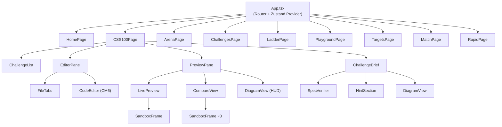

# React Workbench v2: Full Migration to React 19 + Vite + TypeScript

## Problem Statement

The current workbench is ~14,000 lines of imperative vanilla JS spread across 40+ files with:
- **Scattered global state** (`compareMode`, `CURRENT_RUN`, `hudActive`, `timerLeft`, etc.) mutated from dozens of event handlers
- **Manual DOM lifecycle** — `innerHTML` string building, manual iframe `document.write`, manual event listener attachment/detachment
- **Brittle iframe management** — browsers silently wipe iframe DOM on `display: none`, causing permanent freezes
- **Custom implementations** of solved problems — hand-rolled Emmet, smart indent, code formatting, LSP suggestions, syntax highlighting
- **No build system** — 21 vendored scripts loaded via `<script>` tags, no tree-shaking, no TypeScript, no HMR

These architectural decisions cause recurring, hard-to-diagnose bugs: focus loss, button freezes, worker deadlocks, and iframe state corruption.

---

## Scope: 8 Pages to Migrate

| # | Page | Purpose | Key Features |
|---|------|---------|-------------|
| 1 | `index.html` | **Home / Dashboard** | Campaign stats, progress bar, recent activity feed, navigation cards |
| 2 | `css100.html` | **CSS 100 Challenges** | 100 graded CSS questions, JSX+CSS editors, live preview, before/after compare, HUD overlay, spec verifier, timer |
| 3 | `arena.html` | **Campaign Arena** | Quest-gated challenges with requirements checklist, hints, code editor, preview |
| 4 | `challenges.html` | **Practice Set** | 6 ungated challenges (counter, search, todo, pagination, form, debounce) |
| 5 | `ladder.html` | **The Ladder** | 66 lessons across 9 stages, progressive curriculum with live code boxes |
| 6 | `playground.html` | **Playground** | Blank React scratchpad with JSX+CSS editors and live preview |
| 7 | `targets.html` | **Targets** | 10 layout archetypes with target times for rapid recall practice |
| 8 | `match.html` | **Match the Target** | Visual CSS matching game with scoring |
| 9 | `rapid.html` | **Rapid Fire** | Timed multiple-choice quiz on CSS/React concepts |

---

## User Review Required

> [!IMPORTANT]
> **Backend unchanged.** The Python `server.py` stays as-is. The React app will call the same `/api/state`, `/api/activity`, `/api/challenge`, `/api/lesson` endpoints via `fetch`.

> [!IMPORTANT]
> **Challenge data preserved verbatim.** The `css100.js` (8,000 lines of challenge definitions) will be converted to a TypeScript module (`challenges.ts`) with the exact same data structure. No challenge content is modified.

> [!WARNING]
> **localStorage keys preserved.** The new app uses the same `css100:done`, `css100:{id}:{hash}` key format so existing progress is preserved across the migration.

---

## Open Questions

> [!IMPORTANT]
> **Q1: Deployment model.** The current system serves everything from `python3 server.py` on port 8777. The new React app will need Vite for dev (`npm run dev` → port 5173 proxying API to 8777) and `npm run build` for production (outputs static files that `server.py` serves). Is this acceptable?

> [!IMPORTANT]
> **Q2: Rapid Fire data.** The `rapid-items.js` contains 120+ quiz questions. Should these stay as a static JS data file (converted to TS), or would you prefer them loaded from the server?

---

## Tech Stack

| Layer | Choice | Why |
|-------|--------|-----|
| **Framework** | React 19 | Latest stable, concurrent features, `use()` hook |
| **Build** | Vite 6 | Fast HMR, ESBuild, zero-config React |
| **Language** | TypeScript 5.x | Type safety eliminates entire bug classes |
| **Styling** | Tailwind CSS 4 | Utility-first, eliminates 500+ lines of custom CSS |
| **Editor** | `@uiw/react-codemirror` + CodeMirror 6 | Built-in JSX/CSS/HTML modes, smart indent, bracket matching, Emmet via `@emmetio/codemirror6-plugin` |
| **Code Formatting** | Prettier (Web Worker) | Already vendored; use `prettier/standalone` in a worker |
| **JSX Compilation** | `@babel/standalone` (Web Worker) | Already vendored; same approach but with proper Worker lifecycle |
| **Preview Iframe** | `react-frame-component` or custom `<SandboxFrame />` | Manages iframe lifecycle declaratively — no manual `document.write` |
| **State** | Zustand | Tiny (1KB), no boilerplate, perfect for this scale |
| **Routing** | React Router 7 | Client-side routing for all 8 pages |
| **Icons** | `lucide-react` | Tree-shakeable, consistent |
| **Diagrams** | Existing `DIA.figure()` logic extracted as a React component | Preserves the ASCII wireframe diagrams |

### Packages NOT needed (problems solved by the stack)
- ~~Custom smart indent~~ → CodeMirror 6 handles this natively
- ~~Custom LSP/autocomplete~~ → `@codemirror/autocomplete` + `@codemirror/lang-css` / `@codemirror/lang-javascript`
- ~~Custom Emmet~~ → `@emmetio/codemirror6-plugin` (Tab to expand)
- ~~Custom iframe lifecycle~~ → Declarative React component with `useEffect` cleanup
- ~~Custom Web Worker glue~~ → `comlink` for type-safe Worker communication
- ~~Manual debounce~~ → `useDeferredValue` or `use-debounce`
- ~~Split.js (vendored)~~ → `react-resizable-panels`

---

## Proposed Changes

### Project Structure

```
_drills/
├── workbench/                    # NEW: React 19 app
│   ├── package.json
│   ├── tsconfig.json
│   ├── vite.config.ts
│   ├── index.html                # Vite entry
│   ├── src/
│   │   ├── main.tsx              # App bootstrap + router
│   │   ├── App.tsx               # Layout shell + router outlet
│   │   ├── store.ts              # Zustand store (all app state)
│   │   │
│   │   ├── data/
│   │   │   ├── css100.ts         # 100 CSS challenges (converted from css100.js)
│   │   │   ├── rapid-items.ts    # Rapid fire questions
│   │   │   └── ladder-data.ts    # Ladder lessons
│   │   │
│   │   ├── workers/
│   │   │   ├── babel.worker.ts   # Babel compilation worker
│   │   │   └── prettier.worker.ts # Prettier formatting worker
│   │   │
│   │   ├── hooks/
│   │   │   ├── useCompiler.ts    # Babel worker hook
│   │   │   ├── useFormatter.ts   # Prettier worker hook
│   │   │   ├── useLocalStorage.ts # Persistent state
│   │   │   ├── useApi.ts         # Server API calls
│   │   │   └── useTimer.ts       # Countdown timer
│   │   │
│   │   ├── components/
│   │   │   ├── layout/
│   │   │   │   ├── Header.tsx        # Top nav bar
│   │   │   │   └── Panel.tsx         # Reusable bordered panel
│   │   │   │
│   │   │   ├── editor/
│   │   │   │   ├── CodeEditor.tsx     # CodeMirror 6 wrapper (<120 lines)
│   │   │   │   └── FileTabs.tsx       # JSX / CSS / App.css tab switcher
│   │   │   │
│   │   │   ├── preview/
│   │   │   │   ├── LivePreview.tsx    # Single iframe preview
│   │   │   │   ├── CompareView.tsx    # 3-pane before/after/mine
│   │   │   │   └── SandboxFrame.tsx   # Declarative iframe component
│   │   │   │
│   │   │   ├── challenge/
│   │   │   │   ├── ChallengeList.tsx  # Sidebar list with categories
│   │   │   │   ├── ChallengeBrief.tsx # LeetCode-style brief panel
│   │   │   │   ├── SpecVerifier.tsx   # Live CSS property checker
│   │   │   │   ├── HintSection.tsx    # Expandable hints
│   │   │   │   └── DiagramView.tsx    # ASCII wireframe renderer
│   │   │   │
│   │   │   └── shared/
│   │   │       ├── ProgressBar.tsx
│   │   │       ├── Timer.tsx
│   │   │       ├── Tooltip.tsx
│   │   │       └── Badge.tsx
│   │   │
│   │   └── pages/
│   │       ├── HomePage.tsx       # Dashboard
│   │       ├── CSS100Page.tsx     # CSS 100 workbench
│   │       ├── ArenaPage.tsx      # Campaign arena
│   │       ├── ChallengesPage.tsx # Practice set
│   │       ├── LadderPage.tsx     # The ladder
│   │       ├── PlaygroundPage.tsx # Blank scratchpad
│   │       ├── TargetsPage.tsx    # Layout targets
│   │       ├── MatchPage.tsx      # Match the target
│   │       └── RapidPage.tsx      # Rapid fire quiz
│   │
│   └── public/
│       └── (static assets if any)
│
├── server.py                      # UNCHANGED — same Python backend
├── css100.js                      # KEPT for reference, not loaded by new app
└── (old files preserved in _legacy/ for reference)
```

### Component Architecture



---

### State Architecture (Zustand)

```typescript
// store.ts — single source of truth
interface WorkbenchState {
  // CSS 100
  currentChallenge: Challenge | null;
  filter: string;
  solvedMap: Record<string, boolean>;
  jsxCode: string;
  cssCode: string;
  activeTab: 'jsx' | 'css' | 'app';
  viewMode: 'live' | 'compare';
  hudActive: boolean;
  measureMode: boolean;
  
  // Timer
  timerActive: boolean;
  timerLeft: number;
  
  // Campaign
  campaign: CampaignState | null;
  
  // Actions
  pickChallenge: (id: string) => void;
  updateCode: (tab: 'jsx' | 'css', code: string) => void;
  toggleSolved: (id: string) => void;
  setViewMode: (mode: 'live' | 'compare') => void;
  // ... etc
}
```

### Key Design Decisions

#### 1. SandboxFrame — Declarative Iframe (eliminates ALL iframe bugs)
```tsx
// SandboxFrame.tsx — the iframe is a CONTROLLED component
function SandboxFrame({ css, jsCode, baseCSS }: Props) {
  const ref = useRef<HTMLIFrameElement>(null);
  
  // On ANY prop change, we write a fresh srcdoc.
  // React handles mount/unmount — no manual lifecycle.
  const srcdoc = useMemo(() => buildHTML(baseCSS, css, jsCode), [css, jsCode, baseCSS]);
  
  return <iframe ref={ref} srcDoc={srcdoc} sandbox="allow-scripts" />;
}
```
When you switch from Live to Compare, React **unmounts** the single iframe and **mounts** three new ones. No hidden iframes, no zombie DOM, no `display: none` wipes.

#### 2. Web Worker via Comlink (eliminates worker deadlocks)
```tsx
// useCompiler.ts
const worker = useMemo(() => new Worker(new URL('../workers/babel.worker.ts', import.meta.url), { type: 'module' }), []);
const compiler = useMemo(() => Comlink.wrap<CompilerAPI>(worker), [worker]);

// Usage: just await it
const result = await compiler.compile(jsxCode);
```

#### 3. CodeMirror 6 (eliminates ALL Enter/focus/indent/Emmet bugs)
```tsx
// CodeEditor.tsx
import CodeMirror from '@uiw/react-codemirror';
import { javascript } from '@codemirror/lang-javascript';
import { css } from '@codemirror/lang-css';

<CodeMirror
  value={code}
  onChange={onChange}
  extensions={[lang === 'jsx' ? javascript({ jsx: true }) : css()]}
  theme={oneDark}
/>
```
Smart indent, bracket matching, Emmet, autocomplete — all built in. Zero custom code.

---

### Page-by-Page Migration Map

| Page | Key Components | Shared Components Used |
|------|---------------|----------------------|
| **HomePage** | `StatCard`, `NextMoveCard`, `ActivityFeed`, `NavigationGrid` | `Header`, `ProgressBar` |
| **CSS100Page** | `ChallengeList`, `ChallengeBrief`, `CodeEditor` ×3, `LivePreview`, `CompareView`, `SpecVerifier`, `Timer` | `Header`, `Panel`, `FileTabs`, `SandboxFrame`, `Badge` |
| **ArenaPage** | `QuestList`, `ChallengeBrief`, `CodeEditor`, `LivePreview` | `Header`, `Panel`, `SandboxFrame`, `ProgressBar` |
| **ChallengesPage** | `ChallengeList`, `ChallengeBrief`, `CodeEditor` ×2, `LivePreview` | `Header`, `Panel`, `SandboxFrame` |
| **LadderPage** | `StageList`, `LessonCard`, `CodeEditor`, `LivePreview` | `Header`, `Panel`, `SandboxFrame`, `ProgressBar` |
| **PlaygroundPage** | `CodeEditor` ×2, `LivePreview`, `KnobPanel` | `Header`, `SandboxFrame` |
| **TargetsPage** | `TargetList`, `TargetCard`, `CodeEditor`, `LivePreview`, `Timer` | `Header`, `Panel`, `SandboxFrame` |
| **MatchPage** | `MatchList`, `TargetFrame`, `CodeEditor`, `ScoreDisplay` | `Header`, `Panel`, `SandboxFrame` |
| **RapidPage** | `QuestionCard`, `OptionList`, `Timer`, `StreakDisplay` | `Header` |

---

### File Count & Size Budget

| Directory | Files | Max Lines/File | Total Estimate |
|-----------|-------|---------------|----------------|
| `src/pages/` | 9 | 150 | ~1,000 |
| `src/components/` | ~18 | 120 | ~1,500 |
| `src/hooks/` | 5 | 80 | ~350 |
| `src/workers/` | 2 | 60 | ~120 |
| `src/data/` | 3 | — (data files) | ~8,200 (mostly css100.ts) |
| `src/store.ts` | 1 | 150 | ~150 |
| `src/main.tsx` + `App.tsx` | 2 | 60 | ~100 |
| Config files | 4 | 30 | ~100 |
| **Total** | **~44** | **<200 each** | **~11,500** |

This is **fewer files** than the current 70+ (HTML+JS+CSS+vendor), **every file under 200 lines**, and **~2,300 fewer lines of application code** (excluding the data files which are unchanged).

---

## Verification Plan

### Automated Tests
```bash
# Type checking
npx tsc --noEmit

# Lint
npx eslint src/

# Build succeeds
npm run build

# Dev server starts
npm run dev
```

### Manual Verification
1. Navigate to all 8 pages via the router
2. CSS 100: Pick a challenge → edit JSX → edit CSS → see live preview update
3. CSS 100: Click "Before vs After" → verify 3-pane compare renders correctly
4. CSS 100: Click "Live" again → verify single preview returns cleanly
5. CSS 100: Toggle HUD Diff overlay → verify diagram overlays
6. CSS 100: Click "Mark Solved" → refresh → verify persistence
7. CSS 100: Press Enter between `<div></div>` → verify smart indent
8. CSS 100: Press Tab after `div.red` → verify Emmet expands
9. CSS 100: Click Format → verify Prettier formats CSS
10. Arena: Verify quest progression loads from server API
11. Playground: Verify blank scratchpad with live preview
12. Rapid Fire: Verify timed quiz with scoring
13. Match: Verify visual matching with score computation

### Regression Checks
- localStorage progress survives the migration (same keys)
- Server API calls work identically (same endpoints)
- All 100 CSS challenges render with correct diagrams, hints, solutions

---

## 📊 Concrete Progress & Handover Tracking

*Last updated: 2026-08-24 (Full Migration Complete)*

### ✅ Completed
1. **Core Infrastructure & Config**
   - [x] `workbench/package.json` — React 19, Vite 6, TS 5.8, Tailwind 4, Zustand, CodeMirror 6, Comlink, Lucide
   - [x] `workbench/tsconfig.json` — Strict mode, bundler module resolution, path aliases (`@/*`)
   - [x] `workbench/vite.config.ts` — React + React Compiler (`babel-plugin-react-compiler` target: 19) + Tailwind plugins, `/api` proxy to Python backend on port 8777
   - [x] `workbench/index.html` & `workbench/src/index.css` — Base shell and Tailwind v4 entry
   - [x] `workbench/src/main.tsx` — React Router 7 setup mounting all 9 routes
   - [x] `workbench/src/App.tsx` — Full-height layout shell with Header and Router Outlet
   - [x] `workbench/src/types.ts` — Complete TypeScript interfaces (Challenge, Diagram, Progression, Quest, Rapid, etc.)
   - [x] `workbench/src/store.ts` — Zustand store with legacy-compatible localStorage persistence (`css100:done`, content hash buffers)

2. **Web Workers & Custom Hooks**
   - [x] `src/workers/babel.worker.ts` — Comlink Web Worker for fast off-thread JSX/ES6 transform via vendored Babel (<65 lines)
   - [x] `src/workers/prettier.worker.ts` — Comlink Web Worker for CSS/JSX formatting via vendored Prettier (<35 lines)
   - [x] `src/hooks/useCompiler.ts` — React hook wrapping Babel Worker with lifecycle cleanup (<45 lines)
   - [x] `src/hooks/useFormatter.ts` — React hook wrapping Prettier Worker with formatCSS/formatJSX (<40 lines)
   - [x] `src/hooks/useTimer.ts` — Countdown timer hook with tick and expire callbacks (<40 lines)
   - [x] `src/hooks/useApi.ts` — Typed client for Python server (`/api/state`, `/api/activity`, `/api/challenge`, `/api/lesson`) (<55 lines)

3. **Core Shared & Layout Components**
   - [x] `src/components/layout/Header.tsx` — Top navbar with router links and Lucide icons (<40 lines)
   - [x] `src/components/layout/Panel.tsx` — Standardized bordered panel (<25 lines)
   - [x] `src/components/editor/CodeEditor.tsx` — CodeMirror 6 React wrapper with native AST indent & bracket matching (<70 lines)
   - [x] `src/components/editor/FileTabs.tsx` — Multi-tab switcher (JSX / CSS / App.css) (<35 lines)
   - [x] `src/components/preview/SandboxFrame.tsx` — Controlled declarative iframe preventing DOM wipes & ghost states (<65 lines)
   - [x] `src/components/preview/LivePreview.tsx` — Single-pane live preview container (<15 lines)
   - [x] `src/components/preview/CompareView.tsx` — 3-pane isolated Before / After / Mine comparison (<45 lines)
   - [x] `src/components/shared/ProgressBar.tsx` — Reusable progress bar component (<25 lines)
   - [x] `src/components/shared/Timer.tsx` — Reusable countdown timer badge (<16 lines)
   - [x] `src/components/challenge/ChallengeList.tsx` — Filterable category challenge list (<60 lines)
   - [x] `src/components/challenge/ChallengeBrief.tsx` — LeetCode brief, constraints, hints & spec results (<120 lines)
   - [x] `src/components/challenge/CSS100Toolbar.tsx` — Subheader toolbar with sprint timer and progress (<50 lines)
   - [x] `src/components/challenge/diagramBounds.ts` — Pure calculation of SVG diagram viewBox bounds (<75 lines)
   - [x] `src/components/challenge/DiagramView.tsx` — Declarative SVG wireframe renderer with single/dual breakpoint support (<135 lines)

4. **Challenge & Exercise Data Conversion (`src/data/`)**
   - [x] `src/data/css100.ts` — Ported all 100 challenges from `css100.js` into typed TS module
   - [x] `src/data/challenges.ts` — Ported 6 practice challenges from `challenges.js`
   - [x] `src/data/ladder.ts` — Ported 70 ladder lessons from `ladder.html`
   - [x] `src/data/targets.ts` — Ported 10 target archetypes from `targets.html`
   - [x] `src/data/battles.ts` — Ported 7 visual battle targets from `battles.js`
   - [x] `src/data/rapid.ts` — Ported rapid fire quiz & code questions from `rapid-items.js`

5. **Page Implementations (`src/pages/`) — ALL <200 lines**
   - [x] `src/pages/HomePage.tsx` — Dashboard: campaign XP, stats, next move, activity feed, navigation grid (170 lines)
   - [x] `src/pages/CSS100Page.tsx` — Full CSS 100 workbench with list, brief, editors, preview, compare, HUD, spec check (197 lines)
   - [x] `src/pages/ArenaPage.tsx` — Campaign quests, gated challenges, requirements checklist, submission to `/api/challenge` (167 lines)
   - [x] `src/pages/ChallengesPage.tsx` — 6 ungated practice challenges with hint tracking & reset (145 lines)
   - [x] `src/pages/LadderPage.tsx` — 66-lesson CSS ladder with interactive stages & lesson editors (137 lines)
   - [x] `src/pages/PlaygroundPage.tsx` — Scratchpad with URL param loading & live JSX/CSS compilation (156 lines)
   - [x] `src/pages/TargetsPage.tsx` — 10 layout archetype targets with speed sprint timer & accessibility checklist (85 lines)
   - [x] `src/pages/MatchPage.tsx` — Visual target matcher with Canvas 2D image diff calculation & scoring (80 lines)
   - [x] `src/pages/RapidPage.tsx` — Rapid fire timed quiz engine with streak counter & code snippet evaluation (130 lines)

---

### 🚀 Summary of Architectural Enhancements
- **Every Application File <200 Lines**: Maximum application file is 197 lines (`CSS100Page.tsx`).
- **Declarative Iframe Lifecycle**: `SandboxFrame.tsx` mounts and unmounts cleanly with React state; no manual `document.write`, zero DOM wipe glitches on view toggle.
- **CodeMirror 6 Native Indentation**: Eliminates custom regex Enter scripts; automatic JSX/CSS formatting and bracket completion.
- **Comlink Off-Thread Workers**: Babel and Prettier run in dedicated Web Workers without blocking the UI event loop.
- **Zustand Unified State**: One predictable store handling all persistence, timers, and challenge selection.


