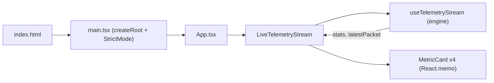

# FleetPulse Nexus — Project Overview

> Mission fleet telemetry & event-ingestion control console — a real-time dashboard that
> simulates and visualizes streaming sensor packets from field assets (drones, rovers,
> satellites).

---

## 1. Executive Summary

**FleetPulse Nexus** is a single-page React application that models a *live telemetry
ingestion pipeline*. A custom React hook (`useTelemetryStream`) generates mock sensor
packets on a configurable interval, folds each packet into a rolling aggregate
(`TelemetryStats`), and renders the result through a grid of `React.memo`-guarded metric
cards. The project is a focused demonstration of **high-frequency state updates**,
**render minimization via memoization**, and **effect lifecycle discipline** (timer setup
and teardown without stale closures).

It is intentionally backend-free: all data is synthesized client-side, which makes it a
clean sandbox for studying React 19 reconciliation behavior under continuous state churn.

## 2. Purpose & Domain

| Aspect | Detail |
| :--- | :--- |
| **Domain** | Fleet / mission telemetry monitoring |
| **Core loop** | Generate packet → aggregate stats → re-render only changed cards |
| **Field assets** | `DRONE-ALPHA`, `DRONE-BRAVO`, `DRONE-CHARLIE`, `ROVER-DELTA`, `SAT-ECHO` |
| **Signals tracked** | Velocity, battery level, latency, RSSI signal strength |
| **Primary KPIs** | Total packets, average latency, low-battery alerts, active unit |

## 3. Tech Stack Summary

| Category | Technology | Version | Role |
| :--- | :--- | :--- | :--- |
| UI Library | React | `^19.2.8` | Component rendering & reconciliation |
| DOM Renderer | React DOM | `^19.2.8` | Host DOM commit |
| Language | TypeScript | `~6.0.2` | Static typing / data contracts |
| Build Tool | Vite | `^8.2.0` | Dev server + production bundling |
| React Plugin | `@vitejs/plugin-react` | `^6.0.4` | Fast Refresh / JSX transform (Oxc) |
| State (available) | Zustand | `^5.0.15` | Global store dependency (scaffolded, not yet wired) |
| Linting | ESLint + typescript-eslint | `^10.8.0` / `^8.65.0` | Code quality gates |

> **Note:** `zustand` is declared in `package.json` and a store file exists at
> `src/store/useFleetStore.ts`, but it is currently **empty**. Present-day state lives
> entirely inside the `useTelemetryStream` hook (local component state). See
> [State Management](./state-management.md).

## 4. Architecture Classification

- **Repository type:** Monolith (single SPA, no workspaces)
- **Project type:** `web`
- **Architecture pattern:** Component hierarchy + custom-hook stream engine, with
  `React.memo` equality guards acting as the reconciliation firewall.
- **Entry chain:** `index.html` → `src/main.tsx` → `App` → `LiveTelemetryStream` →
  `MetricCard[]`



## 5. Repository Structure (high level)

```
FleetPulse Nexus/
├── index.html                 # Vite HTML entry
├── src/
│   ├── main.tsx               # React root bootstrap (StrictMode)
│   ├── App.tsx                # Shell layout + header
│   ├── components/telemetry/  # LiveTelemetryStream, MetricCard
│   ├── hooks/                 # useTelemetryStream (ingestion engine)
│   ├── store/                 # useFleetStore (empty Zustand stub)
│   ├── types/                 # telemetry domain contracts
│   ├── index.css              # Design system (layers, tokens, glassmorphism)
│   └── App.css                # Legacy Vite template styles (unused by app)
├── docs/                      # This documentation set
└── <config>                   # vite / tsconfig / eslint
```

## 6. Documentation Map

| Document | Contents |
| :--- | :--- |
| [Architecture](./architecture.md) | Component hierarchy, reconciliation guard, ingestion sequence |
| [Data Models / Types](./types.md) | UML + field specs for telemetry contracts |
| [Source Tree Analysis](./source-tree-analysis.md) | Annotated directory walkthrough |
| [Component Inventory](./component-inventory.md) | Every component, prop, and render behavior |
| [State Management](./state-management.md) | Hook-based state, update math, effect lifecycle |
| [Development Guide](./development-guide.md) | Setup, scripts, conventions, gotchas |
| [Index](./index.md) | Master navigation entry point |

---

_Generated by `bmad-document-project` (deep scan) · initial scan._
