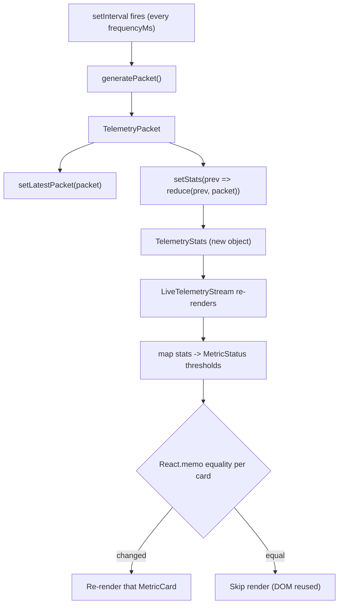

# Source Tree Analysis — FleetPulse Nexus

Annotated map of every meaningful file in the repository, with purpose, entry points, and
data-flow notes. Generated at **deep scan** depth (critical source files read).

---

## Annotated Directory Tree

```
FleetPulse Nexus/
│
├── index.html                      # ⚑ ENTRY — Vite HTML shell, mounts #root, loads /src/main.tsx
├── package.json                    # Manifest: deps, scripts (dev/build/lint/preview)
├── bun.lock                        # Bun lockfile (project installs via bun)
├── vite.config.ts                  # Vite config — react() plugin only
├── eslint.config.js                # Flat ESLint config (js + tseslint + react-hooks + react-refresh)
├── tsconfig.json                   # TS project references root
├── tsconfig.app.json               # App TS config (ES2023, bundler resolution, strict lint flags)
├── tsconfig.node.json              # Node/tooling TS config
│
├── src/
│   ├── main.tsx                    # ⚑ ENTRY — createRoot + <StrictMode><App/></StrictMode>
│   ├── App.tsx                     # Layout shell: header + <LiveTelemetryStream/>
│   ├── index.css                   # ★ DESIGN SYSTEM — @layer tokens, glassmorphism, P3 gamut, animations
│   ├── App.css                     # Legacy Vite template CSS (NOT imported by current app)
│   │
│   ├── components/
│   │   └── telemetry/
│   │       ├── LiveTelemetryStream.tsx   # ★ ORCHESTRATOR — controls, grid, raw feed
│   │       └── MetricCard.tsx            # ★ LEAF — React.memo card w/ render counter
│   │
│   ├── hooks/
│   │   └── useTelemetryStream.ts   # ★ ENGINE — packet generator, interval loop, stats reducer
│   │
│   ├── store/
│   │   └── useFleetStore.ts        # ⚠ EMPTY — Zustand store stub (reserved for global state)
│   │
│   └── types/
│       └── telemetry.ts            # ★ CONTRACTS — TelemetryPacket, TelemetryStats, MetricStatus
│
└── docs/                           # Generated documentation (this set)
    ├── architecture.md
    ├── types.md
    ├── project-overview.md
    ├── source-tree-analysis.md
    ├── component-inventory.md
    ├── state-management.md
    ├── development-guide.md
    ├── index.md
    └── project-scan-report.json
```

Legend: `⚑` entry point · `★` core application logic · `⚠` incomplete/reserved

---

## Critical Files Explained

### Entry Points

| File | Responsibility |
| :--- | :--- |
| `index.html` | Declares `<div id="root">` and loads `/src/main.tsx` as an ES module. Title: `fleetpulse-nexus`. |
| `src/main.tsx` | Creates the React root and renders `<App/>` wrapped in `<StrictMode>`. StrictMode double-invokes effects in dev — relevant to the timer loop (see below). |
| `src/App.tsx` | Presentational shell only: renders the header banner and delegates all behavior to `<LiveTelemetryStream/>`. |

### Core Application Logic

| File | Responsibility | Key detail |
| :--- | :--- | :--- |
| `hooks/useTelemetryStream.ts` | The ingestion engine. Owns `isStreaming`, `frequencyMs`, `latestPacket`, `stats`. Runs a `setInterval` inside `useEffect` and folds packets into stats. | `generatePacket` is wrapped in `useCallback` for a stable reference; effect cleanup clears the interval. |
| `components/telemetry/LiveTelemetryStream.tsx` | Consumes the hook, renders the control bar (pause/resume, reset, frequency slider), the metric grid, and the raw JSON feed. Maps `stats` → threshold-based `MetricStatus`. | Threshold logic: latency `>70` → `warning`; low-battery count `>5` → `critical`. |
| `components/telemetry/MetricCard.tsx` | Memoized leaf card. Displays title, value, unit, and a live render counter badge. | `React.memo` with a **custom equality fn** comparing `value`, `status`, `title`. |
| `types/telemetry.ts` | Single source of truth for the data contracts shared across the hook and components. | See [types.md](./types.md). |

### Design System

`src/index.css` is a first-class artifact, not boilerplate. It uses:
- **CSS `@layer` cascade ordering:** `reset, theme, base, components, utilities, animations`
- **Design tokens** for color, glow, radius, easing
- **Display-P3 wide-gamut** overrides via `@supports (color: color(display-p3 ...))`
- **Glassmorphism** cards (`backdrop-filter: blur + saturate`)
- **WCAG 2.1 AA** focus-visible indicators
- A `pulse-critical` keyframe animation for critical cards

### Reserved / Incomplete

| File | Status |
| :--- | :--- |
| `src/store/useFleetStore.ts` | **Empty (0 lines of logic).** Zustand is installed, indicating an intended migration of `useTelemetryStream` state into a global store. Not yet implemented. |
| `src/App.css` | Legacy Vite template styles. Imported by `App.tsx` but its classes (`.hero`, `.counter`, etc.) are unused by the current UI. Candidate for deletion. |

---

## Data Flow (one ingestion tick)



---

_Generated by `bmad-document-project` (deep scan)._
