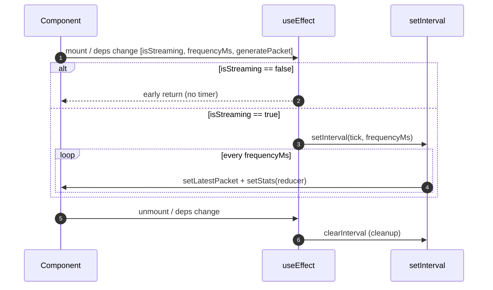

# State Management — FleetPulse Nexus

How application state is owned, updated, and torn down. Today all state is **local and
hook-encapsulated**; Zustand is installed but not yet wired.

---

## 1. Current model: `useTelemetryStream`

All runtime state lives inside the custom hook `src/hooks/useTelemetryStream.ts`. The
hook is the single stateful unit; components below it are (mostly) pure.

### State atoms

| State | Type | Initial | Purpose |
| :--- | :--- | :--- | :--- |
| `isStreaming` | `boolean` | `true` | Whether the ingestion loop is active. |
| `frequencyMs` | `number` | `500` (param) | Interval between generated packets. |
| `latestPacket` | `TelemetryPacket \| null` | `null` | Most recent packet (drives raw feed + active unit). |
| `stats` | `TelemetryStats` | zeros, `isStreaming:true` | Rolling aggregates for the metric cards. |

### Public API returned

```ts
{ isStreaming, frequencyMs, setFrequencyMs, latestPacket, stats, toggleStream, resetStream }
```

| Member | Kind | Effect |
| :--- | :--- | :--- |
| `toggleStream()` | action | Flips `isStreaming` (pause/resume the loop). |
| `resetStream()` | action | Stops streaming, clears `latestPacket`, zeroes `stats`. |
| `setFrequencyMs(n)` | setter | Changes cadence; re-arms the interval via effect deps. |

---

## 2. The aggregation reducer

Each tick folds one packet into the previous stats using a functional updater
(`setStats(prev => ...)`), which avoids stale-closure bugs:

| Field | Update rule |
| :--- | :--- |
| `totalPackets` | `prev.totalPackets + 1` |
| `avgLatency` | `round((prevAvg * prevTotal + packet.latencyMs) / nextTotal)` — running mean |
| `lowBatteryCount` | `+1` when `packet.batteryLevel < 20`, else unchanged |
| `isStreaming` | held `true` while the loop runs |

The rolling-average formula is a **cumulative moving average** — O(1) memory, no history
buffer required.

---

## 3. Effect lifecycle (timer discipline)



Key correctness properties:
- **Cleanup** returns `clearInterval(timer)` so no dangling intervals accumulate when
  deps change or the component unmounts.
- **Stable generator:** `generatePacket` is memoized with `useCallback([])`, so it does
  not needlessly re-arm the effect.
- **Deps array** `[isStreaming, frequencyMs, generatePacket]` re-creates the interval
  precisely when cadence or streaming status changes.

> **StrictMode note:** In development, React 19 `StrictMode` mounts → unmounts → remounts
> effects once to surface cleanup bugs. Because cleanup is correct here, this is safe; you
> may briefly see an extra tick during dev.

---

## 4. Render minimization

State churn is high (a new `stats` object every tick), so `LiveTelemetryStream`
re-renders continuously. Render cost is contained at the leaf via `React.memo` custom
equality on `MetricCard` — see [Component Inventory](./component-inventory.md#3-metriccard).

---

## 5. Reserved: Zustand global store

- **Dependency:** `zustand@^5.0.15` is installed.
- **File:** `src/store/useFleetStore.ts` exists but is **empty**.
- **Intent (inferred):** migrate telemetry state out of the hook into a shared store so
  multiple views/components could subscribe to fleet state independently.
- **Status:** not implemented. No `create()` call, no selectors, no consumers.

### Suggested migration shape (future work)

```ts
import { create } from 'zustand';
import type { TelemetryPacket, TelemetryStats } from '../types/telemetry';

interface FleetState {
  isStreaming: boolean;
  frequencyMs: number;
  latestPacket: TelemetryPacket | null;
  stats: TelemetryStats;
  ingest: (packet: TelemetryPacket) => void;
  toggleStream: () => void;
  reset: () => void;
  setFrequency: (ms: number) => void;
}
```

This would let `LiveTelemetryStream` subscribe via selectors (e.g.
`useFleetStore(s => s.stats)`) and further reduce re-render scope.

---

_Generated by `bmad-document-project` (deep scan)._
