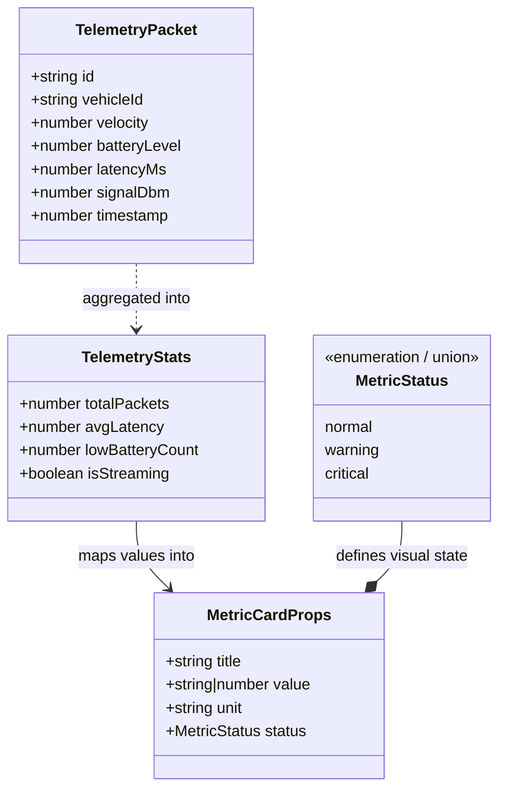

# Telemetry Domain Types & Data Contracts

This document contains the visual UML class diagrams and structural specifications for all data types used in **FleetPulse Nexus**.

---

## 1. Domain Data Model (UML Class Diagram)

---

## 2. Field Specifications & Invariants

### A. `TelemetryPacket`
Represents an individual event emitted by a field unit (Drone, Rover, Satellite).

| Field | Type | Description | Constraints / Units |
| :--- | :--- | :--- | :--- |
| `id` | `string` | Unique packet identifier | e.g. `"pkt-1042"` |
| `vehicleId` | `string` | Unique identifier of the field asset | e.g. `"DRONE-ALPHA"` |
| `velocity` | `number` | Ground/air velocity | Unit: `km/h` (Range: 0 - 200) |
| `batteryLevel` | `number` | Remaining onboard power percentage | Unit: `%` (Range: 0 - 100) |
| `latencyMs` | `number` | Network round-trip ping time | Unit: `ms` (Range: 5 - 500) |
| `signalDbm` | `number` | RSSI Signal strength | Unit: `dBm` (Range: -30 to -90) |
| `timestamp` | `number` | Epoch millisecond timestamp | `Date.now()` |

---

### B. `TelemetryStats`
Aggregated state maintained by the live stream ingestion engine.

| Field | Type | Description | Calculation Logic |
| :--- | :--- | :--- | :--- |
| `totalPackets` | `number` | Count of ingested packets | `prev.totalPackets + 1` |
| `avgLatency` | `number` | Rolling session average latency | `(prevAvg * prevTotal + newLatency) / nextTotal` |
| `lowBatteryCount` | `number` | Active units with critical power | Count where `batteryLevel < 20` |
| `isStreaming` | `boolean` | Status flag for the ingestion loop | `true` (active) / `false` (paused) |

---

### C. `MetricStatus` (Union Type)
Strict enum-like union used to control UI border colors and threshold indicators:
- `'normal'` : Optimal operations (green/gray border).
- `'warning'` : Elevated latency or warning thresholds (gold border).
- `'critical'` : Low battery (<20%) or severe packet loss (red border).